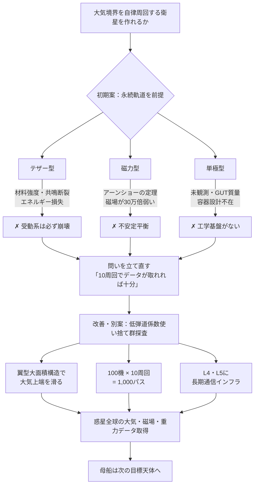

## 1. 概要 (Abstract)

大気を持つ惑星の上層大気境界（高度 80〜100 km 付近）を、燃料補給なしに自律的にスキップし続ける衛星は作れるか——これがこの記事の出発点の問いである。

初期案として3つのアプローチを検討する。**テザー型**は重力勾配とテザー張力で下端を大気上端に維持する。**磁力型**は超電導体のマイスナー効果で惑星極磁場と反発し高度を補助する。**単極型**は磁気モノポールが磁場から直接力を受けることで受動的な浮力を得る。いずれも物理的な根拠を持ちながら、「永続的な安定軌道」という要件のもとで根本的な壁に突き当たる。底流にあるのはアーンショーの定理——静的な逆二乗則の力だけでは安定平衡は存在できないという原理である。

しかし問いを立て直すと状況は一変する。「永続軌道を保てるか」ではなく「10 周回程度のデータが取れれば十分ではないか」と割り切った瞬間、安定性の問題は消える。低弾道係数の使い捨て衛星を群で投下するアーキテクチャが現実味を帯び、ラグランジュ点を活用した階層的な探査インフラとの組み合わせが見えてくる。

---

## 2. 実現不可能性の根拠 (Infeasibility Rationale)

初期案 3 方式に共通する不可能性は、いずれも「永続的な受動安定」という要件から生まれる。

### テザー型

**物理的限界:** 数百 km のテザーで下端を大気上端に留めるには、自重と大気力の両方を支える引張強度が必要だが、現行のどの材料も届かない。大気を通過するたびに空気抵抗が軌道エネルギーを奪い、上端の重りがそれを補う力を持たない。

**技術的限界:** 大気突入・離脱を繰り返すたびにテザーは熱応力と振動にさらされる。固有振動数と軌道周期が共鳴するとテザー共鳴が発生し断裂に至る。TSS-1（NASA・イタリア共同、1992年）でも長尺テザーの絡まりが実証済みである。

**論理的限界:** 大気は通過ごとにエネルギーを奪うだけで補充しない。受動的なテザー構造は時間とともに必ず軌道崩壊に向かう。

### 磁力型（超電導マイスナー効果）

**物理的限界:** 地球の極磁場は約 50〜60 マイクロテスラ。実験室でカエル 1 匹（約 10 g）を磁気浮上させるには約 16 テスラが必要——地球磁場の約 30 万倍である。マイスナー効果による反発力は外部磁場の強さに比例するため、惑星スケールの磁場では衛星への力がナノグラム級にとどまる。

**技術的限界:** 超電導維持自体は宇宙の低温環境で可能だが、大気との摩擦熱が繰り返し加わると転移温度を超えるリスクがある。磁力線に対して常に最適な姿勢を保つ制御機構も必要となり、受動系という前提が崩れる。

**論理的限界:** アーンショーの定理が核心にある。静的な逆二乗則の力だけで構成される系に安定平衡点は存在しない。磁場の均衡点は鞍点（saddle point）であり、ある方向には安定でも別の方向には不安定となる。磁場は高度とともに距離の 3 乗で急減するため、わずかな乱れが復元力ではなく逸脱力として働く。

### 単極型（磁気モノポール）

**物理的限界:** 磁気モノポールは未発見。GUT が予測するモノポールは 1 個あたり約 10⁻¹¹ kg（10 ナノグラム程度）という質量を持ち、衛星として機能する数を収集・濃縮することは現在の技術では構想すら困難である。ディラック磁荷と惑星磁場の積で生じる力も機械的に有意な値に届かない。

**技術的限界:** モノポールはどんな磁性体とも強烈に相互作用する。収容容器が少しでも磁性を持てば吸着・融合してしまう。ディラックの弦の取り扱いも未解決であり、工学的な容器設計の基礎がない。

**論理的限界:** スピンアイス結晶の準粒子モノポールは同じ数学的構造を持つが凝縮系に閉じ込められており、宇宙空間で独立した力源として取り出せるものではない。理論と実用の橋渡しが根本から欠けている。

### 底流：アーンショーの定理

3 方式すべての論理的限界の根底に同じ原理が流れている。静的な逆二乗則力だけで空間中に物体を安定させることは原理的に不可能であり、どの初期案もこの壁を回避できていない。この定理を実用的に回避できる代表例が**二天体系の回転によってコリオリ力が生み出す動的安定点——ラグランジュ点（L4・L5）**だが、その位置は大気境界ではなく天体の軌道面上にある。

---

## 3. 実験の設定 (Setup)

### 初期案——三方式の設計

**テザー型:** 全長 300〜500 km のテザーを上端重りに接続する。重力勾配でテザーを自然に張り、下端のセンサーモジュールが大気上端をかすめるたびに大気組成・磁場・重力データを取得する。GOCE 重力観測衛星のドラッグフリー制御を応用し、マグナス効果（下端モジュールの自転による揚力）でエネルギー損失を最小化することを試みる。

**磁力型:** 高温超電導シェルで覆われた衛星を惑星の極軌道に投入する。極では磁力線が垂直に収束しマイスナー反発力が高度方向に働く。断熱層で転移温度を保護し、大気通過時のマグナス効果と組み合わせてバウンス軌跡の維持を試みる。

**単極型:** モノポール（あるいはスピンアイス的な準粒子を安定化した人工結晶）を非磁性容器に封入した超小型衛星を設計する。北磁極上空に同極のモノポールを配置し、磁荷と磁場強度の積に比例する反発力で高度を支えることを試みる。

いずれも受動的なエネルギー補充機構を持たないため、第 2 節で示した限界を克服できない。

### 改善・別案——問いの転換と低弾道係数使い捨て群探査

初期案の失敗は「永続的な安定軌道」という要件に起因する。この要件を外すと問題の難易度が劇的に変わる。

**問いの転換:** 「永続的に大気境界に留まれるか」→ **「10 周回程度のデータが取れれば十分ではないか」**

この転換により、安定性問題は「どれだけ長く持つか」という工学的問題に変わる。

**低弾道係数滑空型の設計:** 弾道係数 β = m/(Cd·A) を極小化することで、物体が大気上端を「弾む」のではなく「滑る」モードに移行させる。翼型断面を持つ大面積・低質量の構造体は、高度 100 km でも大気との動圧が重力の数百〜千倍に達し、形状が軌道を支配する領域に入る。揚抗比（L/D 比）を最大化した設計なら、各パスで重力の横成分をキャンセルしながら大気上端を連続的になぞる動作が期待できる。最後は大気に溶けて終了するため、処分問題も生じない。

**限定周回の設計目標:** 極軌道で 10 周回すると、惑星の自転（1 周回あたり約 22 度）と合わさって経度 220 度をカバーできる。各パスで取得できるデータは大気組成の初期プロファイル・磁場一次モデル・重力異常の主要パターン・低高度からの表面撮像であり、初探査としての情報量は十分に大きい。

**群展開:** 母船フライバイ中に 100 機を異なるタイミング・角度で投下すれば自然に分散配置が実現する。100 機 × 平均 10 周回 = 1,000 パスのデータとなり、30% が即失敗しても 700 パスが得られる。

---

## 4. 考察と予測 (Speculation)

### 先例：使い捨て探査は実績がある

「数周回で大気に溶けて終わる」という設計は奇抜に見えるが、すでに確立された探査哲学の延長にある。1995 年の**ガリレオ木星大気探査プローブ**は単独降下で 57 分間データを送り続け大気に溶けた。ソビエトの**Venera シリーズ**は金星表面で数十分〜2 時間だけ動作して終了した。どちらも「使い捨て前提」の設計が科学的成果の最大化につながった事例である。大気境界スキッパーはその論理的延長に位置する。

### 「惑星がある」だけで使えるラグランジュ点

ラグランジュ点（L4・L5）は磁場とは無関係に、**2つの重力天体が存在するだけで成立する**。探査対象の惑星が恒星を公転していれば——それは当然そうだが——恒星-惑星系の L4・L5 が無条件に利用できる。惑星に衛星があれば惑星-衛星系の L4・L5 も加わる。磁場の有無は問わない。

L4・L5 はコリオリ力が有効ポテンシャルの鞍点を安定な軌道運動へ変換した動的安定点——静的な場に適用されるアーンショーの定理とは本質的に異なる安定化機構——であり、燃料ゼロで長期維持できる通信・中継インフラの設置場所になる。

### 磁場は別の資源として

大気を持つ惑星にはダイナモ効果による磁場が高い確率で存在する（内部熱源→液体導電性コア→磁場）。ラグランジュ点の利用可能性とは独立しているが、磁場は別の資源として探査を補強する。極付近では磁力線が垂直に収束するため、帯電粒子の軌跡・オーロラ・電離層の構造が観測しやすくなる。磁力型初期案が実用化できなかった原因（惑星磁場の弱さ）を逆手に取れば、スキッパー群が各パスで磁場強度の全球マップを取得する副産物としての価値もある。

### 階層的探査アーキテクチャ

長期インフラ・中期拠点・短期使い捨ての三層が異なる物理で安定を保つ構造が自然に生まれる。

| 層 | 位置 | 維持原理 | スケール |
|---|---|---|---|
| L4・L5 通信インフラ | 軌道面上 | ラグランジュ安定（回転系） | 年〜十年 |
| 母船・探査機 | 高軌道 | 通常軌道力学 | 数ヶ月 |
| 大気境界スキッパー群 | 大気上端 | 低弾道係数滑空 | 10 周回・使い捨て |

高価なシステムは通信と移動に専念し、調査は使い捨ての群に任せる分業が成立する。

### 未知の惑星への自己較正

探査対象の大気密度・重力・磁場は事前に不明である。低弾道係数設計は大気密度に応じて自動的に均衡高度を調整する——密度が高ければ少し上、低ければ少し下に安定する。事前データなしで機能できるこの自己較正性は、精密軌道投入を前提とする既存方式にない強みである。多数の衛星を異なる入射角で投下すれば、設計ではなく物理が自然に全球分散配置を実現する。

---

## 5. 図解 (Diagrams)

---

## 6. 関連記事 (Related)

- 用語: マグナス効果（g370）、弾道係数（g371）、スカイフック（g372）、テザー衛星（g373）、GOCE重力観測衛星（g374）、ディラックの弦（g375）、スピンアイス結晶（g376）、アーンショーの定理（g377）
- [wiim_063](wiim_063.md) — 架空粒子による大気圏突入緩和——ネゴトン・カシミールフォージ・レトロンは再突入熱と重力を制御できるか
- [wiim_053](../quantum/wiim_053.md) — 粒子に個性を持たせることができるか——量子的同一性とトポロジカル粒子の標識問題（磁気モノポール関連）
