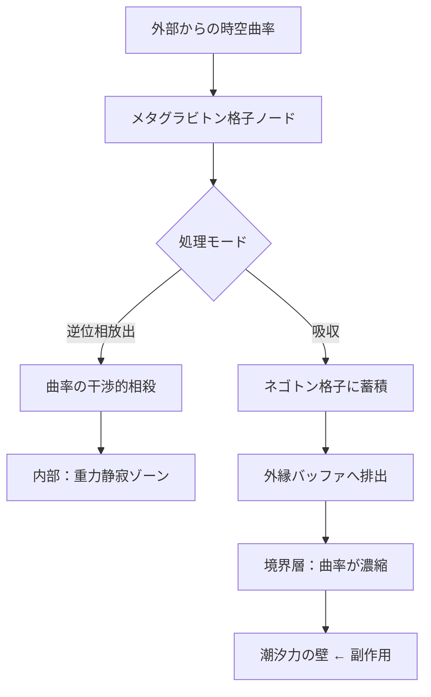

## 概要 (Abstract)

重力場は通常「消せない」。質量があれば時空曲率は生まれ、あらゆる物質は重力波に対して実質透明であるため、受動的に遮断する（グラビトーペイク・g129）ことはできても、空間の内部から能動的に曲率を取り除くことは古典的な一般相対性理論（GR）では不可能とされる。

しかしメタグラビトン（g392）——ネゴトン（g126）格子の集団励起から生まれる準粒子——を空間全体に分布させ、入射してくる曲率成分を吸収・再配置できるとしたらどうなるか。これは単なる「壁を作る」遮断ではなく、空間の内部から重力場を彫刻する能動的な操作だ。本記事では、この「重力彫刻」が成立した場合に生じる3つの帰結を論じる。

---

## 実現不可能性の根拠 (Infeasibility Rationale)

### 物理的限界

重力場にはエネルギーが蓄積されている。GRにおける重力波エネルギー密度は計量テンソルの変化率から定義され、消滅することがない。メタグラビトン格子が曲率を「削る」場合、そのエネルギーは格子に吸収されるか、周囲の空間へ押し出されることになる。吸収側ではネゴトン格子の励起エネルギーが際限なく蓄積し、放出側では境界付近に曲率が濃縮される——問題が消えず、移動するだけだ。

### 技術的限界

静的重力場（巨大質量による定常的な時空曲率）はリアルタイムに書き換えられない。計量の変化は光速で伝播するため、曲率源である質量が存在し続ける限り、削った曲率は光速で補充され続ける。アクティブノイズキャンセリングが音源を消せないように、動的な重力波の低減は可能でも、静的曲率の完全除去はいたちごっこになる。

### 論理的限界

局所的に重力ゼロの領域を作ることは、人工的な局所慣性系の生成と同義である。等価原理によれば、そのような領域は自由落下系と区別がつかない。領域内外では時間の進みに差が生じ、境界を越えるたびに時刻がずれる——「削った」空間は時間的に孤立した泡になるリスクを抱える。

---

## 実験の設定 (Setup)

ネゴトン格子を体積全体に三次元的に分布させた「メタグラビトン充填空間」を想定する。各格子ノードが局所の曲率テンソルを検出し、逆符号の曲率成分をメタグラビトンとして再放出することで干渉的に打ち消す。電磁気のアクティブノイズキャンセリングを重力に適用した機構だ。

削り取った曲率エネルギーは空間外縁のネゴトン蓄積層（エネルギーバッファ）へ排出する。この外縁層で曲率が濃縮されるため、「内部が平坦になった代わりに外周が重力的に分厚くなる」という副作用が必然的に生じる。

---

## 考察と予測 (Speculation)

### 帰結1：重力静寂ゾーン

中性子星（表面重力は地球の約200億倍）の近傍に、平坦化された居住可能領域を形成できると考えられる。船体サイズ（数十メートル）の充填空間なら、局所的な曲率はほぼゼロに近づけられる。

ただし外縁に濃縮された曲率が境界に強い潮汐力を生むため、「泡の壁」が致命的な障害になる。泡のサイズを大きくすれば壁の潮汐力は分散して下がるが、格子の維持コストが体積に比例して増大する。中性子星近傍での実用には、この壁コストとの綱引きが避けられない。

### 帰結2：ワームホール維持コストの削減

wiim_089で論じたモリス＝ソーン型ワームホールの喉部は、ホロウゲイザー（g344）の負エネルギーを永続供給し続けなければ収縮する。喉部にメタグラビトン格子を充填し、収縮を引き起こす内向きの曲率成分を事前に削り取れば、ホロウゲイザーの必要量を大幅に削減できると考えられる。

「押し返す」から「削り取る」への転換であり、維持コストをホロウゲイザーの消耗コストから格子保持コストに置き換えられる可能性がある。喉部の曲率が削られた状態に保たれれば、格子さえ無事なら追加投入なしに安定を維持できる。

### 帰結3：重力レンズの人工設計

天体の重力レンズ効果は質量分布で決まり、通常は変更不能だ。メタグラビトン充填空間を光路に配置し、内部の曲率分布を任意に彫刻することで、任意倍率・任意形状の重力レンズを設計できる可能性がある。

ブラックホール規模の集光能力を持つ「卓上重力望遠鏡」や、特定の天体シグネチャだけを通過させる重力フィルタが実現できる。さらに進めると、重力偏向の分布を設計することで進行方向を位相的に別地点へ接続する——トポロジカル置換ワープ——への発展も示唆される。

---

## 関連記事 (Related)

- [wiim_089](../cosmology/wiim_089.md)：ブラックホール潜入とワームホール開通——喉部維持問題の元記事
- [wiim_010](wiim_010.md)：グラビトーペイク——受動的遮断との対比
- [wiim_023](wiim_023.md)：カシミールフォージ——負エネルギー生成の先行技術
- [wiim_096](wiim_096.md) — 卓上重力子コライダー——メタグラビトン素子で量子重力を手の届く場所に引き寄せられるか
- [wiim_097](wiim_097.md) — トポロジカル置換ワープ——重力偏向で進行方向を別地点へ接続できるか

