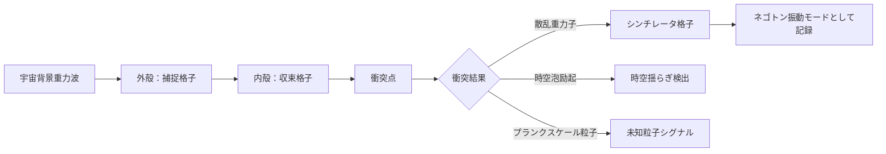

## 概要 (Abstract)

重力子を1個検出するには木星サイズの検出器が必要とされ、重力子同士を衝突させてプランクスケール物理を観測するには10¹⁹ GeVという到達不可能なエネルギーが要る。加速器技術の延長線上に量子重力実験は存在しない——それが現在の物理学の到達点だ。

しかしメタグラビトン（g392）——ネゴトン（g126）格子の集団励起から生まれる準粒子——が「有効結合定数を格子パラメータで制御できる」準粒子であるなら、通過する重力子の有効結合を数桁から数十桁引き上げることが原理上は想定できる。格子間隔・配列・共鳴周波数を精密に調整したメタグラビトン収束格子に重力子を通せば、卓上サイズで重力子同士を衝突させられるかもしれない。本記事ではその可能性と、実現した場合に観測できる現象を論じる。

---

## 実現不可能性の根拠 (Infeasibility Rationale)

### 物理的限界

重力子の結合定数は E/M_Planck に比例する。プランク質量（エネルギー換算で約1.22×10¹⁹ GeV）は自然界の根本的なスケールであり、これより低いエネルギーでは重力子-重力子散乱断面積は事実上ゼロだ。メタグラビトン格子が有効結合定数を引き上げたとしても、それは「格子内の有効粒子」の話にとどまり、裸の重力子がプランクスケールに届いたわけではない。格子から出た瞬間に散乱は起きなかったことになる——格子内の現象と外部の物理の間に原理的な断絶がある。

### 技術的限界

重力子は電荷も色電荷も持たず、電磁場や磁場で軌道を曲げられない。通常のコライダーが荷電粒子を操る手法がまったく使えないため、収束・偏向のすべてをメタグラビトン格子の重力的操作だけで行う必要がある。収束精度はネゴトン格子の配列精度に直結するが、格子自体が生む重力場の非線形効果が収束ビームを乱すという自己干渉問題が避けられない。精密にするほど干渉が強まるというジレンマだ。

### 論理的限界

「プランクスケール物理の直接観測」は、観測装置自体が量子重力効果に晒されるという矛盾を含む。プランクエネルギー近傍では時空の量子揺らぎ（時空泡）が顕在化し、検出器の空間的・時間的位置の確定が原理的に困難になる。「観測しようとする行為そのものが観測対象の時空を乱す」という自己参照的な壁に突き当たり、測定の信頼性を担保できない。

---

## 実験の設定 (Setup)

メタグラビトン収束格子を二重同心球状に配置する。外殻が宇宙背景重力波・地球重力波など周囲の重力子を捕捉・収束し、内殻が収束された重力子ビームを交差点に導く。交差点の直径はネゴトン格子の共鳴波長で決まり、理論上はミリメートルスケールに収束できると想定される。

衝突点の周囲には「重力子シンチレータ」として機能する第三の格子層を配置する。衝突によって生じた励起メタグラビトンが格子に吸収され、ネゴトン層の振動モードとして間接的に検出される設計だ。削り取った曲率エネルギーの処理はwiim_095で論じたエネルギーバッファ方式を流用する。

---

## 考察と予測 (Speculation)

### 帰結1：「格子内コライダー」という間接観測

メタグラビトン格子の中で有効結合定数が引き上げられた状態での重力子-重力子散乱は、格子の外の観測者から見れば「起きていない」が、格子内の有効描像では「起きている」という二重性を持つ。これはプランクスケール物理を「格子という補助系に射影して観測する」形であり、直接観測とは区別される間接的な証拠に留まる。それでも、量子重力の兆候が現れる唯一の卓上実験として価値は高いと考えられる。

### 帰結2：時空泡の可視化

衝突エネルギーが格子内有効値でプランクスケールに近づくと、時空の量子揺らぎ——時空泡——が励起されると予測される。時空泡は通常プランク長（10⁻³⁵ m）スケールで現れるが、有効計量が操作された格子内では実効的なプランク長が伸び、泡の効果が巨視的なスケールに滲み出す可能性がある。これはネゴトン層の異常な位相シフトとして検出できると考えられる。時空泡が格子ノードの位置を揺らす形で現れれば、格子自体が「時空の揺らぎの記録紙」になる。

### 帰結3：未知粒子の生成と漏洩

プランクスケールの衝突からは、通常の加速器では生成できない粒子——微細ブラックホール、重力子束縛状態（グラビトンバウンドステート）、余剰次元のカルツァ＝クライン励起——が生まれる可能性がある。格子内で生まれたこれらが外部空間へ漏れ出した場合、その検出は「格子の外の物理」に影響を与える唯一の信号となる。wiim_095で論じた重力レンズ彫刻技術と組み合わせれば、漏れ出した信号を指向性収束して遠方で観測することも想定できる。

---

## 関連記事 (Related)

- [wiim_095](wiim_095.md)：重力を空間から削れたら——メタグラビトン格子の基礎技術
- [wiim_089](../cosmology/wiim_089.md)：ブラックホール潜入とワームホール開通——プランクスケール近傍の物理
- [wiim_010](wiim_010.md)：グラビトーペイク——格子技術の起源
- [wiim_097](wiim_097.md) — トポロジカル置換ワープ——重力偏向で進行方向を別地点へ接続できるか

