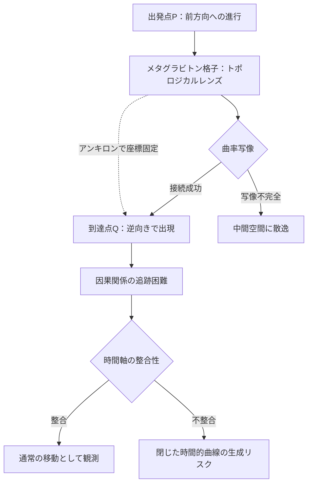

## 概要 (Abstract)

ワームホールは「2つの口と喉部」を明示的に構築する。ワープバブルは「船を包む曲率泡」を生成する。どちらも巨大なエネルギーと工学的構造物を要求し、存在すれば観測可能な痕跡を残す。

メタグラビトン（g392）——ネゴトン（g126）格子の集団励起から生まれる準粒子——による重力場彫刻（wiim_095）を極限まで推し進めると、第三のワープ機構が示唆される。空間の接続形式そのものを書き換え、進行方向を位相的に別地点へ接続するトポロジカル置換だ。口も喉部も曲率泡も持たない。ある地点で「前方向」に進んだ物体が、別地点で「逆向き」に出現する。本記事ではこの機構の可能性と、実現した場合の帰結を論じる。

---

## 実現不可能性の根拠 (Infeasibility Rationale)

### 物理的限界

一般相対性理論のトポロジー変化定理（ゲロッホの定理）によれば、古典的な時空でトポロジーを変化させるには特異点の生成か因果構造の破綻が必要だ。2地点の「方向」を位相的に同一視するためには、その間に何らかの特異的構造——事実上のミクロな特異点——を生じさせなければならない。プランクスケール以下のエネルギーでこれを起こすことは古典GRの枠内では不可能と考えられる。メタグラビトン格子がトポロジー変化を「迂回」できるかどうかは理論的に未解決のままだ。

### 技術的限界

2地点の方向を接続するトポロジカル置換は、2点の座標情報を大域的に参照してはじめて成立する操作だ。しかし物理の操作は原則として局所的であり、光速を超えた大域情報の収集は許されない。メタグラビトン格子による局所操作の積み重ねがグローバルなトポロジー変化を引き起こせるかどうかは、局所と大域のギャップという根本的な壁に阻まれる。局所では「曲率を削る」だけの操作が、大域では「接続形式を変える」に飛躍できるかどうかの保証がない。

### 論理的限界

「前方向に進んで逆向きで出現する」という性質は因果関係の追跡を困難にする。物体Aが点Pで前進し、点Qで後退している状態として出現するとき、Aが運ぶ情報はQからの視点では「逆向きに来た」ことになる。この非対称性が閉じた時間的曲線（CTC）の形成条件と重なる場合、自己矛盾的な情報伝達が生じる可能性がある。逆向き出現が「空間の逆転」なのか「時間の逆行」なのかを事前に区別できないという原理的な問題が残る。

---

## 実験の設定 (Setup)

メタグラビトン格子を「トポロジカルレンズ」として機能させる構成を想定する。格子内部の曲率分布を、光子球（ブラックホール周囲で光が360°周回する面）の幾何学的類似物として設計する。光子球では光が閉じた軌道を描くが、これを開いた系として「入射方向と射出方向を別地点の逆方向に接続する写像」に変形することが目標だ。

接続先との座標合わせにはアンキロン（g128）による計量固定を併用する。アンキロンが両地点の計量座標を固定し、メタグラビトン格子がその固定座標間のトポロジー的写像を実行する。この役割分担はwiim_089のフェーズ4（アンキロンで座標固定、トポロン（g294）でトポロジー書き換え）と同じ論理構造だ。ただしwiim_089が喉部という物理的実体を必要としたのに対し、本機構は格子操作だけで接続を実現しようとする点が本質的に異なる。

---

## 考察と予測 (Speculation)

### 帰結1：逆向き出現の観測特性

トポロジカル置換で到達した物体は逆向きで出現するため、「どこから来たか」の追跡が通常の観測手法では困難になる。wiim_004で論じたワープ航法の重力波シグネチャは存在せず、wiim_009のステルス機構とも異なる種類の不可視性を持つ。移動の痕跡が出発点にも到達点にも残らない可能性があり、観測的には「突然逆向きで現れた物体」としてしか識別できない。

### 帰結2：ワームホールとの構造的差異

wiim_089のワームホールはER橋という物理的実体を持ち、通過には喉部の維持コストが永続的に発生する。トポロジカル置換は維持構造を持たず、格子が写像を実行した瞬間だけ接続が成立して消える。「常設の通路」ではなく「一瞬の写像」であるため、同じ経路を繰り返し使うには毎回接続を確立し直す必要がある。これはコスト面では有利だが、往復が対称でないという運用上の制約を生む。

### 帰結3：射程と距離の概念崩壊

接続できる2点間の距離に原理的な上限があるかどうかは未解決だ。局所操作の積み重ねによるトポロジー変化が光速的な制約を受けるなら射程は有限になる。しかしトポロジー操作が時空の構造に作用する性格上、「距離」という概念自体が適用できない可能性がある。距離が意味を失う操作であれば、数メートル先への置換も銀河間の置換も原理上は同じコストになる——それはすなわち、移動コストが「どこへ行くか」でなく「接続を確立する精度」だけで決まる世界だ。

---

## 関連記事 (Related)

- [wiim_095](wiim_095.md)：重力を空間から削れたら——トポロジカル置換の基礎技術
- [wiim_096](wiim_096.md)：卓上重力子コライダー——メタグラビトン格子の応用
- [wiim_089](../cosmology/wiim_089.md)：ブラックホール潜入とワームホール開通——構造的対比
- [wiim_074](wiim_074.md)：ワープゲート基礎理論——トポロン・アンキロンとの接続
- [wiim_004](../cosmology/wiim_004.md)：ワープ航法の痕跡——不可視性との対比
- [_tech_tree_metagraviton](../notes/_tech_tree_metagraviton.md) — 技術ツリー — メタグラビトン・重力場彫刻系ブランチ

