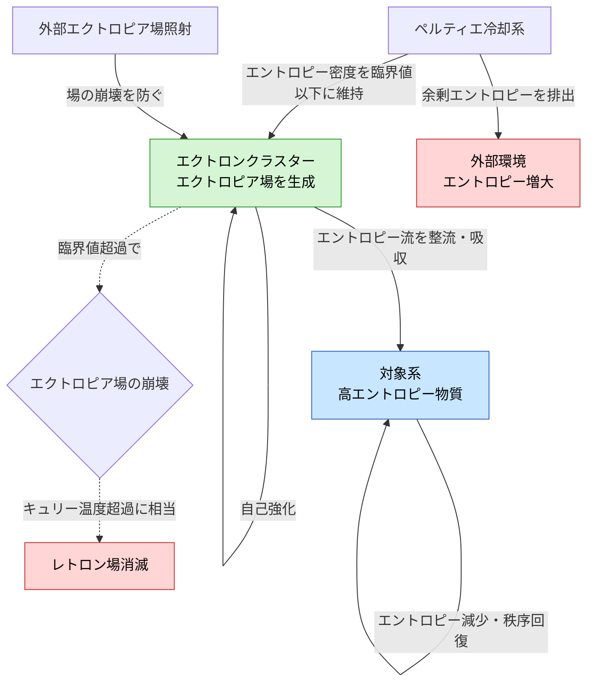

## 1. 概要 (Abstract)

永久磁石は外部エネルギーなしに磁力を維持する。スピンの自発的整列（交換相互作用）が安定した基底状態を作り、キュリー温度（g397）以下では熱揺らぎに負けない。もし同じ論理をエントロピーに適用できるなら——すなわちエントロピー流を整流する場（エクトロピア場）が安定した基底状態を持てるなら——レトロン（g163）の負エントロピー作用を半永久的に維持できるのではないか。

この思考実験が問うのは、**「エクトロン（g394）のエクトロピア場と冷却系の組み合わせにより、持続的に機能するレトロン場を構築できたとしたら何が起きるか」**だ。場が維持される限りエントロピーは自発的に流れ込み、対象系は秩序を取り戻し続ける。熱力学第二法則が局所的に「一時停止」する世界が問うものとは何か。

---

## 2. 実現不可能性の根拠 (Infeasibility Rationale)

### 物理的限界

熱力学第二法則は孤立系に対して成立する。レトロン場が局所的にエントロピーを減少させることは、系の外部へのエントロピー排出と対になっており、宇宙全体では第二法則は依然として守られる——これは冷蔵庫と同じ構造だ。

問題は「コスト」の在処だ。エクトロピア場の維持には冷却（ゼーベック効果・ペルティエ効果 g395）と外部場の照射が必要であり、それらが排出するエントロピーは場が吸収するエントロピーより必ず大きくなる。永久磁石が磁力維持にコストゼロでいられるのは、整列エネルギーが離散量子状態に閉じ込められているからだ。エクトロピア場で同等の「エントロピーロック」状態が実現できるかは、現在の熱力学・量子場理論では根拠がない。

### 技術的限界

レトロン自体の性質がこの設計の最大の障壁となる。レトロン（g163）は高エントロピー領域に引き寄せられ、そこでエントロピーを吸収しながら消耗する。つまりレトロン場を対象系（高エントロピー物質）に向けるほど、レトロン自身は急速に失われていく。

エクトロン場によるレトロンの補充・再生が実現しない限り、場は砂時計のように使い減りしていく。またエクトロン自体の生成コストは未定義であり、エクトロン場を維持するインフラ全体のエネルギー収支が正になる（場の恩恵 > 維持コスト）保証は現在の理論枠内には存在しない。

### 論理的限界

レトロン（g163）の根本的な問題は遡及因果性だ。局所的なエントロピー逆転は熱力学的時間の逆行を意味し、因果パラドックスを引き起こす。半永久的なレトロン場とは、「熱力学的時間が逆行する領域が持続的に存在する」ことを意味する。

この領域の境界では順行時間と逆行時間が接触し、情報の逆流・因果関係の不連続が発生すると考えられる。場が安定するほどこの境界が固定され、周囲の時空構造への影響が蓄積する。局所的な制御を目指した結果、大域的な因果構造が破綻するという自己矛盾が生じる。

---

## 3. 実験の設定 (Setup)

### 構成要素

| 要素 | 役割 |
|---|---|
| エクトロンクラスター | エクトロピア場を生成・相互強化。強磁性ドメインと同じ自己組織化 |
| ペルティエ冷却系（g395） | 周囲のエントロピー密度をキュリー温度相当の臨界値以下に維持 |
| 外部エクトロピア場照射源 | クラスターの場を補強し崩壊を防ぐ（外部磁場による着磁に対応） |
| レトロン供給機構 | 消耗したレトロンを補充し場の強度を維持 |
| 対象系 | 場の外側に置かれた高エントロピー物質。場の整流作用でエントロピーが吸収される |

### 想定されるプロセス

1. エクトロンクラスターが安定したエクトロピア場を形成
2. 冷却系がエントロピー密度を臨界値以下に保ち、場の崩壊を防ぐ
3. 場が対象系のエントロピー流を自身に向けて整流・吸収
4. 対象系のエントロピーが継続的に減少し、秩序が回復
5. 排出されたエントロピーは冷却系を通じて外部環境へ放出

---

## 4. 考察と予測 (Speculation)

### 第二種永久機関の原理的成立

この系が安定動作するなら、熱力学の文脈では第二種永久機関——熱浴から仕事を取り出し続ける機関——が原理的に成立する。対象系のエントロピーが下がり続けるということは、低温熱源が外部入力なしに再生されることを意味し、カルノー効率を上回る熱機関が構成できる。

ただしこれは「宇宙全体では第二法則を破っていない」という条件付きだ。冷却系が外部に排出するエントロピーを含めた全体収支を見れば、宇宙のエントロピーは増え続ける。局所的な秩序化は、外部宇宙への無秩序化を代価として支払っている。

### マクスウェルの悪魔の物理化

エクトロン場の最も重要な特性は「個別観測なしにエントロピー流を整流する」点だ（g394）。マクスウェルの悪魔（[wiim_037](wiim_037.md)で論じられる）は各分子を観測・仕分けするためランダウアーの原理から逃れられなかった。エクトロン場は場として一括作用するため、情報消去コストを回避できる可能性が示唆される。

これが成立するなら、ランダウアーの原理が「情報を持つ観察者」にのみ適用されるのか、「エントロピーに作用するあらゆる機構」に適用されるのかという問いが浮かび上がる。

### 時間の矢の局所的停止

通常、時間の矢はエントロピー増大の方向と一致する。レトロン場が維持される領域では熱力学的時間が逆向きに進み、領域の内側と外側では時間の向きが食い違う。ここで言う「時間の逆行」は相対論的な固有時の遅れとは異なる——熱力学的時間の矢（エントロピー増大の方向）が反転するという意味での逆行だ。情報を内側から外側に渡すとき、因果関係の順序が逆転する可能性がある。これは時間遡行（[wiim_049](wiim_049.md)）が直面する因果問題と同根だ。

### 宇宙スケールとの競合

ヴェルリンデのエントロピー重力（g396）が示唆するように、エントロピー勾配は重力として作用しうる。局所的にエントロピーが著しく低い領域が持続するなら、その周囲に微弱な引力勾配が生じる可能性がある——エクトロピア場が重力場の局所的な歪みを引き起こすという、想定外の帰結だ。

宇宙全体のエントロピーは膨張とともに増大し続けるため、いかなるレトロン場も長期的には宇宙スケールのエントロピー流に押し流される。場の「寿命」は、外部からのエントロピー流入速度と冷却能力のバランスで決まる有限の量だ。

---

## 5. 図解 (Diagrams)

---

## 6. 関連記事 (Related)

- [wiim_037](wiim_037.md) — レトロン——負のエントロピーを持つ粒子と因果の逆行（基盤となる概念）
- [wiim_049](wiim_049.md) — 時間遡行は可能か——因果問題の共通根
- [wiim_077](wiim_077.md) — 架空粒子を掴む——エクトロンクラスター形成に必要な粒子操作技術
- [wiim_085](../quantum/wiim_085.md) — パランティ電子と非熱的エネルギー——「エントロピーを別場所に移す」という共通構造
- [wiim_086](wiim_086.md) — パランティ電子冷却——冷却技術との比較
- [wiim_010](wiim_010.md) — ネゴトン——負の質量との対称性
- [wiim_013](wiim_013.md) — コーラ粒子——他のWIIM粒子との関係
- [wiim_063](wiim_063.md) — 架空粒子による大気圏突入緩和
