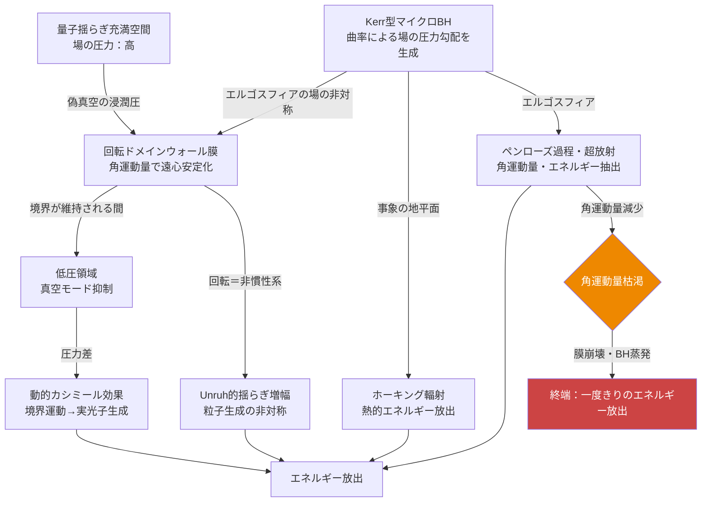

## 1. 概要 (Abstract)

量子真空は「何もない空間」ではない。ゼロ点揺らぎと呼ばれる量子力学的な揺動が全空間を満たしており、この揺らぎは一種の「場の圧力」として働く。カシミール効果はこの圧力差がマクロな力として観測される実例であり、2011年にWilsonらが実証した動的カシミール効果では、動く境界面が真空から実光子を生成することまで確認されている。

> **前提:** 量子揺らぎが充満する空間（高い場の圧力）と、境界によって真空モードが抑制された空間（低い場の圧力）の間に圧力差を維持できるとする。  
> **命題:** 「もしその圧力差を熱機関のように駆動力として利用できたら、量子真空からエネルギーを取り出せるか？」

熱機関が高温・低温の温度差を仕事に変換するように、場の圧力差を変換する機関を考える。問題の核心は「真の真空を作り出す」ことではなく、**局所的な場のモード抑制による圧力勾配の維持**にある。不可能性の根拠は三層にわたるが、宇宙がこの機構を一度だけ使い切った可能性があるという逆説が思考実験の終着点となる。

---

## 2. 実現不可能性の根拠 (Infeasibility Rationale)

- **物理的限界：核生成の壁**  
  場の圧力差を有意なスケールで生成するには、時空曲率を局所的に操作する必要がある。最も具体的な候補はKerr型マイクロブラックホール（回転するBH）であり、エルゴスフィアが自然な圧力勾配発生装置として機能する。しかしプランク質量規模のブラックホール生成にはプランクエネルギー（約10¹⁹ GeV）が必要で、LHCが到達できる10⁴ GeVとは15桁の開きがある。余剰次元仮説によれば閾値はTeVスケールまで下がる可能性があるが、LHCでの長年の探索で現在まで証拠は得られていない。

- **技術的限界：収支の壁**  
  仮に核生成が可能であっても、熱力学第二法則は「圧力差を作るコスト ≥ 差から取り出せるエネルギー」という制約を課す。カルノー効率と同様に変換効率の上限が存在し、ドメインウォール膜の維持コストとマイクロBHの核生成コストの合計が、ホーキング輻射・ペンローズ過程・動的カシミール効果の出力合計を上回ると考えられる。差を「作る」行為がエネルギーを消費するため、自己持続的な循環は成立しない。

- **論理的限界：制御の壁**  
  回転ドメインウォール膜は角運動量によって構造を維持するが、ペンローズ過程や超放射で角運動量を抽出するほど膜の寿命が短くなる。エネルギーを取り出すほど早く壊れるという自己矛盾的な構造を持ち、「制御しながら使い続ける」設計は論理的に成立しない。使い捨てを前提とした設計のみが整合的である。

---

## 3. 実験の設定 (Setup)

1. **Kerr型マイクロブラックホールの核生成**  
   超高エネルギー粒子衝突または（余剰次元仮説下での）TeVスケール装置によって回転するマイクロBHを生成する。回転するBHはエルゴスフィアを持ち、内部では時空が引き摺られることで場のモード密度が非対称になる。事象の地平面ではホーキング輻射が発生し（質量が小さいほど温度が高い）、エルゴスフィアではペンローズ過程・超放射による角運動量とエネルギーの抽出が可能になる。

2. **回転ドメインウォール膜の形成**  
   BHの周囲に、真空モードが抑制された低圧領域と周囲の高圧領域（通常の量子揺らぎ空間）を隔てるドメインウォール膜を形成する。静止した膜は外側からの偽真空浸潤圧によって即座に潰れるが、角運動量を与えて回転させると遠心力が内向き圧力に抗する構造的安定性を生む。さらに回転する境界は非慣性系を形成するため、Unruh効果に類似した量子揺らぎの局所増幅が膜表面で生じ、粒子生成の非対称性が現れる。

3. **動的カシミール効果による光子生成**  
   常に運動している回転ドメインウォール膜は動的カシミール効果の発生源として継続的に働き、場の圧力差を実光子として変換し続ける。

4. **終端：使い捨てエネルギー放出**  
   角運動量の抽出とともにBHの回転が鈍化し、膜が不安定になると、BH蒸発と膜崩壊が連鎖して蓄積したエネルギーを一度に放出して終端する。繰り返し使用ではなく、初期条件として積み上げたポテンシャルを一度だけ変換する設計として位置づける。

---

## 4. 考察と予測 (Speculation)

この機構が最も興味深いのは、宇宙がすでに類似の過程を一度だけ実行した可能性を示唆する点である。

現在の宇宙では物質が反物質をわずかに上回っている（バリオン非対称性）。この非対称は電弱相転移の際に生じた気泡壁——まさにドメインウォールの一形態——での量子揺らぎの非対称によって生まれたと考えられている。宇宙そのものが「場の圧力差を持つ相境界での一度きりのエネルギー変換」を通じて物質優勢を実現したのだとすれば、本記事の機構はその宇宙論的規模の出来事の縮小版として読み直せる。

静的カシミール効果（圧力差の維持）→動的カシミール効果（運動する境界での変換）→回転ドメインウォール（角運動量による安定化と変換の増幅）→Kerr型マイクロBH（曲率による圧力勾配の生成）という連鎖は、いずれも既知の物理概念の延長上にある。不可能性は概念の新奇性にあるのではなく、スケールと収支の問題——「差を作るコストが差を使うコストを上回る」という根本的な制約——にある。

「一度きり」を受け入れるならば、問題は繰り返し可能性から変換効率に移る。マイクロBHの全蒸発エネルギーはその質量を全て輻射に変換するため、同質量の核燃料と比べて桁違いに大きい。問題は、全エネルギーを回収する前にBHが蒸発しきることである。回転ドメインウォールの寿命がホーキング蒸発の時間スケールよりも短い場合、エネルギーの大半は回収されないまま失われる。

カルノー効率が「温度差がある限り原理的には動くが効率に上限がある」と整理するように、場の圧力差機関も「差がある限り原理的には出力があるが、差を作るコストが常に上回る」という整理に落ち着く。技術的不可能性であって概念的不可能性ではない——これがこの思考実験のもたらす結論である。

---

## 6. 図解 (Diagrams)

---

## 7. 関連記事 (Related)

- [カシミールフォージ（wiim_023）](wiim_023.md) — カシミール効果による真空エネルギー利用の出発点
- [量子永久機関（wiim_039）](../quantum/wiim_039.md) — 非対称カシミール板による真空エネルギー搾取の思考実験
- [ディラックサイフォン（wiim_087）](wiim_087.md) — 真空から負エネルギーを汲み出す別アプローチ
- [負のエネルギーを制御できたなら（wiim_088）](wiim_088.md) — 負エネルギー制御の帰結
- [半永久的なレトロン場（wiim_098）](wiim_098.md) — エントロピーを逆流させる別種の真空操作
- [宇宙を振動させただけ（wiim_099）](../quantum/wiim_099.md) — ゼロエネルギー宇宙論と±位相分裂の理論的背景
