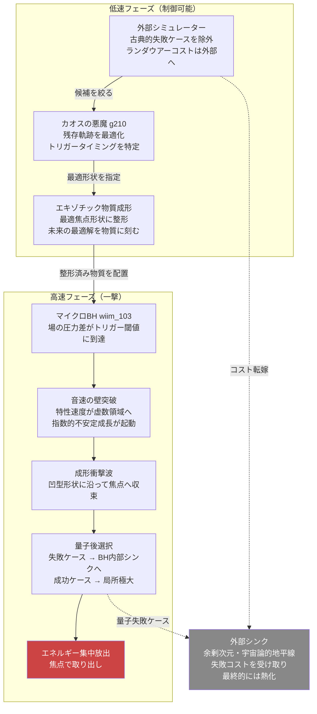

## 1. 概要 (Abstract)

通常の爆薬に凹型のライナーを取り付けると、爆轟エネルギーが一点に集中する高速ジェットが形成される——モンロー効果（成形炸薬）と呼ばれるこの現象は、総エネルギーを増やさずに局所集中だけで威力を劇的に高める。

エキゾチック物質（負エネルギー密度）にも類似の「壁」が存在する。通常の媒質における音速は圧力と密度の関係から実数として決まるが、負エネルギー密度媒質では等価な特性速度が**虚数**になり、波動伝播ではなく指数的な不安定増大に変わる。この不安定点を「音速の壁」として扱い、その突破を制御されたトリガーとして利用できないか——本記事はこの問いを検討する。

> **前提:** 場の圧力差機関（wiim_103）のマイクロブラックホールがエキゾチック物質を生成し、その配置を事前に成形できるとする。  
> **命題:** 「音速の壁の突破を成形炸薬と同様に制御すれば、有用なエネルギーを局所に集中して取り出せるか？」

鍵となるのは**設定フェーズと放出フェーズの分離**である。ゆっくりと整形した構造に未来の最適解を刻んでおき、一撃で放出する。この分離が成形炸薬と量子熱力学を繋ぐ架け橋になる。

---

## 2. 実現不可能性の根拠 (Infeasibility Rationale)

- **物理的限界：時間競争の壁**  
  フォード＝ローマン不等式は、負エネルギー密度の大きさとその持続時間の積に厳しい上限を課す。密度が大きいほど保持できる時間は短くなり、高密度に整形しようとするほど蒸発が早まる。「丁寧に整形する低速フェーズ」と「蒸発する前に撃つ高速フェーズ」の時間競争が解消できない根本的な壁である。さらに整形の精度を高めるほど外部擾乱への感度も上がり、整形作業自体がフォード＝ローマン制約を消費してしまう逆説が生まれる。

- **技術的限界：焦点精度と不安定性**  
  成形炸薬でのモンロー効果はライナーの幾何学的精度に依存する。エキゾチック物質版では、負エネルギー密度分布の整形精度がナノメートル以下を要求する可能性がある。負エネルギー媒質は本質的に不安定（wiim_034 で論じた負の体積弾性率と同じ性質）であり、整形された形状はわずかな外乱で崩れる。カシミールフォージ（wiim_023）が提供する生成精度から、さらに何桁もの向上が必要になると考えられる。

- **論理的限界：集中は節約ではない**  
  成形によってエネルギーが局所に集中しても、総エネルギー収支は熱力学第二法則に従う。「集中した分だけ他の場所でエントロピーが増大する」という保存則は回避できない。失敗ケースの廃棄コスト・シミュレーションのランダウアーコスト・外部シンクの熱化が「別場所の赤字」として必ず発生する。カルノー効率と同様に、効率の上限は差を作るコストによって定まる。

---

## 3. 実験の設定 (Setup)

この思考実験は**低速フェーズ**（制御可能・時間をかけられる）と**高速フェーズ**（一撃・制御困難）に明確に分離される。

### 低速フェーズ：最適解を物質に刻む

1. **シミュレーションによる古典的事前フィルタ**  
   外部システム上でエキゾチック物質の崩壊軌跡を大量にシミュレーションし、失敗に終わる配置を事前に除外する。このランダウアーコストはシミュレーターシステムに帰属するため局所系の外に出せる。古典的失敗モードを除去した後、残った候補配置の情報がカオスの悪魔（g210）に渡される。

2. **カオスの悪魔による軌跡最適化**  
   カオスの悪魔（g210）は古典的に生き残った候補について確率分布を精密計算し、最も高い確率でエネルギー集中をもたらす形状を特定する。悪魔の仕事は「どんな形に整形するか」ではなく「その形状でいつトリガーを引くか」に絞られ、計算負荷（ランダウアーコスト）が大幅に削減される。

3. **エキゾチック物質の成形**  
   カシミールフォージ（wiim_023）が生成したエキゾチック物質を、シミュレーションと悪魔の計算が導いた最適な凹型焦点形状に整形する。この形状はシミュレーション結果を物理構造として固定したものであり、「未来の最適解を現在の物質に刻む」行為である。焦点はマイクロBH（wiim_103）の事象の地平面近傍に設定する。

### 高速フェーズ：一撃での放出

4. **トリガー：音速の壁の突破**  
   マイクロBHのエルゴスフィアが生成する場の圧力差が閾値を超えると、整形されたエキゾチック物質の特性速度が虚数領域に入り、指数的増大モードが起動する。波動ではなく爆発的な不安定成長が焦点形状に沿って伝播する。

5. **量子後選択による局所極大の確保**  
   高速フェーズでは量子揺らぎの確率的な外れが残る。量子後選択によって「焦点に集中した」未来の境界条件を現在の測定に引き寄せることで、瞬間的に熱力学的限界を超えた局所集中が実現しうる。失敗した量子後選択ケースはマイクロBH内部に落下し、一時的なエントロピーシンクとして機能する。

6. **エネルギー取り出し**  
   焦点に集中したエネルギーパルスを捕捉・変換する。ホーキング輻射・動的カシミール効果と合わせて、マイクロBHの蒸発完了までにエネルギーを回収する時間窓が勝負となる。

---

## 4. 考察と予測 (Speculation)

モンロー効果の本質は「エネルギーを増やさずに方向と集中を与える」点にある。成形炸薬が通常の爆薬の10倍の貫通力を持つのはこの理由であり、投入エネルギーは変わらない。本記事の機構も同じ論理に従う——量子真空から取り出せるエネルギーの総量は熱力学第二法則に従うが、その**局所集中度**は成形の巧みさによって大きく変わる。

シミュレーションとカオスの悪魔の相補性がここで重要になる。シミュレーションは「粗い悪魔」として古典的失敗ケースを安価に除去し、本物の悪魔に渡す問題を小さくする。成形という物理行為がシミュレーション結果の「エンコード」として機能するため、高速フェーズでは悪魔はタイミングだけを担当すればよい。計算コスト（ランダウアーコスト）が低速フェーズの成形コストに時間軸で分散される。

外部シンク戦略との組み合わせも有効である。余剰次元がコンパクト化されていれば、その熱容量を一時的なエントロピー排出先として使える——ただし余剰次元は最終的に自らの熱力学に従い熱化するため、これは先送りであり解消ではない。先送りの量が十分大きければ工学的に有意であるという立場は取れる。宇宙論的地平線の彼方への排出も原理的には可能だが、輸送エネルギーコストが排出するエントロピー量に比例して発生する。

最も興味深いのは、この機構全体が「宇宙が電弱相転移で一度やったこと」の再現を狙っている点である。電弱相転移の気泡壁はまさに成形されたドメインウォールであり、量子揺らぎの非対称が一度だけバリオン非対称性として解放された。宇宙規模での使い捨ては成功した——本記事はその縮小版として、人工的・局所的な再現を問うている。

---

## 6. 図解 (Diagrams)

---

## 7. 関連記事 (Related)

- [場の圧力差機関（wiim_103）](wiim_103.md) — 本記事の上流：マイクロBHによる場の圧力差と使い捨て設計
- [カシミールフォージ（wiim_023）](wiim_023.md) — エキゾチック物質の生成源
- [エキゾチック物質音響実験（wiim_034）](wiim_034.md) — 負の体積弾性率と音響不安定性の基礎論
- [カオスを制御するカオスの悪魔（wiim_052）](wiim_052.md) — 確率的軌跡最適化とランダウアー原理
- [ディラックサイフォン（wiim_087）](wiim_087.md) — 別アプローチでの真空エネルギー抽出
- [量子永久機関（wiim_039）](../quantum/wiim_039.md) — 真空エネルギー搾取の思考実験系統
