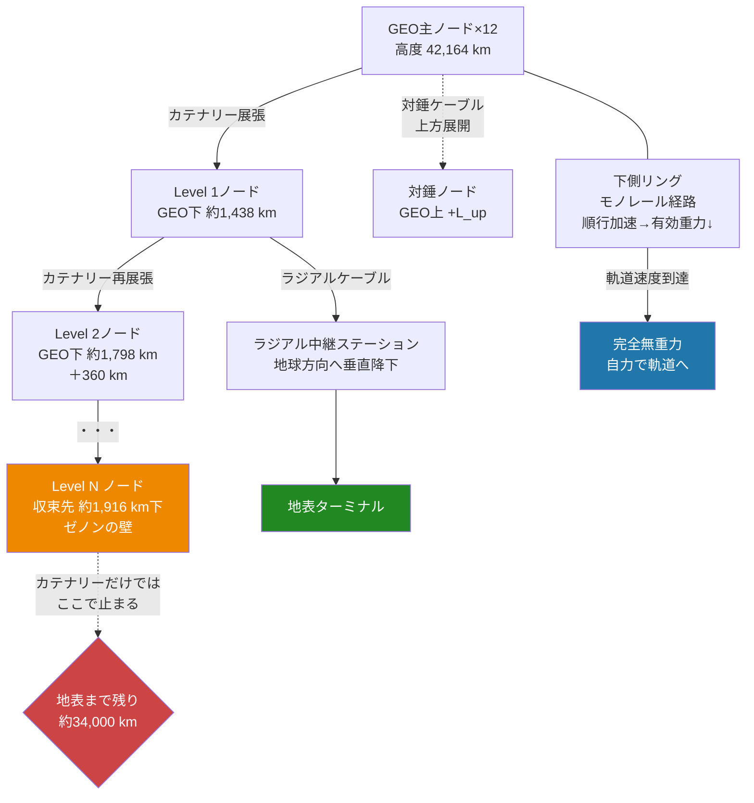

## 1. 概要 (Abstract)

スペースエレベーターの最大の障壁は素材強度だ。赤道上空35,786 kmの静止軌道（GEO）から地表まで一本のケーブルで繋ぐには、引張強度と密度の比が鋼鉄の約150倍に相当する素材が必要とされ、現時点でカーボンナノチューブでさえ実現の目処が立っていない。

> **前提:** 複数のGEO衛星を水平方向のカテナリー（懸垂線）ネットワークで接続し、各ノードから下方へラジアルケーブルを垂らせるとする。  
> **命題:** 「もし静止軌道に浮かぶ多角形の首飾り——GEOネックレス——が構築できたなら、スペースエレベーターの素材強度問題を分散構造で回避しつつ、推進剤ゼロの間欠的宇宙アクセス窓を実現できるか？」

GEOネックレスは単一点の荷重を数十本のケーブルに分散させ、かつ必要な時だけ展開する間欠運用によって維持コストを劇的に削減するアーキテクチャだ。問題は、分散と間欠化が地表到達という根本課題を解決しているかどうかにある。

---

## 2. 実現不可能性の根拠 (Infeasibility Rationale)

- **物理的限界：フラクタルのゼノンのパラドックス**  
  GEO上に等間隔（30°ごと）に並んだ12基の衛星を隣接衛星間でカテナリーケーブルで結ぶと、各ケーブルの最低点はGEOより下にたわむ。GEO軌道では重力と遠心力が釣り合ってゼロ重力になるが、GEO以下では重力が勝るため、ケーブルは自然に地球方向へ弓なりに曲がる。このたわみ量は半角α（隣接衛星間の角度の半分＝15°）の二乗に比例し、最初のノードはGEO高度から約1,438 km下に生まれる。  
  次に各ノードと主衛星の間にもカテナリーを張ると、さらに下のノードが生まれる。しかし半角を半分にするとたわみ量は1/4になる。（1/4）の等比数列は合計が元の値の4/3倍で収束する——したがってGEO高度から約1,900 km下で、このフラクタル構造は永遠に繰り返しても収束してしまう。地表まで残る距離は約34,000 kmだ。カテナリーが「水平方向の等高線的剛性を生む構造」であるため、いくら細かく分割しても垂直方向の到達を稼げないのは本質的なミスマッチであり、幾何学的な必然だ。

- **技術的限界：ケーブル内部張力の二乗則**  
  上下同時展開（主衛星からGEO以下に下方ケーブル・GEO以上に対錘ケーブルを同時に繰り出す）を行えば、衛星にかかる正味の荷重はゼロに近づく。これは推進剤を使わずに構造を展開できることを意味する。しかしケーブル自身の内部に働く最大張力はケーブルの単位長質量と展開長の二乗に比例して増大する。ケーブルが長くなるほどその自重を支える部分の張力が高くなるためで、この制約は単一スペースエレベーターと本質的に同じ——分散構造は荷重を分配するが、各ケーブル内部の二乗則は消えない。

- **論理的限界：GEO以下静止維持のコスト**  
  GEO以下で地球に対して静止を保つ物体には、重力が遠心力を上回る分の推進力が継続的に必要だ。GEO直下1,000 kmを連続維持する10トン級ステーションは、年間で17トンもの推進剤を消費すると見積もられる。これではラストワンマイルの中継ステーションすら半永続的な運用ができない。この限界は間欠展開によって1/48まで下がり（1日30分の展開）、さらに対錘構造と組み合わせると推進剤消費がほぼゼロになる——しかし根本問題は、地表からGEO以下の到達距離34,000 kmを別の方法で解決しなければならないという点だ。

---

## 3. 実験の設定 (Setup)

1. **主ノードの配置**  
   GEO上に等間隔（30°ごと）で12基の静止衛星を配置する。衛星間の距離は弦長で約22,000 km。各衛星は通常のGEO衛星と同等の太陽電池パネルと電動ドラム式ケーブル巻き出し機構を搭載する。

2. **カテナリー展張**  
   隣接衛星間を高強度ケーブルで結ぶ。GEO高度ではケーブルに張力がほぼかからず展張コストが低い。ただし潮汐重力によってケーブルの中央は自然に地球側（下方）にたわむ。たわみ量はGEO半径（42,164 km）と半角（15°）から計算され、最低点はGEO高度から約1,438 km下に位置する。

3. **フラクタルノード展開**  
   各カテナリーの最低点に中間ノード（小型ステーション）を設置し、さらにノードを主衛星と結ぶカテナリーを追加展張する。理論上は無限に繰り返せるが、幾何学的に約1,900 km以上降下できない（ゼノンの収束）。

4. **ラジアルケーブルの追加**  
   フラクタルの収束限界を破るため、各ノードから地球方向へ垂直にラジアルケーブルを延ばす。カテナリーが水平剛性を担い、ラジアルが垂直到達を担う役割分担がGEOネックレスの核心だ。ラジアルケーブルの長さは単一スペースエレベーターより短くて済むが、素材強度の要件は変わらない。

5. **同時双方向展開**  
   下方ケーブル（または対象ノード）と同時にGEO以上へ等長の対錘ケーブルを展開する。潮汐近似では上下が等長のとき正味の荷重がほぼゼロになるため、展開に必要なのは電力のみで推進剤を使わない。

6. **間欠展開モード**  
   下方ケーブルと対錘ケーブルを1日30分だけ展開する。エネルギー消費は連続運用の1/48（約2%）に抑えられ、太陽電池のみで賄える水準（GEO直下1,000 kmで約2.7 kW相当）となる。使用時間以外はケーブルを巻き戻すことで、デブリリスクも最小化できる。

7. **下側リングのモノレール**  
   カテナリー網の最低点付近に形成されるリング状の経路に沿ってモノレールが走る。興味深いことに、リング上を順行方向（地球の自転方向）に加速するほど有効重力が減少し、軌道速度（≈7.9 km/s）に達すると完全無重力になる。このモノレールが各ラジアルアクセス経路の乗換ハブとして機能する。

---

## 4. 考察と予測 (Speculation)

この思考実験の最も反直感的な発見は「下側のカテナリー網はGEO衛星のブレーキにならない」という事実だ。GEO以下の構造物が衛星を引く方向は半径方向（地球に向かう方向）であり、接線方向（軌道速度を下げる方向）への力成分はゼロに等しい。軌道力学では半径方向の引力は軌道のエネルギーを変化させるが、接線方向の力（加速・減速）とは全く異なる効果をもたらす。下方への引力は衛星を少し低い軌道に向けて「ゆっくり引き込む」力だが、この力は対錘ケーブルの上向きの引力と釣り合う——これが同時双方向展開の本質だ。

エネルギー収支を整理すると、間欠運用の効果は計算上非常に大きい。1日30分の展開は連続運用比で1/48のエネルギーで済む。さらに対錘構造により推進剤が不要になるため、必要なエネルギーは衛星の姿勢制御と電動ドラムの駆動のみとなる。現代の通信衛星が持つ太陽電池パネルの出力（数kW〜数十kW）で賄える水準だ。

フラクタルのゼノンのパラドックスに対する答えは、構造の論理を入れ替えることだ。「角度フラクタル（カテナリーを再帰的に細かくする）」は水平均一化には優れるが垂直到達は生まない。これを「ラジアルケーブルによる垂直フラクタル」と組み合わせて初めてアクセス可能な構造になる。カテナリーが等高線の骨格を作り、ラジアルが地表への梯子を架ける——この役割分担こそがGEOネックレスのアーキテクチャ論の核心だ。

単一スペースエレベーターとの本質的な差異は「点から面へ」の転換にある。GEOネックレスが完成すると、GEO軌道上に均等に分布した12本以上の独立したアクセス経路が生まれる。1本のケーブルが損傷しても残りが機能を維持し、下側リングのモノレールで各アクセス経路間を水平移動できる。さらにモノレールが加速するほど有効重力が低下するため、下側リングは「宇宙の速度で飛ぶことへの段階的な移行空間」として機能しうる。

ただしGEOネックレスは「スペースエレベーターの素材強度問題を解決する」のではない。GEO高度から地表までの34,000 kmのラジアルケーブルの最下部には、従来のエレベーターと同等の素材強度が依然として要求される。GEOネックレスが変えるのは、問題の性格だ——単一のケーブルに全荷重を集中させる代わりに、多数の独立した経路に分散させ、それぞれを必要な時だけアクティブにする。問題を「消す」構造ではなく、「分散させ、冗長化し、間欠化する」構造として、スペースエレベーターの進化形と位置づけられる。

---

## 5. 数式による表現 (Mathematical Notation)

カテナリーフラクタルの収束深さは等比数列の和として求まる。

$$\sum_{n=0}^{\infty} \Delta r_n = r_{\rm GEO} \left(1 - \cos\alpha_0\right) \cdot \frac{1}{1 - \tfrac{1}{4}} = \frac{4}{3} \, r_{\rm GEO} \left(1 - \cos\alpha_0\right) \approx \frac{2}{3} \, r_{\rm GEO} \, \alpha_0^2$$

12基の等間隔配置（30°間隔、半角 $\alpha_0 = 15° \approx 0.262$ rad、$r_{\rm GEO} = 42{,}164$ km）では：

$$\sum \Delta r_n \approx \frac{2}{3} \times 42{,}164 \times 0.0686 \approx 1{,}916 \text{ km}$$

地表までの残距離は約34,000 km。フラクタルの収束先がGEO直下わずか1,900 kmであることが、カテナリー単独では地表到達できない理由を数値で示す。

---

## 6. 図解 (Diagrams)

---

## 7. 関連記事 (Related)

- [カテナリー・ラジアル静止軌道帯 g436](../../glossary/terms/g436.md) — 本記事の核心概念
- [軌道エレベーター g433](../../glossary/terms/g433.md) — 本構造の比較対象
- [大気境界衛星（wiim_091）](wiim_091.md) — 低軌道での安定維持戦略（テザー衛星・磁気浮上・ドリブル軌道）の先行議論
- [居住しない惑星（wiim_019）](wiim_019.md) — 地球外インフラの別アプローチ
- [切れない紐と砕けない壁（wiim_106）](wiim_106.md) — 本記事の続き：素材強度の壁への素材アプローチ
