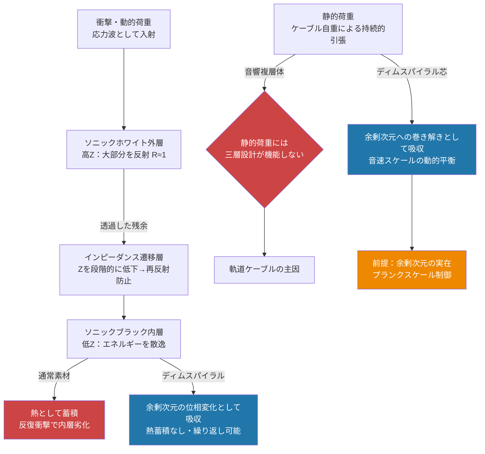

## 1. 概要 (Abstract)

[GEOネックレス（wiim_105）](wiim_105.md)は、スペースエレベーターの素材強度問題を「構造の工夫」で回避しようとした思考実験だった。複数の静止衛星をカテナリー網で結び、荷重を分散し、間欠展開でエネルギーを節約する——しかし記事の末尾に一つの壁が残った。**ラジアルケーブルの最下部には、従来のスペースエレベーターと同等の素材強度が依然として要求される。**

> **前提:** 素材強度の壁を「設計」ではなく「素材そのもの」の性質を変えることで乗り越えられるとする。  
> **命題:** 「もし余剰次元への巻き付き構造で断裂機構を無効化する素材（ディムスパイラル）と、音響設計で衝撃を吸収・分散する複合構造（音響複層体）を組み合わせたなら、軌道ケーブルの素材限界を突破できるか？」

二つのアプローチは互いに異なる前提に立つ。ディムスパイラルは余剰次元の実在を必要とする架空素材だ。音響複層体は余剰次元を必要とせず、自然界がすでに真珠層・骨・シャコの捕脚に実装している原理だ。この二者を組み合わせると、一方の弱点を他方が補う構造が現れる——しかし同時に、前提条件の積み重ねも増えていく。

---

## 2. 実現不可能性の根拠 (Infeasibility Rationale)

### ディムスパイラル（余剰次元可塑体）への三観点

- **物理的限界：余剰次元の未実証**  
  ディムスパイラルの動作原理は、カルツァ＝クライン理論・弦理論的な余剰次元がコンパクト化されて実在することを前提とする。素材の構造がその余剰次元に「巻き付いている」ことで、三次元空間内での断裂が位相変化として吸収される仕組みだ。しかし余剰次元はLHCがTeVスケールの衝突実験を重ねても実験的証拠を得ていない。コンパクト化されているとすればプランクスケール（10⁻³⁵ m）付近に閉じており、素材工学がアクセスできる領域ではない。

- **技術的限界：巻き付き数の製造・検証不能**  
  量子場理論での「巻き付き数」は理論上の位相的不変量であり、通常の素材設計の変数ではない。どの製造プロセスが余剰次元への巻き付き構造を生み出すか、生み出した後にそれを検証する手段があるか——どちらも未知だ。フラックスチューブ（グルーオンが形成する色閉じ込めの管）は類似の位相保護を10⁻¹⁵ mスケールで実装しているが、これを巨視的ケーブルへ拡張する経路は理論的にも存在しない。

- **論理的限界：量子トンネリングによる有限寿命**  
  「宇宙年齢を超える時定数」は永続保護ではなく確率的制限だ。インスタントン作用 S が巨大な場合のトンネリング確率は e⁻ˢ で抑制されるが、長期間・低温環境では確率が積み重なる。さらに音速制限は別の問題を生む——巻き解き前線が音速で走ることは、軌道上の熱サイクルや微小隕石衝突による振動が音速スケールで巻き付き構造に蓄積するという逆説的な疲労経路を意味する。

### 音響複層体への三観点

- **物理的限界：静的荷重への無力**  
  音響インピーダンス差による反射と吸収は、動的な応力波（衝撃・振動・音）に対して機能する。しかしケーブル自重による連続的な引張力は「波」ではなく「状態」だ。静的張力の前では高インピーダンス外層も低インピーダンス内層も区別がなく、三層設計は意味を持たない。軌道エレベーターの破断を引き起こす主因は動的衝撃よりこの静的荷重であり、音響複層体はその根本を解決しない。

- **技術的限界：内層の熱蓄積限界**  
  内層（ソニックブラック）が通常素材の場合、吸収した衝撃エネルギーはすべて熱として蓄積する。軌道上は放射冷却しかなく、反復衝撃が続けば内層の温度は上昇し、粘弾性フォームや吸音ポリマーは劣化・崩壊する。ソニックブラックをディムスパイラルで構成すれば吸収エネルギーが余剰次元の位相変化として消費され熱蓄積が消えるが、これはディムスパイラルの未実証問題を再び呼び込む。

- **論理的限界：スケールの絶壁**  
  真珠層は10 nmスケールの炭酸カルシウム板が数億枚、タンパク質層と交互に自己組立された結果として鋼鉄の約3000倍の靭性を実現する。骨もシャコの捕脚も同様に、ナノ〜マイクロスケールの精密構造が生体合成によって形成されている。軌道エレベーターケーブルは10⁷ mスケール——この長さにわたってナノ精度の三層構造を均質に製造・展開する技術は、現在の製造能力の延長線上にない。

---

## 3. 実験の設定 (Setup)

1. **ディムスパイラル単芯ケーブル**  
   余剰次元への巻き付き数 n ≥ 1 を持つと仮定した単芯ケーブル。軌道環境（紫外線・荷電粒子・熱サイクル−160℃〜+120℃）に長期間さらしても巻き付き構造が維持されるかどうかを第一の試験項目とする。静的荷重での伸び率と、衝撃荷重での応答が通常素材とどう異なるかを比較する。

2. **音響複層体ケーブル（通常素材版）**  
   ソニックホワイト外皮（高剛性・高密度セラミック複合材、Z₂ ≫ Z₁）→ インピーダンス遷移層（密度・弾性率をグラデーションさせたポリマー複合材）→ ソニックブラック内芯（粘弾性フォームまたは音響ブラックホール構造）の三層構造。静的荷重試験と動的衝撃試験を分離評価し、どちらが先に限界に達するかを観察する。

3. **複合構造（ディムスパイラル芯 ＋ 音響複層体外皮）**  
   ソニックホワイト外皮 → インピーダンス遷移層 → ソニックブラック兼ディムスパイラル内芯の三層構造。静的荷重はディムスパイラル内芯が余剰次元を介して吸収し、動的衝撃はソニックホワイト＋遷移層が反射・段階吸収し残余を内芯が処理する役割分担を想定する。

4. **地上スケール実証（音響複層体のみ）**  
   音響複層体設計は通常物理で成立するため地上検証が可能だ。真珠層を模倣したアラゴナイト／ポリマー交互積層体（ナクレオイド構造）のミリ〜センチスケール試験を起点に、スケール則を測定する。大型化するにつれて自重が増し、静的荷重下での性能劣化がどの長さから顕在化するかが実用化の判断基準になる。

---

## 4. 考察と予測 (Speculation)

最も注目すべきは「二つのアプローチが互いの弱点を補完する構造になっている」点だ。

ディムスパイラルは静的荷重を余剰次元への位相変化として吸収できる——これがまさに軌道ケーブルの主要破断原因への直接的な答えだ。ただし「余剰次元に吸収される」は問題の消滅ではなく先送りだ。吸収されたエネルギーは余剰次元のコンパクト化構造に蓄積し、長期的にはコンパクト化半径を変化させる可能性がある。それは素材の物性変化として三次元側に現れるため、真の意味で問題を解消するわけではない。しかしその前提はそもそも「余剰次元が実在し、素材レベルでアクセスできること」という形而上学的な壁の裏側にある。音響複層体は余剰次元なしに地上で今日から試験できる——しかし解けるのは動的荷重であって静的荷重ではない。どちらか一方だけでは半分しか問題が解けない。

両者を組み合わせた複合構造（ディムスパイラル芯 ＋ 音響複層体外皮）は、静的荷重と動的荷重の双方に対処できる理論上最も整合的な設計だ。その代わり「余剰次元の実在」「巻き付き構造の製造」「ナノ精度の三層構造を10⁷ mにわたって均質に展開」という前提を同時に満たす必要がある。

「自然界が先行実装している」という観察は、アーキテクチャの正しさを支持する強い証拠だ。しかし自然界の実装は「自己組立」によって達成されており、人工的な製造とは根本的に異なる経路をたどる。真珠層は貝が数年かけてタンパク質鋳型上にナノ板を一枚ずつ積み重ねる。人工ケーブルにそのような時間と精度を持つ自己組立メカニズムが存在しないなかで、スケールの絶壁は単なる工学的課題ではなく原理的な問いになる。

二つのアプローチは「不可能性の形を変える」素材戦略だ。従来の不可能性「十分に強い素材が存在しない」は「余剰次元が実在しない／均質な大スケール製造ができない」という別の不可能性に変換される。問題は消えず、より精密な形に結晶化する——このことがこの思考実験の到達点だ。

---

## 5. 数式による表現 (Mathematical Notation)

音響インピーダンス Z と境界面での反射係数 R の関係は音響複層体設計の核心だ。

$$Z = \rho \cdot c \qquad R = \frac{Z_2 - Z_1}{Z_2 + Z_1}$$

ρ は密度、c は音速。Z₂ ≫ Z₁（ソニックホワイト外皮）では R ≈ +1（ほぼ完全反射）、Z₂ = Z₁ では R = 0（完全透過）。遷移層は Z を段階的に変化させることで各界面の R を 0 に近づけ、入射エネルギーを反射させず内層まで「なだらかに」送り込む。エネルギーが内層に到達してから熱または余剰次元位相変化として散逸するのが設計の要点だ。

---

## 6. 図解 (Diagrams)

---

## 7. 関連記事 (Related)

- [GEOネックレス（wiim_105）](wiim_105.md) — 本記事の前提となる構造的アプローチ
- [切れないエネルギー紐（wiim_021）](wiim_021.md) — 巻き付き構造の先行概念
- [ディムスパイラル g437](../../glossary/terms/g437.md) — 余剰次元可塑体
- [音響複層体 g438](../../glossary/terms/g438.md) — 三層複合素材設計
- [ソニックホワイト g439](../../glossary/terms/g439.md) — 高音響インピーダンス外層
- [ソニックブラック g440](../../glossary/terms/g440.md) — 高音響吸収内層
