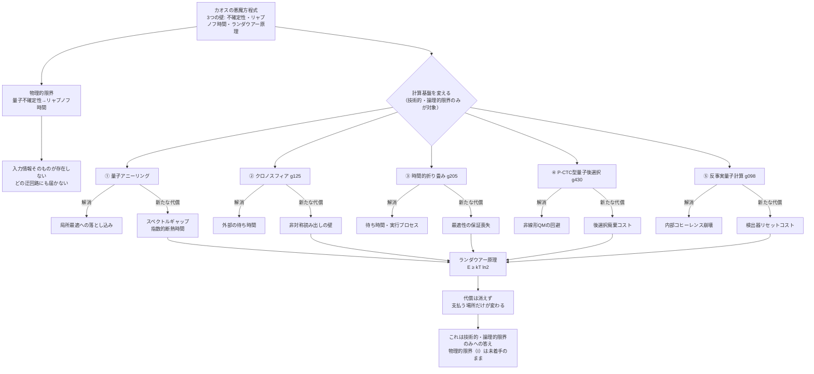

## 概要

カオスの悪魔の方程式（wiim_052）は、量子不確定性・リャプノフ時間・ランダウアー原理という三つの壁に阻まれ、確率100%には収束しない漸近線として描かれた。この壁は「計算の精度を上げる」方向の努力では越えられないとすでに示されている。

ならば計算の精度ではなく、**計算の基盤そのもの**——古典コンピュータから量子コンピュータへ、平坦な時空から歪んだ時空へ、一方向の時間から閉じたループへ——を取り替えれば、壁を迂回できるのではないか。本記事ではこの問いを五つの具体的な迂回路に分けて検証する。結論を先に言えば、すべての迂回路は壁を消すのではなく、壁を**別の場所に移し替える**だけだという同型の構造に行き着くと考えられる。

## 実現不可能性の根拠

### 物理的限界——揺らぎの源を変えても揺らぎは消えない

古典的な焼きなまし法（アニーリング, g449）は、温度という熱的揺らぎでエネルギーの谷から谷へ飛び越え、大域最適解に近づく。量子アニーリングはこの熱揺らぎを量子トンネリングに置き換え、エネルギー障壁を直接貫通することで同じ目的を達成しようとする。

しかしどちらの方式も、厳密な大域最適解への到達を保証するには現実的でない代償を要求する。古典焼きなまし法は対数的に遅い冷却スケジュール（ゲーマン＝ゲーマンの条件）を必要とし、量子アニーリングは基底状態とのエネルギー差（スペクトルギャップ）が小さい難問題ほど指数的に長い断熱時間を必要とする。揺らぎの源を熱から量子に取り替えても、組合せ最適化に内在する計算複雑性そのものは消えず、形を変えて残る。

### 技術的限界——時空を歪めても読み出しの壁が立つ

クロノスフィア（g125）のように内部時間を外部より速く進める空間を使えば、量子アニーリングが必要とする指数的に長い固有時間を、外部の実験者にとっては短時間に圧縮できる。これは「待ち時間」という別の制約を解消する点で意義がある。

だがクロノスフィアは「入れるが（ほぼ）出られない」非対称な自己封鎖構造を持つ（g125）。計算結果を外部へ読み出す段階で、入射時には存在しなかった同種の壁——出射方向への強い抑制——が新たに立ち上がる。さらに、時間加速を生む高速回転シェルの極端な電磁場環境は、量子ビットのコヒーレンスを保つための静かな環境と正反対の要求をする。時間という制約を解いた代償が、空間の境界面に移転しているにすぎない。

### 論理的限界——時間そのものを操作しても答えの正しさは保証されない

時間的折り畳み——ワームホール（g036）の時間方向版——を使えば、計算結果を未来から現在へ転送できるかもしれない。これが矛盾を起こさないことは、ノビコフ自己整合性条件（g205）がすでに保証している——閉じた時間的曲線を通る軌跡は、自己整合的でありさえすれば許される。

しかし自己整合性は**正しさ**を保証しない。アニーリングの最適化問題に複数の局所最適解（自己整合的に成立しうる固定点）が存在する場合、ループはそのどれかに収まるだけで、大域最適解である保証はない。これを解消するDeutsch型の閉じた時間的曲線モデルは、量子力学を非線形に拡張するという、量子力学の基礎そのものに踏み込む代償を払う。一方、量子後選択（g430）に基づく線形なP-CTC型モデルは量子力学の枠内に留まるが、計算能力はPSPACE（多項式時間より強力な、解の検証に膨大な記憶領域を要する問題群の複雑性クラス）には届かず、後選択に失敗した分岐の廃棄コストがランダウアー消去コストとして系全体のエントロピー収支に戻ってくる（g430）。

最後の迂回路——反事実量子計算は、量子ゼノン効果（g098）を使って「計算が走らなかったこと」自体に答えを符号化し、計算機内部のコヒーレンスを崩さずに済ませる。しかし干渉パターンから答えを読み出すには十分な試行回数の蓄積と、干渉計出口での通常の確定測定が必要であり、その検出器をリセットする際にランダウアー原理（g172）のコストが必ず発生する。

五つの迂回路はそれぞれ異なる物理的・技術的・論理的な壁を立てたが、最終的に行き着く先は同じ一点——情報を確定させる行為には必ずエネルギーの代償が伴うというランダウアー原理——だったと考えられる。

## 実験の設定

カオスの悪魔の方程式が突破しようとする壁を、五つの計算基盤で迂回しようとする思考実験を設定する。

| 迂回路 | 揺らぎ・操作の手段 | 解消する制約 | 新たに生じる代償 |
|---|---|---|---|
| ① 量子アニーリング | 熱揺らぎ→量子トンネリング | 局所最適への落とし込み | スペクトルギャップに依存する指数的断熱時間 |
| ② クロノスフィア（g125） | 内部・外部の時間比率の操作 | 外部観測者の待ち時間 | 非対称構造による読み出しの壁・コヒーレンス環境の相克 |
| ③ 時間的折り畳み（ノビコフ型, g205） | 閉じた時間的曲線・自己整合性 | 待ち時間・計算プロセスの実行そのもの | 最適性の保証の喪失（複数固定点の不定性） |
| ④ P-CTC型量子後選択（g430） | 波動関数の重ね合わせ＋後選択 | Deutsch型の非線形拡張という代償 | 後選択失敗分の廃棄コスト（ランダウアー消去） |
| ⑤ 反事実量子計算（量子ゼノン効果, g098） | 「走らなかったこと」を答えとして符号化 | 計算機内部のコヒーレンス崩壊 | 干渉計出口での確定測定・検出器リセットコスト |

各迂回路は前段の代償を一つずつ消すが、新しい代償を必ず生み出す。代償の総量を追跡すると、最終的にすべての経路がランダウアー原理に帰着する。

## 考察と予測

### 代償保存則という仮説

この五段階の構造は、「計算手段や時空構造をどれだけ取り替えても、情報を確定させる代償の総量は変わらない」という一種の保存則を示唆しているのかもしれない。エネルギー保存則や情報保存則（ユニタリ性）と同じ階層に位置する、いわば「決定の代償の保存則」と呼べるものだ。

カオスの悪魔方程式（wiim_052）が「収束しない漸近線」として描かれたのは、特定の計算手段（古典的シミュレーション）の限界ではなく、この保存則そのものの反映だったのかもしれない。計算基盤を量子コンピュータに、時空をクロノスフィアに、因果構造をループに取り替えても、悪魔は依然として漸近線のままだろうと考えられる。

### 唯一の自由度——代償を「いつ」「どこで」払うか

五つの迂回路に共通するのは、代償を消すことはできないが、**代償を払うタイミングと場所を選ぶことはできる**という点だ。計算中に払うか、読み出し時に払うか、検出器のリセット時に払うか——カオスの悪魔方程式の真の「進化」は、確率100%への到達ではなく、この代償の支払いタイミングを工学的に最適化する方向にあるのかもしれない。

対消滅工学（wiim_052）でランダウアー消去コストを衝突の瞬間に即座に局所で払うのではなく、反事実計算のように検出器のリセットまで先送りできれば、衝突そのものは系を乱さずに済む。代償の総量は変わらないが、**いつ・どこで乱すか**を選べることには工学的な価値があると考えられる。

### 漸近線の形は変わる

それでも、迂回路ごとに「漸近線への近づき方」は変わる。量子アニーリングは多項式的に、P-CTC型は確率的多項式時間（PP）の範囲で、Deutsch型は（量子力学の書き換えを許せば）PSPACEまで近づける。代償の総量が保存されても、**単位代償あたりに得られる確率向上の効率**は手段によって異なる——これが、カオスの悪魔方程式の「自己進化」（wiim_052）が本当に向かうべき最適化対象なのかもしれない。

### 五つの迂回路が触れていなかった壁

ここで一つ、五つの迂回路すべてに共通する限界を指摘しておく必要がある。カオスの悪魔方程式（wiim_052）が抱える三つの壁——物理的限界（量子不確定性→リャプノフ時間）・技術的限界（計算量の指数爆発）・論理的限界（自己参照・ランダウアー原理）——のうち、本記事で検証した五つの迂回路が対象としていたのは、**技術的限界と論理的限界の二つだけ**だったと考えられる。これらは計算資源の確保や代償の支払いタイミングに関わる問いであり、計算基盤や時空構造を変えることで原理的に交渉の余地がある領域だ。

しかし物理的限界——量子不確定性に起因するリャプノフ時間の壁——は、計算資源の不足が原因ではない。初期条件を無限精度で取得することがハイゼンベルクの不確定性原理によって禁じられており、カオス系の指数的な誤差増幅（バタフライ効果, g178）が、残された有限精度をどれだけ小さくしても無に帰してしまう。これは「もっと強力な計算機」や「もっと巧妙な時空構造」では一切埋まらない——**入力情報そのものが、宇宙のどこにも存在しない**ためだ。

つまり五つの迂回路は、カオスの悪魔方程式が抱える三つの壁のうち、最も根本的な一つには最初から無関係だったことになる。計算手段をどれだけ洗練させても、量子不確定性が課す情報の不可到達性という壁の手前で、カオスの悪魔は依然として漸近線のままだろうと考えられる。

## 数式による表現

ランダウアー原理が課す、情報消去1ビットあたりの最小エネルギーは次式で与えられる。

$$E \geq kT\ln 2$$

五つの迂回路がどれだけ計算手段を変えても、消去される情報量に比例したこの下限そのものは変わらない。迂回路の工夫は、この下限を払うタイミングと場所をずらすことに尽きると考えられる。

## 図解

## 関連記事

- [wiim_052](wiim_052.md) — カオスを制御するカオスの悪魔の方程式——確率的粒子誘導と対消滅工学の限界
- 用語: アニーリング g449 / クロノスフィア g125 / ノビコフ自己整合性条件 g205 / 量子後選択 g430 / 量子ゼノン効果 g098 / ランダウアー原理 g172 / カオスの悪魔 g210 / ワームホール g036 / 因果律 g017
- [tech_tree_entropy](../notes/tech_tree_entropy.md) — tech_tree_entropy.md
- [wiim_110](wiim_110.md) — カオスの悪魔を出し抜く別の四路線——軌道を捨てる数学的アプローチ

