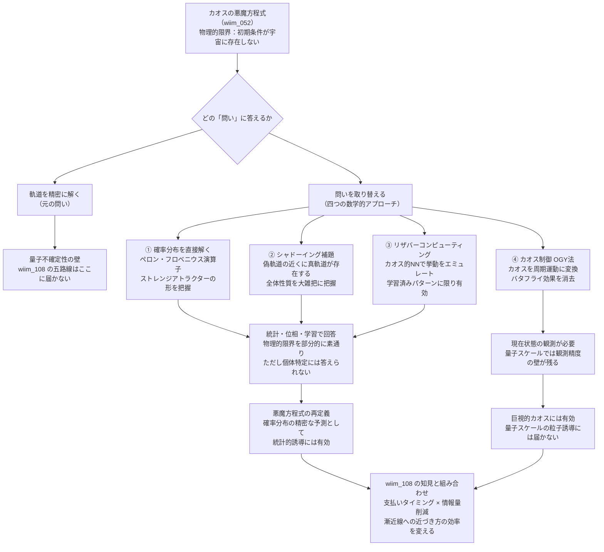

## 概要

カオスの悪魔を出し抜く五つの抜け道（wiim_108）は、量子コンピュータ・クロノスフィア・閉じた時間的曲線といった「計算基盤を取り替える」五路線を検証し、すべてランダウアー原理に帰着するという結論を出した。特に物理的限界——量子不確定性に起因する初期条件の不可到達性——については「入力情報そのものが宇宙のどこにも存在しない」ため、どの迂回路にも届かないとされた。

しかし、この結論には重要な前提が埋め込まれている。「カオスの悪魔方程式（wiim_052）が答えようとしている問いは、軌道を精密にシミュレートすることで達成される」という前提だ。もし問いそのものを取り替えるなら——軌道の精密な追跡を諦め、カオスの振る舞いに対して別の問いを立てるなら——その前提ごと外れる。

本記事では、この方向を四つの数学的アプローチで検証する。ただし結論を先取りすれば、問いの転換は物理的限界の一部を素通りできるが、カオスの悪魔方程式が本来目指していた「特定粒子の確率的誘導」という目標に対しては、依然として答えきれない部分が残る。

## 実現不可能性の根拠

### 物理的限界——問いを変えても標的の問題は残る

四つのアプローチのうち①②③は「確率分布の形を知る」「全体的な性質を把握する」という問いに答えるものであり、ハイゼンベルクの不確定性原理が禁じているのは「正確な軌道」であって「統計分布の形」ではない。この意味で、これらのアプローチは wiim_108 の五路線が届かなかった物理的限界を部分的に素通りできると考えられる。

しかし「素通りできる」のは「統計的な問い」の範囲内に限られる。カオスの悪魔方程式の工学的目標——パランティ粒子（g161）やパラポジ粒子（g209）との衝突確率を引き上げ、特定の粒子を狙い撃ちで誘導する——には、個々の粒子の位置や運動量に関する情報が最終的に必要になる。確率分布は「どの領域に粒子が多く存在するか」を教えてくれるが、「今この瞬間にあの粒子がどこにいるか」は答えられない。統計的な精度と個体的な精度の間には、埋めることのできない溝がある。

④のカオス制御（OGY法）は性格が異なる。カオスそのものを消去するため、バタフライ効果を無効化してしまう逆転のアプローチだ。しかし制御信号を最適なタイミングで与えるには、現在の系の状態を正確に観測しなければならない。量子スケールの粒子誘導を対象とする場合、その観測行為自体にハイゼンベルクの壁が立つ。

### 技術的限界——「問いを変える」コストは移転するだけ

①のペロン・フロベニウス演算子アプローチは、軌道の精密な計算を確率分布の計算に置き換える。ところが、高次元のカオス系に対してこの演算子を厳密に解くこと自体が、計算複雑性の観点では軌道を解くのと同程度かそれ以上に困難になりうる。特に、対象とする粒子誘導が高次元の相空間を扱う場合、計算コストの削減は保証されない。

②のシャドーイング補題は「本物の軌道が近くに必ず存在する」というトポロジー的な存在定理であり、具体的な軌道を構成的に与えるものではない。厳密には双曲的な構造を持つカオス系（一様双曲系）に対して保証された定理であり、一般のカオス系への適用は系の性質に依存する。存在を保証するだけで、それを見つけ出すための計算コストは別途かかる。

③のリザバーコンピューティングは学習データを必要とする。これまで観測したことのない初期条件や、過去に見たことのないカオス挙動に対しては学習済みのパターンが通用しない。未知の状況に対する一般化能力には上限がある。

### 論理的限界——問いの転換は悪魔の目標を変える

四つのアプローチは「カオスを扱う難しさ」を解決するが、カオスの悪魔方程式（wiim_052）が目的としていた問いを解決するわけではない。統計分布を知ることは、平均的な振る舞いを制御する上では強力だが、対消滅工学が要求する「特定粒子を特定の時空点に誘導する」という精度要件には答えが届かない。

問いを変えた瞬間、「カオスの悪魔を出し抜いた」のではなく「カオスの悪魔が答えようとしていた問いを別の問いに差し替えた」ことになる。これは有用な転換ではあるが、悪魔の本来の限界を取り除いたとは言えない。

## 実験の設定

カオスの悪魔方程式への四つの数学的アプローチを、解消する制約・残る制約・物理的限界（初期条件不可到達性）への到達可否という軸で整理する。

| アプローチ | 手段 | 解消する制約 | 残る制約 | 物理的限界を素通りするか |
|---|---|---|---|---|
| ① 確率分布（不変測度）を直接解く | ペロン・フロベニウス演算子・フォッカー・プランク方程式 | 正確な軌道の追跡が不要 | 個体特定には答えられない・高次元系では計算コスト巨大 | 統計的な問いの範囲内では○ |
| ② シャドーイング補題 | 偽軌道の近くに真の軌道が必ず存在するという位相幾何学的保証 | 数値誤差を積み上げた計算でも全体性質を捉えられる | 存在定理であり構成的でない・軌道の発見コストは別途必要 | △（軌道を求めない問いには有効、求める問いには届かない） |
| ③ リザバーコンピューティング | カオス的ニューラルネットワークにパターンを学習させ未来挙動をエミュレート | ステップごとの数式計算が不要 | 学習データの外側は予測できない・一般化能力に上限 | △（既知パターンには有効） |
| ④ カオス制御（OGY法） | 不安定周期軌道に微小制御信号を与えカオスを周期運動に変える | バタフライ効果そのものを消去 | 制御に必要な現在状態の観測精度が量子スケールで要求される | ×（観測精度の問題が残る） |

## 考察と予測

### 代償情報量の削減という別の回避戦略

wiim_108 は「情報を確定させる代償の総量は変わらない」という代償保存則仮説を提示した。四つの数学的アプローチが示唆するのは、これへの別方向の切り返しだ——「確定させなければならない情報量そのものを削減する」という戦略である。

軌道を追う場合、すべての時刻における位相空間の座標を確定させなければならない。確率分布を解く場合、確定させるのはマクロな形状だけであり、個々の座標は不問にできる。確定させる情報量が減れば、それに対応するランダウアーコストも減る。代償の総量が変わらないのは「同じ問いを解く別の手段を使う場合」であり、「問いの情報量そのものが少ない場合」は話が別かもしれない。

ただし、カオスの悪魔方程式が最終的に要求する「粒子誘導」という問いに戻った瞬間、確定させなければならない情報量は元の水準に戻る。削減できるのは中間過程の情報量であって、最終目標の情報要件ではない。

### 三つのアプローチが開く可能性——悪魔方程式の再定義

カオスの悪魔方程式（g210）はその body で「確率分布の精密な予測として定義し直すと可能性が開く」と述べている。この再定義を受け入れるなら、①②③は強力な実装候補となる。ストレンジアトラクターの統計的な形を正確に把握し、高確率領域を特定し、エントロピーの流れを統計的に誘導する——これは対消滅工学において「全打数を増やして確率を稼ぐ」アプローチの精度向上として意義がある。

特定の粒子を狙うのではなく、「粒子が多く存在する領域に誘導スポットを集中配置する」設計に転換すれば、確率分布の精度が直接工学的性能に結びつく。これはカオスの悪魔の「100%未満という漸近線」を変えるものではないが、漸近線への近づき方の効率を変える可能性がある。

### wiim_108 との関係——補完関係にある二系統

五つの迂回路（wiim_108）と四つの数学的アプローチは対立するものではなく、補完関係にある。前者は「どの計算基盤を使うか」という問いへの探索であり、後者は「何を計算するか」という問いへの探索だ。

代償の支払いタイミングを工学的に最適化する（wiim_108 の洞察）という方向と、確定させる情報量そのものを目標に応じて最小化する（本記事の洞察）という方向を組み合わせることで、カオスの悪魔方程式が対消滅工学に貢献できる範囲は広がると考えられる。その上限がどこにあるかは、wiim_108 と本記事が共に「漸近線の形」と呼んでいるものだ。

## 図解

## 関連記事

- [wiim_052](wiim_052.md) — カオスを制御するカオスの悪魔の方程式——確率的粒子誘導と対消滅工学の限界
- [wiim_108](wiim_108.md) — カオスの悪魔を出し抜く五つの抜け道——ランダウアー原理はどこまで先送りできるか
- [wiim_054](wiim_054.md) — カオスの創発文法——秩序パラメータ操作と問いの転換
- 用語: カオスの悪魔 g210 / バタフライ効果 g178 / カオス系 g179 / ランダウアー原理 g172 / パランティ粒子 g161 / パラポジ粒子 g209
- [tech_tree_entropy](../notes/tech_tree_entropy.md) — tech_tree_entropy.md

