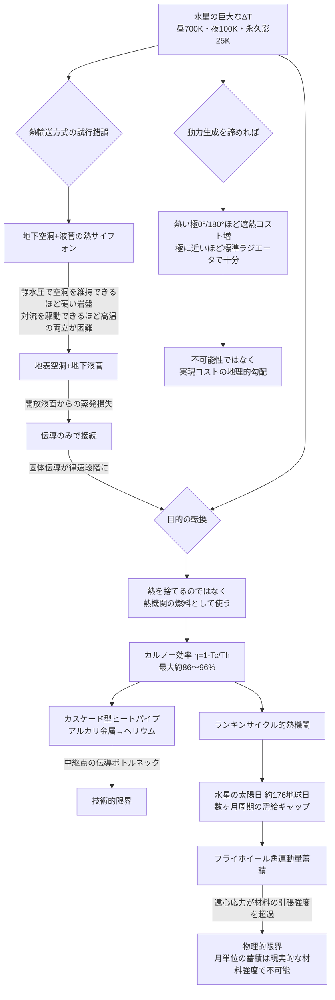

## 1. 概要 (Abstract)

水星は3:2のスピン軌道共鳴により、太陽日（日の出から次の日の出まで）が約176地球日という極端な長さを持つ。受光面は最高で約700 K、夜側や極域の永久影クレーターは約100 K、深い影では約25 Kまで下がることが観測されている。

この巨大な温度差（ΔT）を「どう冷やすか」ではなく「どう動力に変えるか」という問いに転換したらどうなるか、という思考実験である。

> **前提:** 水星表面に、昼側の高熱を集めて低温側へ効率よく輸送する巨大インフラを建設できると仮定する。
> **命題:** 「もしそのインフラを単なる放熱装置ではなく熱機関として設計し、水星の異様に長い自転周期に見合うエネルギー貯蔵手段と組み合わせたら、何が実現するか？」

---

## 2. 実現不可能性の根拠 (Infeasibility Rationale)

- **物理的限界:** 水星の太陽日（約176地球日）は、灼熱期と極寒期がそれぞれ数ヶ月続くことを意味する。この需給ギャップを均すために提案するフライホイール式の角運動量蓄積は、月単位のエネルギーを保持しようとすると天文学的な慣性モーメントか回転数を必要とする。フライホイールの限界は材料の引張強度で決まり、実在の最先端フライホイール蓄電技術でも数分から数時間分のエネルギー蓄積が限度である。月単位の蓄積は、現実的などんな材料強度をもってしても到達し得ない領域にある。
- **技術的限界:** 温度域をカバーするために高温区間と低温区間で異なる作動流体を中継する「カスケード型ヒートパイプ」が必要になるが、中継点（境界面）では固体伝導に頼らざるを得ず、対流・相変化に比べて桁違いに遅い伝導がボトルネックになる。効率よく熱を集めたはずの系全体が、最後の接続部分で律速されてしまう。
- **論理的限界:** 熱輸送経路として最初に検討される「地下空洞＋液菅の熱サイフォン」方式は、静水圧に耐えて空洞を維持できるほど岩盤が硬い条件と、対流を駆動できるほど内部が高温である条件が両立しにくいという自己矛盾を抱える。「地表に空洞・地下に液菅」という改良案も、開放液面からの作動流体の蒸発損失か、伝導ボトルネックの再発のどちらかに行き着き、根本的な解決にはならない。

---

## 3. 実験の設定 (Setup)

1. **舞台:** 水星表面。受光面（最高約700 K）と夜側・極域永久影クレーター（約100 K、深い影で約25 K）
2. **輸送インフラ:** 高温区間はアルカリ金属（ナトリウム等）ヒートパイプ、低温区間は液体ヘリウムを用いるカスケード型ヒートパイプ網
3. **動力変換:** 集めた熱でランキンサイクル的な熱機関を駆動し、蒸気（作動流体の膨張）でタービンを回転させる
4. **蓄積:** タービンの回転運動を電力に変換せず、そのまま巨大フライホイールに角運動量として蓄積し、数ヶ月周期の需給変動を吸収する

---

## 4. 考察と予測 (Speculation)

### 設計の試行錯誤

最初に検討されるのは地下に空洞を掘り、液体を循環させる熱サイフォン方式である。しかし地下深部は岩石静水圧が急増するため、対流を駆動できるほど高温な場所ほど、空洞を維持できるほど岩盤が硬くない。空洞を地表に移し、地下は満たされた液菅にする改良案は、静水圧の問題こそ解消するが、地表の開放液面が真空や希薄大気に露出することで作動流体を失う。液を直接つなげず伝導だけで熱を渡す設計に切り替えても、今度は固体伝導そのものの遅さが系全体を律速する。

この試行錯誤が示すのは、輸送方式をどれだけ工夫しても「熱をどこかに捨てるためだけの装置」という設計目標そのものが、水星という舞台には見合っていないということだ。

### 「捨てる」から「使う」への転換

水星のΔTをカルノー効率に換算すると、

$$\eta = 1 - \frac{T_c}{T_h}$$

受光面（$T_h \approx 700\,\mathrm{K}$）と夜側（$T_c \approx 100\,\mathrm{K}$）の組み合わせで約86%、極域永久影クレーター（$T_c \approx 25\,\mathrm{K}$）まで低温側を伸ばせば約96%という、理論上は太陽系内でも屈指の高効率が見積もられる。この数字は、熱を「捨てる」のではなく熱機関の燃料として「使う」動機になる。放熱は、熱機関が原理的に排出せざるを得ない排熱という副産物の位置づけに変わり、「なぜそこまでして冷やすのか」という問い自体が消える。

### 水星の自転が要求する蓄積手段

地球上の発電インフラであれば、需要と供給のギャップは数時間から長くとも数日単位で調整すれば足りる。しかし水星の太陽日は約176地球日で、灼熱期・極寒期がそれぞれ数ヶ月続く。この超長周期の変動を化学電池や熱容量による蓄熱で吸収しようとすると、必要な蓄積量は非現実的な規模になる。

ここで着目したいのが、熱機関のタービンが生み出す回転運動をそのままフライホイールに角運動量として蓄積するという発想である。電力への変換を挟まないぶん変換損失を避けられ、機械的な貯蔵という点で数ヶ月スケールの緩衝材として理にかなっているように見える。

### なぜ実現しないか

しかし、この発想の魅力はそのまま限界の鋭さに直結する。フライホイールに蓄えられるエネルギーは回転体の慣性モーメントと角速度の2乗に比例するが、回転体を高速化するほど遠心応力が増大し、材料の引張強度が上限を決める。実在の最先端フライホイール蓄電システムでも、実用的な蓄積時間は数分から数時間が限度であり、月単位のエネルギーを蓄えようとすれば、現実的などんな高強度材料を仮定しても遠心応力に耐えられない。

つまり水星の熱をカルノー効率の恩恵を受けて動力化することそのものは理にかなっているが、その動力を水星の自転周期という時間スケールに合わせて貯蔵する手段が、材料強度という物理的な壁に突き当たる。「熱の輸送」という当初の問題は「熱機関」への転換で解消されたが、「エネルギーの貯蔵」という新しい問題が、その転換の代償として生まれたことになる。

### 動力生成を諦めれば——不可能性から実現コストの勾配へ

ここまでの検討はすべて「熱を動力に変える」という目的を前提にしていた。この前提を外し、単に居住や機械稼働に必要な熱を処理するだけで良いなら、話は大きく変わる。

水星は3:2のスピン軌道共鳴と大きな軌道離心率（約0.206）により、近日点で常に同じ経度（0°・180°、「熱い極」と呼ばれる）が太陽直下になり最高約700Kに達する一方、90°・270°経度（「温かい極」）は遠日点側で太陽直下になるためピーク温度はより低い（約550〜600K程度）。緯度が上がるにつれて温度は下がるが、平衡温度はステファン＝ボルツマン則の4乗根で決まるためその下がり方は緩やかで、劇的に冷えるのは極のごく近傍に限られる。

しかしこの温度分布のどこを取っても、実は「不可能」ではないことが実例からわかる。メッセンジャー・ベピコロンボは水星近傍の全緯度・全経度を航行・観測しており、熱い極直下の最悪条件（約700K）ですら専用サンシールドと標準的なラジエータで実際に乗り切っている。つまり純粋な熱管理という条件だけで見れば、水星表面のほぼ全域は「不可能」ではなく、必要な遮熱・放熱設備の質量が場所によって連続的に変わるだけだと考えられる。熱い極の周辺ほど遮熱質量・ラジエータ面積のコストが跳ね上がり、極付近ほど軽装備で済むという勾配であり、明確な「ここから先は不可能」という境界線は引きにくい。

動力生成というカルノー効率の恩恵を求めた瞬間に、フライホイールという明確な不可能性の壁が現れる。しかし恩恵を求めず熱を処理するだけなら、水星の居住可能性は不可能性の問題ではなく実現コストの地理的勾配の問題に変わる——同じ天体を舞台にしていても、目的が変わるだけで「不可能」の中身がまるごと入れ替わるという、この思考実験全体を通じて繰り返し現れたパターンがここでも成立する。

### 哲学的な問い

- 一つの技術的制約（熱輸送の非効率）を解消するために目的そのものを転換する（冷却から発電へ）というアプローチは、他の「実現不可能」な思考実験にも応用できる一般的な戦略ではないか
- 数ヶ月単位でしか電力を使えない文明は、地球由来の「常時稼働」を前提とした技術体系とどう折り合いをつけるのか
- 「不可能」と「単にコストが高い」の境界はどこにあるのか。フライホイールの材料強度は物理法則そのものの壁だが、居住コストの勾配は技術と予算の問題にすぎない——この2種類の限界を同じ「実現不可能性」という言葉で語ってよいのか

---

## 5. 図解 (Diagrams)

---

## 6. 関連記事 (Related)

- [wiim_019](wiim_019.md) — 居住しない惑星——エネルギー用途のテラフォーミング
- [wiim_106](wiim_106.md) — 切れない紐と砕けない壁——ディムスパイラルと音響複層体は軌道ケーブルの素材限界を突破できるか
- [wiim_105](wiim_105.md) — GEOネックレス——カテナリー・ラジアル静止軌道帯は宇宙アクセスインフラとして成立するか
- [_space_thermal_radiation](../notes/space_thermal_radiation.md) — 宇宙空間・真空における放熱技術（補遺ノート）
