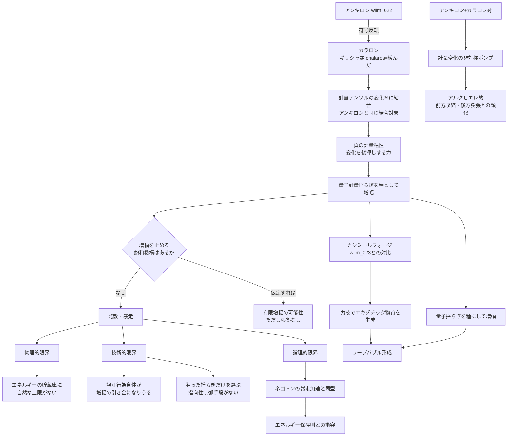

## 概要 (Abstract)

時空の「硬さ」を表すアインシュタイン方程式右辺の係数は途方もなく大きい。この硬さを局所的に和らげる現実の理論的候補としては、重力定数を一定値ではなく場の値として扱うスカラー・テンソル重力理論（ブランス=ディッケ理論やカメレオン場）が挙げられるが、太陽系規模の精密観測によって局所的な変動はすでに強く制限されており、等価原理との衝突も避けられない。

この思考実験は、時空の「硬さ」そのものを変えるのではなく、既存の架空粒子アンキロン（[wiim_022](wiim_022.md)）の仕組みを**符号反転**させるという別角度から同じ目的に迫る。アンキロンは計量テンソルの変化率に比例した粘性抵抗を及ぼし、重力波の通過のような計量の変化にブレーキをかける粒子だった。

この記事が仮定する**カラロン（Chalaron）**——ギリシャ語 χαλαρός（chalaros：緩んだ・弛んだ）に由来する架空粒子——はその正反対の性質を持つ。計量の変化に抵抗するのではなく、**変化を後押しして増幅する**。錨（ankyra）を打つアンキロンに対し、錨綱を緩めるカラロン、という語源レベルでの対構造だ。

カラロンが存在すれば、量子論的に絶えず生じている微小な計量揺らぎ（真空のノイズ）を「種」として取り込み、巨視的なワープバブルへ育て上げる——カシミールフォージ（[wiim_023](wiim_023.md)）が力技でエキゾチック物質を生成するのとは異なる、第二のワープ生成経路になり得るかもしれない。

---

## 実現不可能性の根拠 (Infeasibility Rationale)

### 物理的限界

**負の粘性は、それ自体では止まらない。**

通常の粘性（アンキロンの場合）は変化を打ち消す方向に働くため、外乱が去れば系は自然に静止状態へ戻る。カラロンの負の粘性は逆に、変化が生じるほど押す力が強くなる正のフィードバックだ。現実の負粘性現象——二次元乱流や木星の縞状ジェット気流に見られる「負の渦粘性」——では、乱流エネルギーという有限の貯蔵庫からエネルギーが汲み出されるため、増幅にはおのずと上限がある。ところがカラロンが増幅する対象は時空の計量そのものであり、これを飽和させる自然な貯蔵庫の上限は一般相対性理論のどこにも規定されていない。飽和させるには非線形の抑制項を追加で仮定する必要があり、それ自体が別の未知の物理を呼び込む堂々巡りになる。

さらにアンキロンが抱えていた自己矛盾——計量に固着する粒子自身がエネルギーを持ち、そのエネルギーが計量を変形させてしまう——はカラロンではより深刻な形で再来する。カラロンが計量の変化を増幅すればするほど、その変化自体がカラロンの結合先を動かし、増幅をさらに加速させる。**増幅器が自分自身の出力を再び入力する**、際限のない正帰還だ。

### 技術的限界

**安全弁が設計できない。**

増幅を止める飽和機構がない以上、実験的に検証しようとした瞬間に暴走が始まりうる。観測とは計量の微小な変化を検出することだが、カラロンが存在する場では「観測しようとして計量を僅かに乱す」行為そのものが増幅の引き金になりかねない。アンキロンなら制御に失敗しても系は静止するだけだが、カラロンの制御失敗は計量発散——極限では特異点形成——につながる可能性がある。

加えて、量子計量揺らぎは特定の場所・方向にだけ生じるものではなく、あらゆる場所で常に生じている背景ノイズだ。狙った一点だけを「種」として選び出し、他の場所での増幅を抑える指向性制御の手段が存在しない。レーザーが特定の光子モードだけを誘導放出で選択的に増幅できるのは共振器の境界条件があるからだが、計量の揺らぎに対する等価な「共振器」を構成する方法は未知数だ。

### 論理的限界

**ネゴトンの暴走加速と同型のエネルギー保存問題。**

[ネゴトン](wiim_003.md)（負の実質量粒子）が正の質量と近づくと暴走加速を起こしエネルギー保存則と矛盾する振る舞いを示すのと同じ構造の問題を、カラロンは時間発展の軸で抱える。エネルギーを消費せず変化を増幅し続ける系は、外部からエネルギーを汲み上げているか、エネルギー保存則そのものを破っているかのどちらかだ。前者だとすれば増幅源の正体を説明する必要があり、それは結局カシミールフォージのような別の生成装置に頼ることになって「量子揺らぎを種にするだけで済む」という当初の利点が消える。後者だとすれば、この思考実験は単なる粒子の仮定を超えて熱力学第一法則そのものへの挑戦になる。

---

## 実験の設定 (Setup)

カラロンの基本パラメータを定義する：

| パラメータ | 記号 | 定義 |
|-----------|------|-----|
| **計量結合定数** | κ_C | カラロンが計量テンソルと結合する強さ。アンキロンと同じ次元を持つが符号の意味が異なる |
| **計量負粘性係数** | η_C | 計量変化率に比例した「後押し」力の大きさ（力の向きが変化と同方向） |
| **増幅飽和閾値** | Λ_C | 増幅が発散せず定常状態に落ち着くために必要な仮想的な上限値。理論上未解決 |
| **種揺らぎ振幅** | δg_seed | 量子計量揺らぎのうち増幅の起点となる初期振幅 |

関連する架空粒子・既存アプローチとの比較：

| 粒子・技術 | 結合対象 | 主な効果 | 時空への影響 |
|-----------|---------|---------|-----------|
| アンキロン（wiim_022） | 計量テンソルの変化率 | 変化への抵抗（正の粘性） | 計量を現状に固定しようとする |
| ネゴトン（wiim_003） | 重力場（負の質量） | 局所的重力反発・時間加速 | 計量を逆向きに曲げる |
| カシミールフォージ（wiim_023） | 真空のエネルギー・運動量テンソル | エキゾチック物質の力技生成 | 方程式右辺を直接操作 |
| **カラロン（この記事）** | 計量テンソルの変化率 | 変化の増幅（負の粘性） | 微小な揺らぎを巨視化しようとする |

想定される配置シナリオ：

| 配置 | 期待される効果 | 問題 |
|-----|-------------|-----|
| 真空中の一点 | 量子計量揺らぎの局所増幅 | 増幅の方向・停止点を制御できない |
| アンキロン–カラロン対 | 抑制側から増幅側への計量変化の「送り込み」 | 送り込まれたエネルギーの起源が説明できない |
| ワープバブル前方 | カシミールフォージ不要の第二経路 | 増幅を空間的に整形する手段がない |
| 密集配置 | 集団的暴走による巨視的曲率生成 | 特異点形成・因果的孤立のリスク |

力の向きは符号だけがアンキロンと逆になる：

$$F \sim \pm\,\eta\,\dot g_{\mu\nu}$$

（アンキロンは負符号で変化に抵抗し、カラロンは正符号で変化を後押しする）

---

## 考察と予測 (Speculation)

### 負の粘性という足場——木星の縞と逆カスケード

架空の設定とはいえ、負の粘性自体は現実の物理に足場を持つ。二次元乱流や木星の縞状ジェット気流では、小さな渦の乱れが減衰せずにより大きな組織的な流れへ自己組織化していく「逆カスケード」が観測されており、この振る舞いは局所的に「負の渦粘性」として記述される。カラロンはこの現象を計量そのものに適用した類推であり、全くの空想ではなく、既知の負粘性現象のスケールと対象を極端に拡張した仮説と位置づけられる。

### 量子計量揺らぎを種にする——「重力メーザー」という発想

レーザーが誘導放出によって特定の光子モードを選択的に増幅するように、カラロン場は計量揺らぎの特定モードを選択的に増幅する「重力版のメーザー」として機能するかもしれない。この類推は完全に思弁的だが、もし飽和機構を人為的に与えられるなら——たとえばカラロン密度そのものに上限を設け、密度が増すほど結合定数κ_Cが減衰する自己制限的な設計を仮定できるなら——暴走を伴わない有限の増幅が原理上は描けなくもない。ただしその「自己制限機構」の存在根拠は本記事のどこにも示されておらず、この思考実験の最も弱い環である。

### アンキロン＋カラロン対——計量の「ポンプ」

アンキロンとカラロンを対で配置すると、興味深い構造が生まれる。アンキロン側で計量変化を抑え込み、カラロン側でそれを増幅すれば、抑制側から増幅側へ計量変化が「送り込まれる」非対称な流れができる。これはアルクビエレ・ドライブが船体前方で空間を収縮させ後方で空間を膨張させる非対称構造と、発想の形だけは似ている。アンキロン側を船体後方、カラロン側を船体前方に配置すれば、計量変化がエネルギー紐（[wiim_021](wiim_021.md)）のように一方向へポンプされるバブル形成の別ルートが描けるかもしれない。ただしこの「送り込み」がどこからエネルギーを得ているかという問いは、実現不可能性の根拠で述べた論理的限界がそのまま残る。

### 増幅の果てに何があるか

カラロンが体現しているのは、局所的な秩序をノイズから増幅して作り出すという構造だ。これは以前の議論で触れたエントロピー（[g008](../../glossary/terms/g008.md)）と時間の矢の関係を思い起こさせる——微小な揺らぎという「乱雑さ」から巨視的な構造という「秩序」を生み出す過程は、どこかで埋め合わせの乱雑さを生まなければ熱力学第二法則と衝突する。カラロンの暴走問題は、結局のところ「代償なしに秩序を作れるか」という、この思考実験群に繰り返し現れる古い問いの新しい衣装なのかもしれない。

---

## 図解 (Diagrams)

---

## 関連記事 (Related)

- [wiim_022](wiim_022.md) — アンキロン——時空の計量に錨を打つ架空粒子（直接の対概念）
- [wiim_003](wiim_003.md) — 負の質量を持つ粒子による局所的時間加速（ネゴトン。暴走加速問題が同型）
- [wiim_023](wiim_023.md) — カシミールフォージ——仮想粒子の増幅でエキゾチック物質を量産できたら（ワープ生成の対抗経路）
- [wiim_021](wiim_021.md) — 切れないエネルギー紐（アンキロンとの対比で参照した弾性的拘束）
- [wiim_074](wiim_074.md) — ワープゲート基礎理論——コーラ粒子のマヨラナ的自己対とエニオンブレイドによるトポロジー接続
- [wiim_095](wiim_095.md) — 重力を空間から削れたら——メタグラビトン格子による時空曲率の彫刻
- [wiim_099](../quantum/wiim_099.md) — 宇宙を振動させただけ——痕跡なし振動と粒子の起源
- （未作成）重力メーザー——誘導放出による重力波増幅は可能か
- （未作成）カラロン密度の自己制限機構——増幅を飽和させる仮想的な非線形項
- [tech_tree_main](../notes/tech_tree_main.md) — tech_tree_main.md

