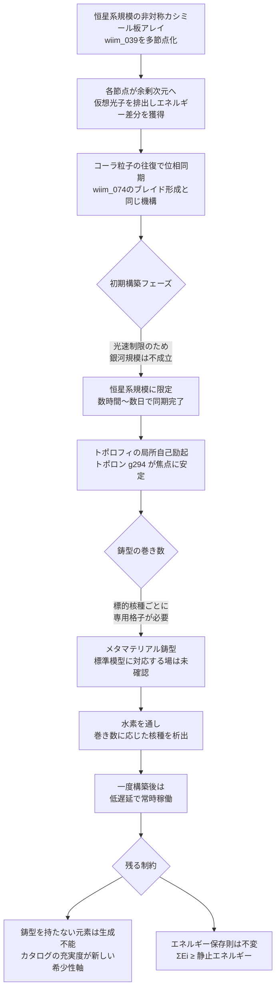

## 1. 概要 (Abstract)

[wiim_069](wiim_069.md)は元素変換の根本障壁——クーロン障壁（g271）——を安価に回避する5つのアプローチを比較し、「安価化と制御性はトレードオフの関係にある」と結論づけた。障壁を下げるほど、どの原子核をどの元素に変換するかという選択性が失われる。

本記事はこのトレードオフの立て方そのものを疑う。障壁を下げる操作（エネルギー軸）と、何が生成されるかを決める操作（選択軸）を、最初から別々の物理量に割り当てられないか——という問いだ。

> **前提①:** ゼロ点エネルギー（真空のエネルギー、カシミール効果g009関連）を単一の高温炉に集中させるのではなく、広域に分散した収穫網で位相を揃えて集める（コヒーレント収穫）ことができると仮定する。
> **前提②:** トポロフィ（g293）——本来はワープゲート（[wiim_074](wiim_074.md)）で2地点間の接続形式を決める架空の場——の局所励起を、遠方の別地点とではなく「その場自身の内部構造」に対して起こすことで、量子化された巻き数が生成される核種を離散的に決定する「鋳型」として機能させられると仮定する。
> **命題:** 「もしこの2つを組み合わせられたら、高温プラズマも粒子加速器も使わずに、狙った元素を狙った量だけ作れるか？」

---

## 2. 実現不可能性の根拠 (Infeasibility Rationale)

- **物理的限界:** コヒーレント収穫はエネルギー保存則を免除しない。標的核種の静止エネルギー（例えば陽子1個で約938MeV）は、分散収穫した全ノードのエネルギーを合計してもなお下回ってはならない——「低温」であって「低エネルギー」ではない。この収穫の代償も[wiim_039](../quantum/wiim_039.md)と同じ場所に発生する——コーラ粒子含浸板が仮想光子を余剰次元へ排出するたびに、その余剰次元のエントロピーが増大する。節点を恒星系規模に増やすほど収穫できるエネルギー総量は増えるが、それは余剰次元のエントロピー容量という「バンク」の残量を、より広い面積から同時に取り崩していることに等しい。バンクが有限である以上、この設計が使えるエネルギー総量にも上限があり、無からのエネルギー生成にはならない。さらに、収穫網を広域に展開するほど深刻化するのが位相同期の問題だ。各収穫ノードの位相情報が焦点（鋳型）に届くには光速の制限がかかるため、当初想定された「銀河規模以上」での同期は現実的でない。銀河規模（数万〜十万光年）の同期には同程度の時間が要り、これは「瞬時の物質生成」という目的と正面から矛盾する。本記事ではこの矛盾を解消せず、素直に**恒星系規模**（光時間にして数時間程度）へスケールダウンする。銀河規模はこの設計が対応できない領域として切り捨てる。
- **技術的限界:** トポロフィ（g293）が[wiim_074](wiim_074.md)で担っていたのは、あくまで「離れた2地点を接続する」機能であり、そこでの限界（トポロフィの量子化不能性——固定された時空多様体そのものを書き換える場を量子化しようとすると定義域が自己矛盾を起こす）は本記事でも変わらず存在する。加えて本記事はさらに大胆な前提を追加している。「2地点接続」ではなく「1地点で完結する自己励起」という、[wiim_074](wiim_074.md)が一度も検証していない全く新しい動作モードをトポロフィに要求している点だ。この自己励起モードが元の「2地点接続」モードと同じ場の物理で記述できるのか、あるいは別物として扱うべきかは未検証のまま残る。さらに根本的な問題として、標準模型には「トポロジカル電荷が核種（陽子数・中性子数の組み合わせ）に対応する」秩序パラメータ場が存在しない。スカーミオンや渦糸の巻き数は磁化や超流体位相といった秩序パラメータの幾何学的性質であって、バリオン数のような数え上げ量ではない。トポロフィの巻き数を元素識別に転用するには、この対応関係自体を新しい仮説として導入する必要がある。
- **論理的限界:** 巻き数が量子化されているという性質は、[wiim_069](wiim_069.md)が指摘した「安価化すると制御を失う」というトレードオフを一見解消するように見える——しかしトレードオフは消えたのではなく**別の場所に移動しただけ**だ。量子化された鋳型は特定の巻き数（＝特定の核種）しか生成できないため、「どんな元素でも作れる万能装置」にはならない。狙った元素ごとに、その巻き数を持つ鋳型構造を個別に設計・製造しなければならない——鋳型を持たない元素は原理的に生成不能なままだ。安価化と制御性の対立は、「エネルギーと選択性の連続的なトレードオフ」から「鋳型カタログの充実度という離散的な制約」へと姿を変えて存続する。

---

## 3. 実験の設定 (Setup)

1. **収穫網:** 恒星系規模に展開された非対称カシミール板アレイ（[wiim_039](../quantum/wiim_039.md)のコーラ粒子含浸板を多数の節点に分散配置したもの）。各節点が仮想光子を余剰次元へ排出し、局所的な引力の非対称からエネルギー差分を得る
2. **同期機構:** 各節点の位相情報をコーラ粒子（g127）の往復によって焦点へ集約する。[wiim_074](wiim_074.md)のエニオン的ブレイド形成と同じ機構——往復回数に比例して接続が安定化していく
3. **鋳型:** 焦点に設置されたメタマテリアル格子。特定の巻き数を持つトポロフィの局所自己励起（トポロン、g294）を安定させる構造を持ち、標的核種ごとに異なる格子パターンが必要
4. **標的:** 水素（原料）を鋳型に通し、鋳型の巻き数に応じた核種（例：炭素・窒素・鉄など）として析出させる
5. **検証する仮説:** 収穫網の位相同期に要する初期構築時間と、構築完了後の1回あたりの生成レイテンシを分離して評価できるか

---

## 4. 考察と予測 (Speculation)

### 「一度だけ高くつき、その後は安い」という構造

恒星系規模の収穫網とトポロン鋳型の初期構築には、[wiim_074](wiim_074.md)のゲート形成と同じく相応の時間とエネルギーがかかる。しかし一度この接続（トポロン）が安定すれば、以後の抽出は既存の経路を使い続けるだけで済み、実質的な遅延はほぼ生じない。これは「瞬時の物質生成」という当初の要求を、正確には「瞬時なのは運用時だけで、立ち上げは瞬時ではない」という形に修正した結果だ。一度きりの巨大な初期投資と、その後の低コストな常時稼働という構造は、[wiim_069](wiim_069.md)5手法のいずれとも異なる、この設計独自の経済的シルエットになる。

### 希少性は「存在量」から「鋳型の有無」へ移る

[wiim_024](wiim_024.md)や[wiim_069](wiim_069.md)は「元素変換が安価になれば希少性という概念が消える」と予測していた。本記事の設計はこれをやや修正する。存在量による希少性は消えるが、**鋳型を設計・製造する能力による希少性**が新たに生まれる。ありふれた軽元素（炭素・窒素・酸素）用の鋳型は早期に量産され尽くすだろうが、超重元素や特殊な同位体比を持つ核種用の鋳型は、設計に成功した勢力だけが独占的に生産できる——旧来の鉱山利権が「鋳型特許」に置き換わるだけで、資源をめぐる非対称性そのものは消えないかもしれない。

### wiim_069・5手法との比較

制御性は5手法中もっとも高い（量子化された巻き数による離散選択のため、意図しない核反応が混入しにくい）。エネルギー効率は収穫網の規模に依存するため一概には言えないが、初期投資さえ終えれば運用コストはアプローチD（反物質触媒）に匹敵しうる。最大の弱点は安全性ではなく**汎用性**——鋳型を持たない元素には無力という制約が、5手法にはなかった新しい軸として加わる。

### 哲学的な問い

- 鋳型を持たない元素は事実上「作れない」のと同じであるとき、それは「存在しない」こととどう違うのか。設計図の不在が、物質そのものの不在と同義になる世界の存在論
- 恒星系規模の収穫網を最初に完成させた勢力だけがこの技術を運用できるとすれば、それは新しい寡占なのか、それとも単に先行投資が報われているだけなのか

### MyCellsとの接続について

これは思考実験の域を出ないが、実在の創作プロジェクト「MyCells」には[wiim_068](wiim_068.md)由来の「核変換宿主種」という設計が既に存在し、そこでは核変換能力がZ≤50程度の上限を持つ人類側プローブ技術に依存している（[wiim_122](wiim_122.md)が示した通り、菌糸自体がプローブを代替することはできない）。本記事の機構はその生物学的経路とは独立した、純粋に工学的な代替ルートであり、[wiim_061](wiim_061.md)「菌類ダイソン網」のような恒星系規模の既存構造物を収穫網の物理的土台として転用できる可能性がある——ただしこれもMyCells側の設計判断次第であり、本記事はあくまで一つの選択肢を示すにとどまる。

---

## 5. 数式による表現 (Mathematical Notation)

N個に分散した収穫節点それぞれが得るエネルギー $E_i$ の合計は、標的核種の静止エネルギーを下回れない：

$$
\sum_{i=1}^{N} E_i \;\geq\; m_{\text{target}} c^2
$$

収穫を空間的に分散させても、この不等式そのものは動かない——変わるのはエネルギーを集める「場所の数」であって、必要な総量ではない。

---

## 6. 図解 (Diagrams)

---

## 7. 関連記事 (Related)

- [wiim_069](wiim_069.md) — 架空粒子で元素変換は安価になるか——クーロン障壁を回避する5つの思考実験（本記事が前提とする「安価化と制御性のトレードオフ」の出典）
- [wiim_039](../quantum/wiim_039.md) — 量子永久機関——非対称カシミール板と真空エネルギーの搾取（分散収穫網の基礎機構）
- [wiim_074](wiim_074.md) — ワープゲート基礎理論——コーラ粒子のマヨラナ的自己対とエニオンブレイドによるトポロジー接続（トポロフィ・トポロンの出典、自己励起モードへの拡張元）
- [wiim_013](wiim_013.md) — 空間を超越する粒子——コーラ粒子の仮説（位相同期の光速制限の根拠）
- [wiim_023](wiim_023.md) — カシミールフォージ——エキゾチック物質生成の基盤設備
- [wiim_022](wiim_022.md) — アンキロン——計量テンソルへの錨づけ（関連する計量安定化技術）
- [wiim_024](../biology/wiim_024.md) — マイコプラズマギカ——生物的核変換との比較対象
- [wiim_061](../biology/wiim_061.md) — 菌類ダイソン網——恒星系規模インフラの流用先候補
- [wiim_068](../biology/wiim_068.md) — マイコプラズマギカと宇宙菌糸知性の共生
- [wiim_122](../biology/wiim_122.md) — 金星大気とマイコプラズマギカ——生物学的経路の限界（本記事の非生物学的アプローチの出発点）
- [_tech_tree_nuclear](../notes/tech_tree_nuclear.md) — 技術ツリー — 核変換・常温核融合系ブランチ
