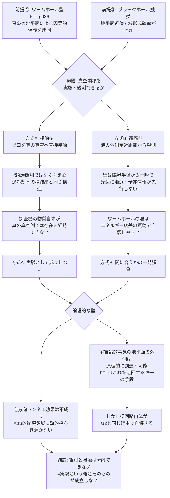

## 1. 概要 (Abstract)

[wiim_014](wiim_014.md)は、宇宙の真空が「偽の真空」にすぎず、いつか真の真空へ相転移する可能性——真空崩壊（g012）——を、超光速航法の副作用として論じた。ヒッグス粒子の測定値は、現在の宇宙が準安定な状態にあることを示唆しており、真空崩壊は完全な空想ではない。wiim_014は関連記事欄に「（未作成）真空崩壊は本当に起こりうるか」という問いを宿題として残していた。

本記事はその宿題を、少し違う角度から引き継ぐ。「起こりうるか」ではなく、「もし起こせる（あるいは既に起きている場所を見つけられる）としたら、人為的に実験・観測することは可能か」という問いだ。

> **前提①:** ワームホール型FTL（g036）が実現すれば、光速に由来する事象の地平面という因果的な保護を迂回できると仮定する。
> **前提②:** ブラックホールが真空崩壊の核形成を触媒するという理論的示唆（Gregory・Moss・Withersらの研究に代表される、ブラックホール地平面近傍の強い曲率がトンネル確率を高めるという結果）を踏まえ、銀河中心の超大質量ブラックホールを最有力の実験候補地として仮定する。
> **命題:** 「もしこの2つを組み合わせられたら、真空崩壊を人為的に実験・観測することは可能か？」

結論を先取りすると、答えは「観測と接触を分離できない」という一点に収束する。これは技術的な未熟さの問題ではなく、真空崩壊という現象の定義そのものに起因する壁だ。

---

## 2. 実現不可能性の根拠 (Infeasibility Rationale)

- **物理的限界:** 真の真空に触れることは「サンプリング」ではなく、「その場所を確定的に遷移させる」ことそのものだ。過冷却水に種結晶を一粒落とすと、種結晶を取り除いても凍結が止まらないのと同じ構造で、ワームホールの出口が真の真空に触れた瞬間、そこはもう観測地点ではなく新しい崩壊泡の核になる。探査機を送り込んで持ち帰る方式も別の理由で破綻する——探査機を構成する物質（陽子・電子など）は偽の真空の場の値に依存して初めて「物質」として存在しており、真の真空側では粒子質量も相互作用の強さも別物になる。探査機は損傷するのではなく、そもそも同じ物質として存在し続けられない。

- **技術的限界:** ワームホールの喉はエキゾチック物質（g068）で開いた状態を維持する必要があり、真の真空と偽の真空という桁違いのエネルギー落差という摂動に対して極めて不安定だ。特に真の真空側が前提②の環境（ブラックホール近傍）で核形成した場合、その内部は既に負の真空エネルギーによる急速な重力崩壊（AdS的クランチ）を起こしており、出口ごと押し潰される可能性が高い。接触を避けて遠隔観測型（崩壊泡の外側至近距離から覗く）に切り替えても、壁自体が臨界半径からの一瞬の加速を経て光速に漸近する速度で広がるため、壁が接近する予兆情報が壁の到達を先回りすることはなく、観測装置を安全に引き上げるタイミングを見計らう猶予がほとんど存在しない。

- **論理的限界:** 逆方向の量子トンネル効果（真の真空→偽の真空）は、崩壊領域がAdS的（ド・ジッター温度のような熱的揺らぎの供給源を持たない）であるため実質的に起こりえず、崩壊は不可逆だ——「巻き戻して確かめる」という検証手段が原理的に存在しない。さらに、ダークエネルギーによる**宇宙論的事象の地平面**（ブラックホールの事象の地平線g006とも、瞬時の後退速度で決まるハッブル地平線g155とも異なる、将来にわたる到達可能性の限界。現在の値でおよそ160〜170億光年、ハッブル地平線の約140億光年よりも一回り大きい）の外側で発生した崩壊は、壁が光速に漸近する以上、原理的に永遠に到達しない。FTLはこの地平面による保護を唯一迂回できる手段だが、その迂回路自体が上記の技術的限界によって崩壊とほぼ同時に自壊する。観測と接触が分離できない以上、「実験」という言葉が要求する再現性・安全な離脱・データの持ち帰りのいずれも満たせない。

---

## 3. 実験の設定 (Setup)

1. **触媒地点:** 銀河中心の超大質量ブラックホール近傍。地平面近傍の強い時空曲率が核形成の障壁を実質的に下げるという理論的示唆を利用する
2. **観測方式A（接触型）:** ワームホールの出口を、発生した真の真空領域に直接接触させ、探査機による物理サンプルの採取と帰還を試みる
3. **観測方式B（遠隔型）:** ワームホールの出口を、既存の崩壊泡の外側（まだ偽の真空のまま）至近距離に置き、壁が到達する直前まで光学観測を継続し、間に合えば出口を撤収する
4. **検証する仮説:** 方式A・Bのそれぞれで、崩壊の内部構造（真空エネルギーの値・崩壊速度など）に関する定量的データを、観測点の外側へ安全に持ち出せるかを検証する
5. **成功の定義:** 得られたデータが、次回以降の実験に活かせる形で再現可能に持ち帰られること（一度きりの巻き添え死は「実験」に数えない）

---

## 4. 考察と予測 (Speculation)

### 方式A: 接触型は「実験」の定義そのものを満たさない

接触型は原理的に一回性の事象しか生まない。真の真空に触れた瞬間、それは観測ではなく引き金であり、引き金を引いた者自身が最初の被害範囲に含まれる。仮に何らかの信号が一瞬だけ返ってきたとしても、その信号を受け取った側もほどなく同じ壁に飲み込まれるなら、「実験結果を持ち帰った」とは呼べない。

### 方式B: 遠隔観測は「間に合うかどうか」の一発勝負

遠隔観測型は方式Aより筋が良いが、[wiim_124](wiim_124.md)で論じた分散コヒーレント収穫網の議論と同様、装置自体の安定性が最大の弱点になる。加えて、壁の接近を伝える光学的な予兆（減光や色の変化）はほとんど発生しない——銀河中心で崩壊が起きた場合、外部の観測者からは恒星が中心から外側へ向けて予兆なく次々に消灯していく波としてしか見えないことは、この観測方式にもそのまま当てはまる。装置の引き上げは「見てから判断する」のではなく、「あらかじめ計算した到達予定時刻を信じて機械的に撤収する」以外の運用が成立しない。

### 銀河中心を選ぶことの意味——加速ではなく触媒

銀河中心という舞台立ては、崩壊の**速さ**を左右するものではない。泡の内部崩壊は素粒子物理学スケールのエネルギー差で決まり、恒星やブラックホールの質量エネルギーはそれに比べて無視できるほど小さい。銀河中心が意味を持つのは、あくまで崩壊が**起こりやすくなる**という核形成確率の観点だ。

また直感に反するが、中心の質量が「消える」ことで周囲の恒星が重力減少により弾き飛ばされる、という展開も考えにくい。真の真空のエネルギー密度は大きく負になると予測されており、宇宙の加速膨張を導く関係式（後述）から、負のエネルギー密度はむしろ通常物質より強い引力源になる。仮に重力が弱まる想定だったとしても、重力場の変化が伝わる速度も光速を超えないため、恒星がその変化を感知する時刻と壁が到達する時刻はほぼ一致し、逃げる猶予は生まれない。

### 内部は「もう一つの宇宙」——一様性と不可逆性

崩壊領域の内部で真空エネルギーが濃淡を持つことはない。物質と違って重力的に凝集する性質がないため、内部はどこでも均等に真の真空の値に落ち着く。数学的にはこの内部は独自の開いた（負曲率の）宇宙として展開し、崩壊はある一点から波及するのではなく内部全体でほぼ同時に進行する——私たちのビッグバンが「ある一点」ではなく「ある瞬間」だったのと対称的な構造だ。

この内部宇宙の特異点への到達は有限の固有時間で起こる。「無限に続く奈落」ではなく、「理論の記述がそこで尽きる地図の端」に近い。その先に何があるか——終端なのか、量子重力的な効果で何らかの形でバウンスするのか——は現代物理でも未解明であり、これは「ビッグバン以前に何があったか」を問うのと構造的に同じ、答えのない問いになる。

### wiim_014との接続——「読み取り専用の宇宙」、再訪

[wiim_014](wiim_014.md)は、物理定数が書き換え不能な「読み取り専用メモリ」として実装されているのではないか、という比喩を提示していた。本記事の結論はこの比喩をさらに一歩進める。真空崩壊を「実験」しようとする試みは、読み取り専用領域を「壊さずに読む」試みに等しい。しかし真空という記録媒体は、読み出しヘッドが触れた瞬間にその場所自体を書き換えてしまう性質を持つ——読むという行為と書くという行為が、原理的に同じ操作なのだ。宇宙が持つ保護機構は、書き込みを禁止しているのではなく、「読み込みと書き込みを区別できない」という、より根本的な形で機能していると考えられる。

---

## 5. 数式による表現 (Mathematical Notation)

宇宙の加速度を決めるフリードマン方程式は、密度ρと圧力pの組み合わせで重力の引力・斥力を決定する：

$$
\frac{\ddot{a}}{a} = -\frac{4\pi G}{3}\left(\rho + \frac{3p}{c^2}\right)
$$

真空成分は状態方程式 $p = -\rho c^2$ を持つため、$\rho + 3p/c^2 = -2\rho$ となる。現在のダークエネルギーはρが正なのでこの値は負（斥力＝加速膨張）だが、真の真空のようにρが大きく負であれば、この値は正（引力）に転じ、しかも|ρ|が巨大な分だけ通常物質より強い引力源になる。

---

## 6. 図解 (Diagrams)

---

## 7. 関連記事 (Related)

- [wiim_125_theory.md](../notes/wiim_125_theory.md) — 理論的背景：スピン分類・真空期待値・スカラー場がなぜ真空崩壊の主役になれるかの科学的解説
- [wiim_014](wiim_014.md) — 宇宙のルート権限を奪取せよ——物理定数ハッキングによる超光速航法（真空崩壊g012の初出。本記事が引き継ぐ「未作成」の宿題の出典）
- [wiim_074](wiim_074.md) — ワープゲート基礎理論——コーラ粒子のマヨラナ的自己対とエニオンブレイドによるトポロジー接続（ワームホール・エキゾチック物質の技術的基盤）
- [wiim_039](../quantum/wiim_039.md) — 量子永久機関——非対称カシミール板と真空エネルギーの搾取（エキゾチック物質生成の基盤機構）
- [wiim_067](wiim_067.md) — ネゴトンホワイトホール——排除地平線が閉じるとき、反重力天体はビッグバンを起こすか（地平線・不可逆な相転移というテーマの関連記事）
- [wiim_124](wiim_124.md) — トポロジカル鋳型と分散コヒーレント収穫——高温プラズマなしで元素変換はできるか（分散型エキゾチック技術・ブラックホール近傍利用という着想の直接の前段）
