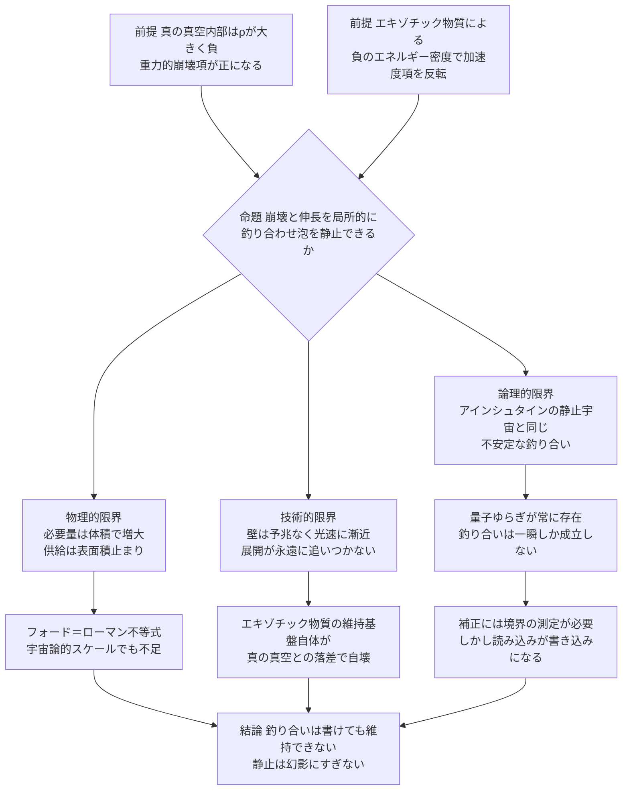
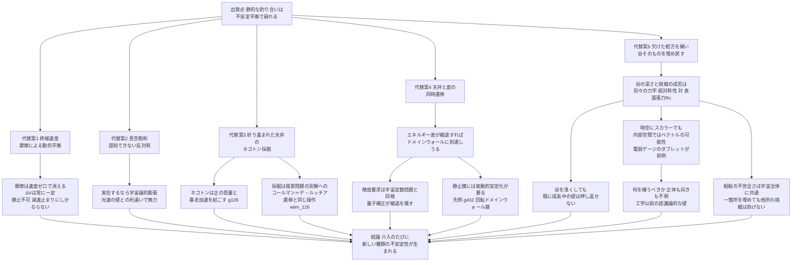

## 1. 概要 (Abstract)

[wiim_125](wiim_125.md)は、真空崩壊の壁に「観測者として」触れようとする試みが、接触と崩壊の引き金を分離できないという壁にぶつかることを示した。本記事はその壁を迂回し、もっと直接的な問いを立てる——観測ではなく**介入**によって、壁の進行そのものを止められないか。

真の真空の内部は、[wiim_125_theory](../notes/wiim_125_theory.md)で確認した通り、真空エネルギー密度ρが大きく負の値を取る。フリードマン方程式の加速度項 $\rho + 3p/c^2$ は、この符号のもとではむしろ正となり、通常の物質より強い引力源として働く——つまり内部空間は自らの重みで潰れていく「崩壊」を起こす。

一方、ワームホールの喉を開いたまま維持したり、アルクビエレ的に空間を押し広げたりするために持ち出されるエキゾチック物質（g068）は、負のエネルギー密度・負の圧力によってこの符号を逆転させ、空間を伸長させる効果を持つ。

> **前提:** ワームホール維持やワープ航法で使われるものと同種のエキゾチック物質を、望む密度・望む場所へ、望むタイミングで供給できる工学基盤が存在すると仮定する（[wiim_023](wiim_023.md) カシミールフォージの延長線上）。
> **命題:** 「もし真の真空領域の内部崩壊と、エキゾチック物質による空間伸長を局所的に釣り合わせられたら、真空崩壊泡の拡大を静止させられるか」

結論を先取りすると、この釣り合いは数式の上では書けても、物理的に**維持できない**。理由は必要量の桁違いな不足だけでなく、その釣り合い自体が原理的に不安定な種類のものだからだ。アインシュタインが1917年に静止宇宙を作ろうとして陥ったのと同じ罠が、100年後のエキゾチック物質工学にも待ち構えている。

---

## 2. 実現不可能性の根拠 (Infeasibility Rationale)

- **物理的限界:** 泡が真の真空へ転換する体積エネルギーの解放は半径の3乗（∝R³Δρ）に比例して増え続けるのに対し、それを打ち消すために配置できるエキゾチック物質は、どれほど濃縮しても密度に上限がある。結果として必要な負エネルギーの総量も体積相応で増え続けるが、供給側は球殻の表面積分でしか稼げない。しかもg068で確認した通り、フォード＝ローマン不等式は負エネルギーを集中できる密度と持続時間そのものに厳しい上限を課しており、ワームホールの喉ひとつ開け続けるだけでも宇宙的スケールで不足するとされる規模の技術で、光速に迫りながら膨張し続ける泡の全周を覆うことは、必要量が桁違いに不足する話であり程度の問題ではない。加えて、壁の進行そのものは真空期待値というスカラー場が自らのポテンシャルの谷を転がり落ちる現象であり（[wiim_125_theory](../notes/wiim_125_theory.md)）、エキゾチック物質が操作するのは計量——時空の曲がり方——という別の階層だ。内部の重力的崩壊を計量操作で相殺できたとしても、それが場がポテンシャルを転がる速度、つまり壁の進行速度そのものに影響するとは限らない。「伸長」と「崩壊」は同じ「空間」という言葉を使うが、前者は外から加えるエネルギー条件の話、後者は場自身の内部力学の話であり、符号を合わせれば自動的に打ち消し合うわけではない。

- **技術的限界:** [wiim_125](wiim_125.md)で確認した通り、壁は臨界半径を超えた直後から光速に漸近し、その接近を告げる予兆情報は壁の到達を先回りしない。つまりエキゾチック物質は「壁が来てから配置する」のではなく、あらゆる方向についてあらかじめ、しかも球対称に途切れなく展開し終えていなければならない。[wiim_124](wiim_124.md)で論じた分散コヒーレント収穫網は、静止した対象に対してさえ位相同期の維持に苦しんだ。ここでは対象自体が全方向へ光速で膨張し続けるため、供給網は対象の成長に永遠に追いつき続けなければならず、完成という状態が存在しない建設作業になる。さらに、そのエキゾチック物質自体を安定に維持する基盤（ワームホールの喉と同種の構造）は、真の真空との桁違いなエネルギー落差という摂動に極めて弱いことも[wiim_125](wiim_125.md)で確認済みであり、崩壊を止めるための道具が、まさに止めようとしている崩壊によって真っ先に破壊される。

- **論理的限界:** 仮に必要量と展開速度の問題を度外視し、内部の真の真空とシェルを合わせた加速度項をちょうどゼロにする配置ができたとしても、それは安定な釣り合いではない。アインシュタインは1917年、宇宙項Λを導入して物質の引力と釣り合わせる静止宇宙モデルを提案したが、1930年にエディントンはこの釣り合いが不安定であることを示した。半径がわずかでも大きくなれば膨張が加速して元に戻らず、わずかでも小さくなれば収縮が加速して元に戻らない。鉛筆を尖った先端で立てるのと同じ構造だ。そしてここでの「わずかな揺らぎ」は避けられないものとして常に存在する。[wiim_125_theory](../notes/wiim_125_theory.md)で確認した通り、真空の場の値は期待値としてはゼロでも、瞬間瞬間はゼロ以外の値を取り続けている——場は原理的に静止していない。しかも釣り合いを維持し続けるには、壁の位置とエネルギー密度を常時測定してエキゾチック物質の供給量を補正するフィードバック制御が要る。だが[wiim_125](wiim_125.md)が導いた結論——真の真空境界において「読み込みと書き込みを区別できない」——はここでも成り立つ。境界の状態を読み取る行為そのものが境界を書き換えてしまうなら、正しい補正量を知るためのセンサーが、同時に釣り合いを崩すアクチュエーターとして働く。安定化しようとする制御ループが、制御対象そのものによって撹乱され続ける。

---

## 3. 実験の設定 (Setup)

1. **要素A（主体）:** 臨界半径を超えて成長を始めた真空崩壊泡。内部は真の真空、境界は光速に漸近しつつある壁
2. **要素B（介入装置）:** 壁を包み込む形で展開される、望む密度・タイミングで負のエネルギー密度を供給できるエキゾチック物質シェル（[wiim_023](wiim_023.md) カシミールフォージの理想化拡張）
3. **操作:** シェルの負のエネルギー密度を、内部の真の真空が持つ正の加速度項（重力的崩壊への寄与）を相殺するように、リアルタイムで調整し続ける
4. **検証する仮説:** 泡の半径が外部から見て一定値に静止する状態を、有限の時間だけでも維持できるか
5. **成功の定義:** 静止状態が、外部からの継続的な補正なしに、あるいは少なくとも量子ゆらぎに起因する自然な摂動に対して自己修復的に、一定時間以上持続すること

---

## 4. 考察と予測 (Speculation)

### 予測される結果

- 数式上の釣り合い点を一瞬だけ通過させることは理論上可能かもしれないが、その状態は摂動を受けた瞬間に崩れ、収縮側か暴走膨張側のどちらかへ不可逆に転がり落ちる
- 摂動が伸長優位に振れれば、通常の光速膨張へ復帰する。崩壊優位に振れれば、[wiim_125_theory](../notes/wiim_125_theory.md)の臨界半径の議論を逆向きにたどる形で、外部からの持続的なエネルギー注入という条件下でのみ泡が縮小・消滅する経路も理論上は開けるが、これは「静止」ではなく「別の不安定な運動」への乗り換えにすぎない
- 十分な精度の制御が一瞬成立しても、シェル自体の量子的な性質——フォード＝ローマン不等式が保証する、負エネルギー供給の本質的な短時間・局所性——により補正の空白期間が周期的に生じ、そのたびに釣り合いは振り出しに戻る

### 代替案の検討——境界を維持する5つの試み

単純なエキゾチック物質シェルが崩れるなら、もっと別の種類の「境界」を持ち出せば静止に近づけないか。この問いを5段階でたどると、試みるたびに新しい不安定性が姿を現す構造が浮かび上がる。

**代替案1: 終端速度としての壁**

静的な力の釣り合いではなく、二つの「運動する領域」が押し合う境界を考える案がある。実際、電弱相転移の泡壁力学では、周囲の粒子との摩擦によって壁が一定速度（終端速度）に落ち着く現象が知られており、これは速度が増すほど摩擦も強まる負のフィードバックを持つ、正真正銘の動的平衡だ。しかしこの機構は壁の速度がゼロの場所では成立しない。摩擦力は速度に依存して立ち上がる量である一方、崩壊を駆動する真の真空とのエネルギー差ΔVは壁の速度と無関係に常に一定であり、「ΔV＝摩擦力」という釣り合いの式は速度ゼロでは満たしようがない。加えて、g068のエキゾチック物質は負エネルギー密度によって計量（重力）だけをソースする存在であり、粒子が壁を通過する際の質量変化を介した摩擦——プラズマが泡壁を減速させる際の実際の機構——とは相互作用のチャンネルそのものが異なる。到達しうるのは「静止」ではなく「有限速度での定常伝播」にとどまる。

**代替案2: 真空飽和という反対称**

崩壊の「反対」を、我々が認知できなくなる種類の変化として捉える案もある。これが文字通り何の物理的効果も持たない変化なら、境界で押し返す力を持ちようがなく検討に値しない。一方、実在はするが検出できないという意味なら、最も近い現実の候補は宇宙論的膨張——ダークエネルギーによるハッブル膨張——だ。銀河のような重力束縛系が膨張と一緒に伸びないため、この膨張は日常的に感知されない。局所的な崩壊（泡）と大域的な伸長（背景の膨張）という対比は「真逆」という表現によく合う。しかし規模の桁が違いすぎる。ハッブル定数が与える伸長率は光速で迫る壁の前ではほぼゼロと見なせ、[wiim_125](wiim_125.md)が確立した「宇宙論的事象の地平面の外側でしか安全ではない」という結論の通り、この効果が意味を持つのは壁が地平面の外に出たときだけであり、地平面の内側での局所的な相殺力にはならない。

**代替案3: 折り畳まれた天井のネゴトン**

反重力的な物質が余剰次元の「折り畳まれた天井」に大量に存在すると仮定する案は、二つの既存の筋と直結する。ひとつは負の実質量を持つ架空粒子ネゴトン（g126）——[wiim_003](wiim_003.md)で初出——であり、正の質量（真の真空の強い引力的な崩壊項）と接触すると暴走加速を起こしエネルギー保存則との整合性を失うことが既に知られている。もうひとつは[wiim_126](../cosmology/wiim_126.md)が確立した超弦理論の「風景問題」——余剰次元のコンパクト化（カラビヤウ多様体、g219）の候補が10の500乗通り存在し、それぞれ異なる真空エネルギーを持つという構造——だ。「天井」はこの莫大な代替解の集積として読める。しかし天井から資材を取り出す行為は、その区画へ向けてコンパクト化を局所的に変形させる操作にほかならず、wiim_126がランドスケープ上の解の移行として記述したコールマン＝デ・ルッチアのインスタントン機構——通常の真空崩壊とまったく同じ数学的枠組み——を、こちらから誘発することに等しい。崩壊を止めるための資材調達そのものが、粒子スケールではネゴトンの暴走を、コンパクト化スケールでは新たな泡の核形成を、二重に連れてくる。

**代替案4: 天井と底の同時遷移とドメインウォール**

天井（コンパクト化）と底（4次元の真空エネルギー）を同時に変化させる案は、実は両者を独立に操作できるという前提そのものが誤りかもしれない。カラビヤウ多様体の形状が4次元の物理定数一式を決定する以上、天井と底は別々のレバーではなく、モジュライ空間上のひとつの遷移を二つの角度から見ているにすぎない。この見立てに立つと、これまでの案になかった可能性が開ける。底側で失うエネルギーと天井側で変化するエネルギーが遷移の経路上でちょうど釣り合い、体積エネルギーの差分ΔVがゼロになるよう設計できれば、境界は光速に漸近する崩壊の壁ではなく、表面張力だけが支配するドメインウォール——真空領域間の位相欠陥——という別カテゴリの物体になる。

ただしこれは二重の代償を伴う。第一に、量子場理論スケールの真空エネルギー差と、弦理論のモジュライスケールの真空エネルギー差を寸分違わず一致させる精度要求は、現実物理で未解決の宇宙定数問題（真空エネルギーがなぜほぼゼロに近いのか、100桁以上のオーダーで説明がつかない問題）と同格、あるいはそれ以上に困難だ。第二に、量子ループ補正は両者のエネルギーを独立にずらすため、古典的な縮退は量子論のもとで自然には保たれない。わずかなズレが生じた瞬間、ドメインウォールはどちらか一方へ向けて緩やかに加速を始め、時間差で通常の崩壊の壁に戻っていく。さらにWIIM内には既に前例がある——場の圧力差機関（[wiim_103](wiim_103.md)）の回転ドメインウォール膜（g432）は、静止した状態では偽真空浸潤圧（g431）という別種の内向き圧力によって即座に潰れ、遠心力による能動的な安定化を要求する。圧力の起源は本記事のΔVとは異なる（ゼロ点モード密度差 対 ポテンシャルエネルギー差）が、教訓は一般化できる——ドメインウォールという「正しいカテゴリの物体」に到達しても、静止という性質は自動的には付与されない。

**代替案5: 欠けた相方を補う——谷そのものを埋め戻す**

これまでの4案はすべて、崩壊が始まった後の壁と戦う発想だった。発想を変え、そもそも谷が存在する理由に手を付ける案もある。真空エネルギーはボソン（整数スピン）とフェルミオン（半整数スピン）の寄与が符号違いで打ち消し合うことで決まり、両者が完全に対をなす超対称性のもとでは相殺は厳密になり谷そのものが生まれない。現実の宇宙で谷（真の真空）が存在するのは、この対称性が破れ、相殺の片方——超対称パートナー——が欠けているためだと考えられる。壁の手前、まだ手つかずの偽真空へこの「欠けている相方」を局所的に補えれば、谷を浅く、あるいは消してしまえるかもしれない。ボールが転がり込む先そのものを埋め戻す発想であり、内部の重力効果と戦う代替案1〜4とは質的に異なる。

ただし相方の補充は谷の**深さ**を決める背景設定を変える話であり、実際に個々の量子ゆらぎが臨界半径を超えられるかどうかは、また別の力学——[wiim_125_theory](../notes/wiim_125_theory.md)が確立した臨界半径 $R_c = 2\sigma/(\Delta\rho c^2)$ における表面張力σ——が支配している。亜臨界（R<Rc）のゆらぎが常に元の偽真空へ引き戻されているのは、泡の外側の偽真空自身が表面コストという形で内側を押し返しているからであり、これは相方の有無とは独立に、あらゆる場所・あらゆる瞬間に起きている過程だ（コールマンのインスタントン計算が定量化する崩壊率Γ∝e^(-作用) は、この絶え間ない亜臨界の挑戦と失敗を前提にしている）。つまり相方の補充は「谷の深さΔVを浅くする」ことしかできず、それによってRcが大きくなり挑戦の成功率が下がるという間接的な効果はあっても、既に臨界半径を超えて成長中の壁を直接押し返す力にはならない。

「欠けている相方」の実体を考えるとき、見落とせない区別がある。真空期待値を持てるのは時空（ローレンツ群）に対してスカラーな場に限られるという制約は[wiim_125_theory](../notes/wiim_125_theory.md)が既に確立した通りだが、これは場が別の——ゲージ対称性のような——内部空間に対してまで単純（スカラー）であることは意味しない。標準模型のヒッグス場自体、SU(2)ゲージ対称性に対してはダブレット、いわば内部空間のベクトルとして振る舞い、真空期待値がこの内部空間のどこを向くかで電弱対称性の破れ方が決まる。ただし標準模型単体では、この「向き」はゲージ変換で自由に回転でき物理的にはすべて同値——これも[wiim_125_theory](../notes/wiim_125_theory.md)が指摘する「谷底は縮退した円・球面であり、方向は人為的な選択」という点そのものだ。しかし「相方」がSU(2)より大きな、大統一理論（GUT）的な、あるいは代替案3・4のランドスケープに連なるより根源的な内部空間に属しているなら、方向ごとに異なる不変部分群・異なる真空エネルギーを持つ、物理的に別々の谷が生じうる。この場合、谷の深さΔVは単一の量ではなく、その内部空間における場の「向き」のある成分への射影にすぎないことになる。

そして相方の補充には、代替案1〜4のいずれとも異なる種類の限界が重なる。技術的には、壁が予兆なく光速に漸近する以上、手前で谷を埋め戻す作業を間に合わせることはできない——代替案1・3が既にぶつかった先回りの壁がそのまま立ちはだかる。さらに一段深い限界として、何を補えば相殺が完成するのか——欠けている相方の正体そのもの——が、現実の物理学でも未解決だ。加えて上記の内部空間の議論を踏まえると、たとえ正体が分かったとしても、それを内部空間のどの「向き」で補うかまで指定しなければ谷は狙い通りに浅くならない——量だけでなく向きまで特定を要求される。存在しないと分かっている道具の調達ではなく、正体も向きも不明な道具を要求するという、工学的な実現可能性より手前にある認識論的な壁になる。加えて、相殺の不完全さは特定の壁の周辺だけの局所的な事情ではなく、偽真空が存在するあらゆる場所に共通する構造であるため、たとえ一箇所を埋め戻せても、宇宙のどこか他の場所で独立に臨界半径を超える挑戦が成功する可能性は手つかずのまま残る。

### 哲学的な問い

- 絶え間ない補正によってのみ維持される「静止」は、静止と呼べるのか、それとも運動の一形態にすぎないのか
- 崩壊を止めた泡は「起こらなかった真空崩壊」なのか、それとも「人為的に維持された、安定しない新しい存在様式」という別のカテゴリーの物体なのか
- 代替案1〜5のように、介入のたびに新しい種類の不安定性が生まれるという構造は、真空崩壊が「地平面の外側でしか安全ではない」というwiim_125の結論の必然的な帰結なのか、それとも現在の技術的想像力の限界にすぎないのか
- 谷の深さ（なぜ真の真空が存在するか）と、挑戦の成否（なぜ大半の量子ゆらぎは失敗するか）が別々の力学で決まっているという構造そのものが、真空崩壊を「単一の原因を潰せば防げる」対象ではなく「宇宙が存在する限り伴う統計的な条件」にしている、と言えるのではないか

---

## 5. 数式による表現 (Mathematical Notation)

内部の真の真空とエキゾチック物質シェルを合わせた実効的な加速度項がゼロになる、局所的な釣り合いの条件：

$$
\rho_{\text{true}} + \rho_{\text{exotic}} + \frac{3(p_{\text{true}} + p_{\text{exotic}})}{c^2} = 0
$$

wiim_125のフリードマン方程式の加速度項を、真の真空とエキゾチック物質の二成分に拡張したものだ。この式そのものは机上で解けても、エディントンが示した通り、解の周りの安定性までは保証しない。

---

## 6. 図解 (Diagrams)

### 代替案の検証フロー

---

## 7. 関連記事 (Related)

- [wiim_125](wiim_125.md) — 真空崩壊を実験できるか——FTLとブラックホール触媒が開く（そして閉じる）扉（本記事が直接引き継ぐ前提。観測ではなく介入という角度への転換）
- [wiim_125_theory.md](../notes/wiim_125_theory.md) — 理論的背景：臨界半径・真空期待値・スカラー場の必然性
- [feynman_path_integral_unification.md](../notes/feynman_path_integral_unification.md) — 経路積分の統一的描像：真空崩壊のトンネル計算（インスタントン）が直進・反射・回折と同じ原理から出てくる理由
- [wiim_014](wiim_014.md) — 宇宙のルート権限を奪取せよ——物理定数ハッキングによる超光速航法（真空崩壊g012の初出）
- [wiim_023](wiim_023.md) — カシミールフォージ——仮想粒子の増幅でエキゾチック物質を量産できたら（本記事が前提とするエキゾチック物質供給基盤）
- [wiim_124](wiim_124.md) — トポロジカル鋳型と分散コヒーレント収穫——高温プラズマなしで元素変換はできるか（分散型展開が対象の成長に追いつけないという失敗パターンの参照元）
- [wiim_067](wiim_067.md) — ネゴトンホワイトホール——排除地平線が閉じるとき、反重力天体はビッグバンを起こすか（地平線・不可逆な相転移というテーマの関連記事）
- [wiim_003](wiim_003.md) — 負の質量を持つ粒子による局所的時間加速（ネゴトンg126の初出。代替案3が引き継ぐ暴走加速の前例）
- [wiim_126](../cosmology/wiim_126.md) — 時空は生きているか——単一生物仮説とクダクラゲ型群体仮説（超弦理論の風景問題・カラビヤウ多様体・コールマン＝デ・ルッチア機構の出典。代替案3・4の理論的基盤）
- [wiim_103](wiim_103.md) — 場の圧力差機関——量子真空の勾配からエネルギーを取り出せるか（回転ドメインウォール膜g432・偽真空浸潤圧g431の出典。代替案4のドメインウォール安定化に関する前例）
