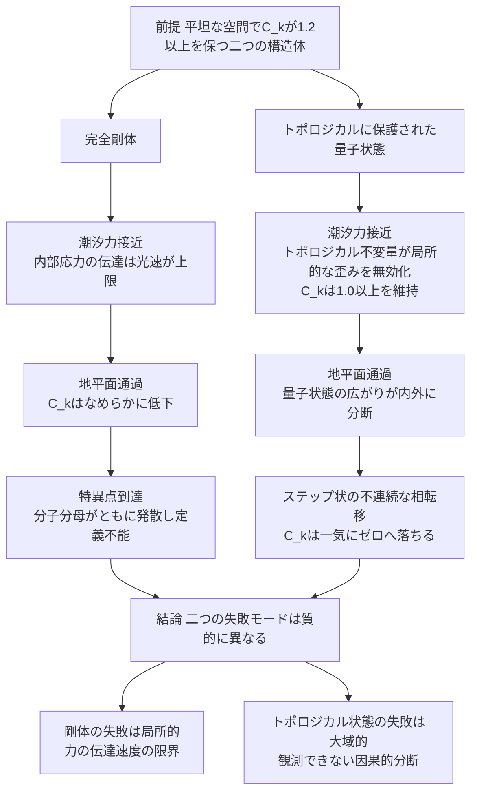

## 1. 概要 (Abstract)

[切れないエネルギー紐](wiim_021.md)は「完全剛体なしに不変距離を定義できるか」を論じ、力の伝達速度が有限である以上、完全剛体は存在し得ないという剛体禁止定理に行き着いた。[ワープゲート基礎理論](wiim_074.md)は、時空のトポロジーを書き換えるにはエニオン的なブレイド構造が必要だが、エニオンは2次元空間にしか存在できないという壁を示した。これらは一見別の話に見えるが、共通する問いが背後にある——「歪んだ空間を通過するとき、対象は自分の**形**をどこまで保てるか」。

この問いに定量的な言葉を与えるため、架空の無次元係数**カラビナント係数**（記号 $C_k$）を導入する。空間接続面の曲率変化と、対象の内部応力（トポロジーを保とうとする力）の比率として定義され、$C_k>1.0$ なら形状は保たれ、$C_k<1.0$ なら形状は崩壊する。登山用のフック「カラビナ」になぞらえた名称であり、異なる空間同士を安全に接続する「かかりしろ」の強さを表すイメージだ。

> **前提:** 平坦な空間で $C_k \geq 1.2$ を保つよう設計された、性質の異なる二つの構造体を用意する。ひとつは変形を一切許さない**完全剛体**、もうひとつは非局所的な位相不変量で情報を保持する**トポロジカルに保護された量子状態**（エニオンのブレイドで符号化された量子ビット群を想定する）。
> **命題:** 「この二つをブラックホールへ落としたとき、カラビナント係数はどちらがどう崩れるか。そして崩れ方の違いは何を意味するか」

結論を先取りすると、両者は同じ $C_k \to 0$ という終着点に至りながら、そこへ至る経路がまったく異なる。完全剛体は**なめらかに**崩壊し、特異点では数式そのものが意味を失う。トポロジカル量子状態はしばらく持ちこたえたのち、**不連続に**崩壊する。この違いは、二つの構造体が「何によって形を保っていたか」——局所的な硬さか、大域的なつながりか——の違いをそのまま反映している。

---

## 2. 実現不可能性の根拠 (Infeasibility Rationale)

- **物理的限界:** [wiim_021](wiim_021.md)が確立した剛体禁止定理はこうだ——物体の一部が力を受けたとき、その情報が反対側へ伝わる速度は光速を超えられない。ブラックホールへ落下する完全剛体は、地平面に近い端と遠い端で潮汐力（重力の差）を受け、引き伸ばされようとする（いわゆるスパゲッティ化）。「完全剛体」であろうとするなら、この引き伸ばしに対抗する内部応力を瞬時に全体へ伝えなければならないが、それは光速を超える情報伝播を要求し不可能だ。直感的には「絶対に変形しない＝内部応力が無限大＝ $C_k\to\infty$」に見えるかもしれないが、実際には逆のことが起きる。潮汐力（分母の曲率）が特異点に向かって発散する一方、変形できない剛体は潮汐力の変化に応じて内部応力を再分配することができず、実効的な構造保持力（分子）は頭打ちのまま取り残される。地平面通過時点で $C_k$ はなめらかに $0$ へ近づき（位相崩壊）、特異点では分子・分母がともに発散する不定形——数学的には $\infty/\infty$——に陥る。これは「値が大きくなりすぎる」故障ではなく、「形状」「位置」「向き」という、係数がそもそも前提としていた幾何学的概念自体が定義を失うという、より根本的な壁だ。

- **技術的限界:** トポロジカルに保護された量子状態は、[wiim_074](wiim_074.md)が論じた通り、エニオン（g157）のような2次元限定の準粒子のブレイドとして符号化される場合が多い。3次元の宇宙空間でこの状態を維持するには、対象を薄い2次元的な層（量子ホール系に類する人工構造）で包む必要があり、この時点で既に工学的な理想化を要求する。さらに深刻なのは、[コーラ粒子は事象の地平線を抜けられるか](wiim_081.md)が示した通り、事象の地平面の内側の座標は外部から観測も指定もできないという制約だ。トポロジカル保護は「系全体を一度に観測・操作できる限り破れない」という性質に支えられているが、事象の地平面はまさにこの「一度に」を破壊する——量子状態の広がりの一部が地平面の内側、残りが外側に位置した瞬間、内外間の情報伝達は因果的に途絶する。局所的な潮汐力にはトポロジカル不変量が耐えるため $C_k \geq 1.0$ をしばらく維持できるが、この大域的な分断が起きた瞬間、なめらかな減衰ではなく段差状の崩壊が生じる。分断された情報がその後どうなるかについては、[wiim_081](wiim_081.md)が依拠するブラックホール相補性・ホログラフィック原理（地平面という2次元境界に3次元的な内部情報が再符号化されて保持されるという仮説）が手がかりになる——分断の瞬間に崩れるのは対象の「一体性」であって、情報そのものは地平面上に薄く引き伸ばされた形で残り続け、最終的にホーキング放射の熱的なもつれへ拡散していくと考えられる。

- **論理的限界:** 特異点における $C_k \to \infty/\infty$ という不定形は、単に「計算できない」という技術的な不便さではない。カラビナント係数は「曲率」「応力」「境界」という、滑らかな幾何学が成り立つことを前提にした量だ。中心特異点では曲率半径がゼロに近づき、時空の滑らかさそのものが失われて完全に量子的な揺らぎ（時空の泡）へ還元されると考えられる。滑らかさが前提の量を、滑らかさが失われた場所に適用しようとする行為自体が、範疇の誤り（カテゴリーエラー）に陥っている。これは「無限に大きい」のではなく「問い自体が意味を失う」という、思考実験としての論理的な行き止まりだ。

---

## 3. 実験の設定 (Setup)

1. **要素A（主体1）:** 完全剛体。平坦な空間で $C_k \geq 1.2$ を保つよう理想化された、変形を一切許さない構造体（[wiim_021](wiim_021.md)が示す通り、そもそも物理的に構成不可能な仮想物質）
2. **要素B（主体2）:** トポロジカルに保護された量子状態。エニオン（g157）のブレイドで符号化され、局所的な擾乱に対しては不変量が保たれるよう設計された量子ビット群
3. **要素C（環境）:** シュヴァルツシルト・ブラックホール。遠方から地平面、そして中心特異点へ至る強い潮汐力場
4. **操作:** 両主体を同じ軌道でブラックホールへ投下し、遠方接近・地平面通過・特異点到達の3チェックポイントでカラビナント係数 $C_k$ を追跡する
5. **検証する仮説:** $C_k$ が最終的に崩壊へ至ることは共通するが、その崩壊が連続的か不連続かという経路の違いが、二つの構造体の「形の保ち方」の違いを説明できるか

| チェックポイント | 完全剛体 | トポロジカル量子状態 |
|---|---|---|
| 遠方接近 | $C_k \geq 1.2$（安定） | $C_k \geq 1.2$（安定） |
| 潮汐力の増大 | 内部応力の伝達が追いつかず $C_k$ がなめらかに低下し始める | 局所的な不変量が擾乱を無効化し $C_k \geq 1.0$ を維持 |
| 地平面通過 | 連続的な低下が続く | 量子状態が内外に分断され不連続に $C_k \to 0$ |
| 特異点到達 | $C_k \to \infty/\infty$（定義不能） | 分断後の残存情報がホーキング放射の熱的もつれへ拡散し実質的に消失 |
| 崩壊の性質 | 連続的（局所的な力学限界） | 不連続（大域的な因果分断） |

---

## 4. 考察と予測 (Speculation)

### 予測される結果

- 完全剛体のカラビナント係数は、地平面のかなり手前から緩やかに低下を始める。これは潮汐力が地平面より外側でも既に強まり続けているためで、崩壊の「予兆」を外部から観測できる可能性がある
- トポロジカル量子状態のカラビナント係数は、地平面通過という単一の事象を境に段差状に崩れる。予兆となる連続的な変化がほとんどなく、崩壊の瞬間を外部から予測することは原理的に難しい
- 二つの崩壊は同じ「$C_k \to 0$」という値に収束するが、崩壊の**原因**は異なる。剛体の崩壊は「局所的な力の伝達速度」という工学的・物理的な限界に起因し、トポロジカル状態の崩壊は「大域的な観測・操作可能性」という認識論的な限界に起因する

### 均衡と破断——境界に踏みとどまる場合

崩壊力（潮汐力・量子デコヒーレンス）とトポロジカルな秩序がちょうど拮抗し、$C_k=1.0$ の臨界閾値に留まり続ける特殊な状態を仮定すると、対象は地平面へ落ちも弾かれもせず、時空にカラビナで引っかけたように定常化すると考えられる。この均衡状態が理論上どこまで成立しうるか、また均衡が破れた際にどのような災害的現象に至るかは、それぞれ独立した思考実験として掘り下げるに値するテーマであり、本記事では詳細に立ち入らない。

ただし一点だけ指摘しておくと、この均衡は本質的に不安定だと考えられる。崩壊力とトポロジカル秩序という、由来のまったく異なる二つの量がぴったり一致し続けるための機構が存在せず、わずかな擾乱でどちらか一方へ転がり落ちてしまうはずだからだ。これは[真空崩壊泡は静止できるか](wiim_127.md)がアインシュタインの静止宇宙になぞらえて論じた「不安定平衡」と同じ構造だと言える。

### 哲学的な問い

- 「形を保つ」ことの意味は、局所的な硬さとして定義される場合と、大域的なつながりとして定義される場合とで、本質的に異なる現象なのではないか
- トポロジカル量子状態が守っているのは対象そのものの同一性なのか、それとも外部の観測者から見た情報の一貫性にすぎないのか——事象の地平面がこの二つを区別する境界として機能するとしたら、その区別は何を意味するか
- 剛体の崩壊が「予兆を伴う」のに対しトポロジカル状態の崩壊が「予兆を伴わない」という非対称性は、どちらがより「自然」な壊れ方なのか、あるいは両者とも人間が持ち込んだ幾何学的直感の限界を映しているだけなのか

---

## 5. 数式による表現 (Mathematical Notation)

カラビナント係数の定義——空間接続面の曲率変化と、対象の内部応力の比率：

$$
C_k = \frac{\Phi_{\text{stress}}}{\oint_{\partial\Omega} \kappa \, dA}
$$

$\Phi_{\text{stress}}$ は境界 $\partial\Omega$ にかかるポテンシャル応力、$\kappa$ はその境界における空間曲率を表す。分母がブラックホールの潮汐力によって発散する一方、分子が構造体の性質によってどう振る舞うかが、本記事の対比実験の核心にあたる。

---

## 6. 図解 (Diagrams)

---

## 7. 関連記事 (Related)

- [wiim_021](wiim_021.md) — 切れないエネルギー紐——完全剛体なしに不変距離を定義する（剛体禁止定理の出典。本記事はこれをブラックホールの潮汐力という極限ケースへ適用する）
- [wiim_074](wiim_074.md) — ワープゲート基礎理論——コーラ粒子のマヨラナ的自己対とエニオンブレイドによるトポロジー接続（エニオンの次元制約とトポロジカル接続の出典）
- [wiim_081](wiim_081.md) — コーラ粒子は事象の地平線を抜けられるか——ブラックホール内外の空間超越と因果律の衝突（事象の地平面内部の観測不能性・因果的分断の出典）
- [wiim_022](wiim_022.md) — アンキロン——時空の計量に錨を打つ架空粒子（計量へ直接固着する別系統の思考実験。トポロジー保持というカラビナント係数の観点とは異なる角度から「形の固定」を論じる）
- [wiim_127](wiim_127.md) — 真空崩壊泡は静止できるか——エキゾチック物質による収縮と伸長の相殺という綱渡り（拮抗する二つの力の均衡が本質的に不安定になる構造の先例）
