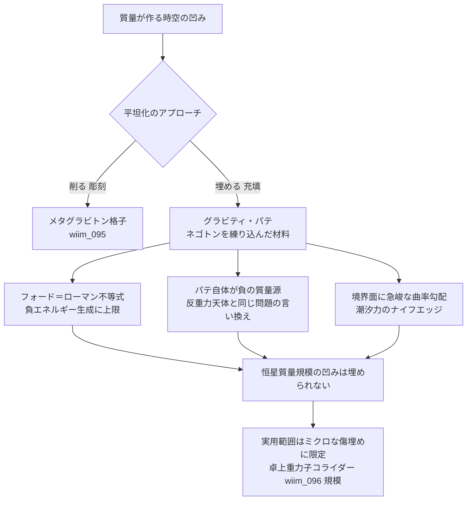

## 1. 概要 (Abstract)

質量は時空を凹ませる——一般相対性理論の入門でおなじみの「ゴムシート」の比喩だ。[wiim_095](wiim_095.md)では、この凹みを能動的に「削り取る」アプローチ（メタグラビトン格子による曲率彫刻）を論じた。しかし比喩に忠実に考えるなら、もっと素朴な発想もありうる。凹みを削るのではなく、そこに材料を注ぎ込んで平らにする——道路のくぼみをアスファルトで埋めるように、時空の凹みを直接「埋める」ことはできないか。

本記事ではこの発想を「グラビティ・パテ」と呼び、負の実質量を持つ架空粒子ネゴトン（[g126](../../glossary/terms/g126.md)）を練り込んだペースト状の複合材料と仮定する。彫刻アプローチ（[wiim_095](wiim_095.md)）との違い、そしてこの素朴な発想がなぜ物理的・技術的・論理的に破綻するかを論じる。

> **前提:** 質量が作る時空の凹み（重力ポテンシャル井戸）に、負のエネルギー密度を持つ材料を注ぎ込んで直接埋められると仮定する。
> **命題:** 「もし時空の凹みを"削る"のではなく"埋める"ことができたら、何が起こるか」

---

## 2. 実現不可能性の根拠 (Infeasibility Rationale)

### 物理的限界

アインシュタイン方程式が示す通り、時空の曲率は物質・エネルギーの分布によって一意に決まる。凹みを「埋める」とは、幾何学を上から塗り替える操作ではなく、その場所に実在するエネルギー運動量を持ち込んで曲率そのものを変化させる操作にほかならない。正の質量が作る凹みを平らにするには、符号が逆——負のエネルギー密度——を持つ実体的な材料が必要になる。

ここでグラビティ・パテの原材料として想定されるネゴトンが登場する。ネゴトンは負の実質量を持ち、時空を「盛り上げる」——通常の重力とは逆方向に作用する架空粒子だ（[wiim_003](wiim_003.md)）。理屈の上では、正の質量が作る凹みにネゴトンを詰め込めば、盛り上げと凹みが打ち消し合って平坦になると考えられる。

だが問題は、この打ち消しが幾何学的なトリックではなく、正味のエネルギー会計だという点にある。凹みを完全に埋めるために必要なネゴトンの量は、凹みを作った質量とほぼ同等のエネルギーに達すると考えられる。「埋める」という操作は、実質的には同じ質量のエキゾチック物質をもう一つ用意することと同義であり、ネグレーザー（[wiim_064](wiim_064.md)）や反重力天体（[wiim_065](wiim_065.md)）がすでに直面している負エネルギー生成問題を、名前を変えて繰り返しているに過ぎない。

### 技術的限界

たとえ十分な量のネゴトンを調達できたとしても、ネゴトンには正の質量との相互作用で暴走加速（runaway motion）が生じるという既知の不安定性がある（[g126](../../glossary/terms/g126.md)）。凹みの縁——正のエネルギー密度を持つ母材とパテの負のエネルギー密度が接する境界面——では、正負の質量が至近距離で向き合う状態が常に生じる。この境界がパテの全周に渡って存在する以上、暴走加速は局所的な事故ではなく、構造の全表面で恒常的に進行する現象になると考えられる。

さらに、彫刻アプローチ（[wiim_095](wiim_095.md)）が抱える「静的曲率は光速で補充され続ける」という問題はここでも避けられない。凹みの原因である質量が存在し続ける限り、パテが打ち消した分の曲率は即座に再生される。彫刻アプローチは能動的なフィードバック格子でこれに追従しようとしたが、パテは一度流し込んで固定する受動的な材料であるため、質量がわずかに動いただけでパテの形状と実際の凹みの形状がずれ、埋め残しと過剰充填が同時に生じてしまう。

### 論理的限界

そもそも「凹みを埋める」という発想は、比喩を取り違えている疑いがある。ゴムシートの凹みは、内在的に曲がった2次元面を可視化するために仮想的な3次元空間へ埋め込んだ「埋め込み図」にすぎない。実際の時空の曲率は内在的な量であり、測地線からのずれ（潮汐力）として時空の内部から測定されるものであって、外部の「上から」や「横から」材料を注ぎ込める第三の方向は存在しない。パテを「埋め込む」という操作は、説明用の絵に対してしか意味を持たず、物理的な時空に対しては指し示す先がないと言える。

さらに、局所的な凹みをうまく平坦化できたと仮定しても、その領域の外側にいる観測者にとって全体の質量エネルギーが消えるわけではない。パテ自身が負のエネルギーを持つ実体である以上、遠方から見た総質量はパテの分だけ減少するが、それは「凹みを消した」のではなく「別の負の質量源を隣に置いて相殺した」だけであり、[wiim_095](wiim_095.md)の重力静寂ゾーンと同じく、平坦化は局所的な泡の中でしか成立しない。

---

## 3. 実験の設定 (Setup)

1. **主体:** グラビティ・パテ——高密度に圧縮したネゴトン（[g126](../../glossary/terms/g126.md)）を、グラビトーペイク（[g129](../../glossary/terms/g129.md)）と同様の格子構造で保持しつつ、流動性を持たせたペースト状複合材料。
2. **環境:** ある質量Mが作る局所的な重力ポテンシャル井戸。中性子星近傍やストレンジスター（[wiim_027](wiim_027.md)）表面付近の限定領域を想定する。
3. **操作A（充填）:** 凹みの形状をあらかじめ計測し、その形状に合わせてパテを塗り込む。
4. **操作B（維持）:** 質量の位置や形状が変化した場合、パテの分布を継続的に再充填する。
5. **比較対照:** 同じ凹みにメタグラビトン彫刻（[wiim_095](wiim_095.md)）を適用した場合との対比。

---

## 4. 考察と予測 (Speculation)

### 予測1：継ぎ目に生じる潮汐力の壁

彫刻アプローチ（[wiim_095](wiim_095.md)）は曲率を境界の外へ徐々に押し出すため、境界付近の曲率濃縮はある程度なだらかに分布する。一方パテは「内側は平坦・外側はそのまま」という白黒の境界を作ろうとするため、パテと母材の接触面で曲率勾配が急峻になる。これは事実上のドメインウォール（真空崩壊泡の壁と同種の構造、[wiim_127](wiim_127.md)）であり、彫刻アプローチの「泡の壁」よりも薄く鋭い潮汐力のナイフエッジが生じると考えられる。

### 予測2：パテ自体がもう一つの重力源になる

グラビティ・パテは「幾何学を書き換える魔法の材料」ではなく、それ自体が負の質量を持つ実体的な物質だ。遠方の観測者から見れば、パテを詰めた領域は「元の質量＋逆符号のパテの質量」という二つの重力源の重ね合わせとして観測される。うまく相殺できたとしても、それは反重力天体（[wiim_065](wiim_065.md)）やネグレーザー（[wiim_064](wiim_064.md)）が抱える負エネルギー生成の困難を、パテという道具の姿に置き換えただけであり、根本の物理的コストは消えていないと言える。

### 予測3：実用範囲はミクロな凹みに限られる

負のエネルギー密度の生成量と持続時間には量子不等式（フォード＝ローマン不等式）による上限がある。恒星質量が作るような大きな凹みを丸ごと埋めることは到底できず、実用に耐えるのは卓上重力子コライダー（[wiim_096](wiim_096.md)）が生成するような微視的・瞬間的な曲率の揺らぎをならす「傷埋め」程度の用途にとどまると考えられる。

### 哲学的な問い

- 「削る」（[wiim_095](wiim_095.md)）と「埋める」（本記事）は、直感的には正反対の操作に見える。しかしどちらも最終的には同量の負エネルギーを必要とする点で、実は同じ問題の言い換えにすぎないのではないか。操作のイメージの違いが、コストの違いだという錯覚を生んでいないか。
- ゴムシートの比喩は一般相対論の入門教育で広く使われるが、「埋める」という発想はまさにこの比喩が生む誤解の産物だ。説明のための図が、説明対象そのものの直感を歪めてしまう現象は、他の物理概念にもどれほど潜んでいるだろうか。

---

## 5. 数式による表現 (Mathematical Notation)

時空の曲率と物質・エネルギー分布を結びつけるアインシュタイン方程式：

$$G_{\mu\nu} = \frac{8\pi G}{c^4} T_{\mu\nu}$$

左辺（曲率）を変えるには、右辺（エネルギー運動量テンソル）を実体的に書き換える以外の手段がないことを示している。

---

## 6. 図解 (Diagrams)

---

## 7. 関連記事 (Related)

- [g126](../../glossary/terms/g126.md) — ネゴトン（負の実質量を持つ架空粒子、暴走加速の不安定性）
- [g129](../../glossary/terms/g129.md) — グラビトーペイク（ネゴトン格子による受動遮断材、パテの構造的先行技術）
- [wiim_095](wiim_095.md) — 重力を空間から削れたら——メタグラビトン格子による時空曲率の彫刻（対比：削る vs 埋める）
- [wiim_064](wiim_064.md) — ネグレーザー——真空ゆらぎのコヒーレント化による引力・反重力ビームは実現できるか（負エネルギー生成の同型問題）
- [wiim_065](wiim_065.md) — 反重力天体——エキゾチック物質とカシミールフォージで斥力場を生成できるか（負エネルギー密度による斥力場生成の先行例）
- [wiim_096](wiim_096.md) — 卓上重力子コライダー——グラビティ・パテが唯一実用に耐えうる規模
- [wiim_127](wiim_127.md) — 真空崩壊泡は静止できるか——ドメインウォール構造との類比
