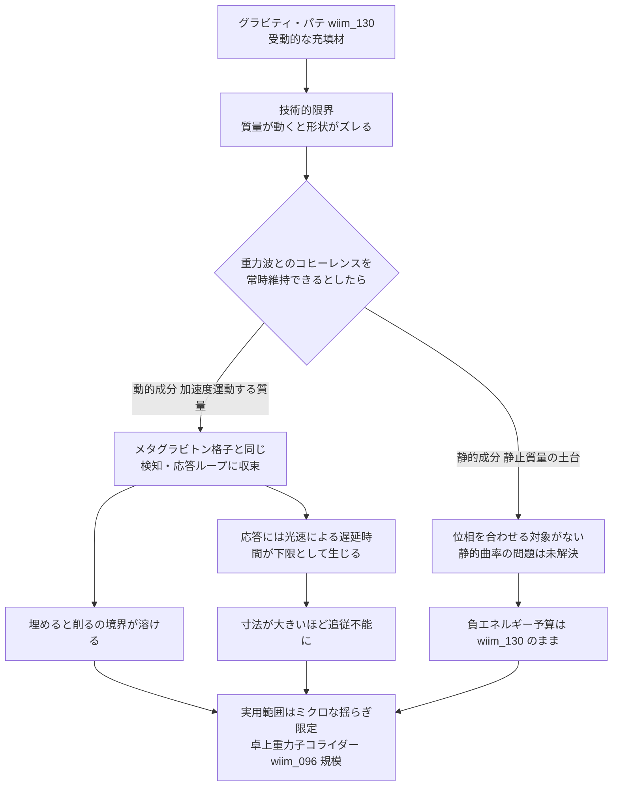

## 1. 概要 (Abstract)

[wiim_130](wiim_130.md)で論じたグラビティ・パテには、致命的な技術的限界があった。パテは一度流し込んで固定する受動的な材料であるため、凹みの原因である質量がわずかに動いただけで、パテの形状と実際の凹みの形状がずれてしまう——埋め残しと過剰充填が同時に生じる問題だ。

ではもし、パテ自身が周囲の重力波や重力圏の変化を常時検知し、位相を合わせてリアルタイムに形状を更新し続けられるとしたらどうか。これは彫刻アプローチ（メタグラビトン、[wiim_095](wiim_095.md)）がすでに採用している能動的フィードバックの仕組みを、埋めるアプローチにも輸入する発想になる。

> **前提:** グラビティ・パテが周囲の重力波・重力圏の変化と常に位相を合わせ、リアルタイムに形状を更新し続けられると仮定する。
> **命題:** 「もし埋める技術が削る技術と同じ追従能力を獲得したら、両者の違いに何が残るか」

---

## 2. 実現不可能性の根拠 (Infeasibility Rationale)

### 物理的限界

常時コヒーレントな追従とは、実質的には「検知→計算→応答」を絶え間なく回し続ける能動的フィードバック制御にほかならない。これは[wiim_130](wiim_130.md)で示した物理的限界（凹みを埋めるには凹みを作った質量とほぼ同等の負エネルギーが必要）を解消するものではなく、その上にさらにコストを積み増す。

制御ループが情報を取得し状態を更新するたびに、ランダウアー原理（[g172](../../glossary/terms/g172.md)）が定める最小限の熱的コストが発生する。重力波の歪みは実際の検出器（LIGO級の感度で歪み量にして10⁻²¹程度）でようやく捉えられるほど微弱であり、これを常時・高帯域で検知し続ける仕組みそのものに、材料の負エネルギー予算とは独立したエネルギーが恒常的に必要になる。

### 技術的限界

「重力波」という言葉が指すのは、あくまで動的に伝播する擾乱——質量が加速度運動したときに光速で放射される成分だ。一方、凹みの大部分を占めるのは、静止した質量が作る定常的な重力圏であり、これは伝播する波ではなく、質量とともに「そこにある」場の配置にすぎない。位相を合わせてロックオンする対象がそもそも存在しない。

つまり常時コヒーレンスが解決するのは「質量が加速度運動・振動している場合のミスマッチ」だけであり、[wiim_130](wiim_130.md)で扱った静止質量の凹みという主要ケースに対しては、光速で補充され続ける静的曲率の問題がそのまま居座る。技術的な守備範囲は広がるが、本丸は手つかずのままだと考えられる。

### 論理的限界

「常時コヒーレント」という言葉は、暗に遅延ゼロの応答を要求している。しかし質量側で生じた変化の情報は、光速を超えて伝わることができない。有限の大きさを持つパテである以上、その代表寸法をL、光速をcとすると、応答には必ずL/c以上の遅延が伴う——変化を検知してから追従し終えるまでの間、パテは常に「一歩遅れた」形状を保持し続けることになる。「常時」コヒーレントであるためには、変化が起こる前にその変化を知っている必要があり、これは未来の質量の挙動を事前に知る予知的制御を要求する——任意の未知の質量源に対して汎用的に機能する材料としては、論理的に成立しない条件だ。

加えて、センサーとアクチュエータを備えたパテ自身も質量・エネルギーを持つ実体である以上、それ自体が観測対象である重力場の一部を構成してしまう。測定装置が測定対象に組み込まれてしまうという、この種の思考実験で繰り返し現れる自己言及的な構造がここでも顔を出す。

---

## 3. 実験の設定 (Setup)

1. **主体:** コヒーレント・グラビティ・パテ——[wiim_130](wiim_130.md)のネゴトン（[g126](../../glossary/terms/g126.md)）パテに、重力波検出とリアルタイム位相フィードバック機構（メタグラビトン格子と同種のセンサー・アクチュエータ）を統合した改良版。
2. **環境1（動的成分）:** 連星系や自転する非対称質量など、加速度運動により重力波を放射し続ける質量源。
3. **環境2（静的成分）:** 静止した質量が作る、時間変化しない定常的な重力圏。
4. **操作A:** 環境1に対して位相を合わせ、リアルタイムに形状を更新する。
5. **操作B:** 環境2に対しては従来通り、実体的な負エネルギー充填のみで対応する。
6. **比較対照:** 完全にコヒーレントな極限状態と、メタグラビトン彫刻（[wiim_095](wiim_095.md)）の挙動をどこまで区別できるか比較する。

---

## 4. 考察と予測 (Speculation)

### 予測1：動的成分では「埋める」と「削る」の境界が溶ける

加速度運動する質量源に対しては、コヒーレントなグラビティ・パテは実質的にメタグラビトン格子と同じ検知・応答ループを持つ能動システムに収束すると考えられる。素材の中身（バルクの負エネルギー材料か、格子干渉によるみかけの準粒子か）が異なるだけで、外部から見た挙動——曲率変化への追従性能——はほぼ区別がつかなくなる。[wiim_130](wiim_130.md)の哲学的な問いで触れた「削るも埋めるも同じ問題の言い換えではないか」という疑念は、少なくとも動的成分に関しては裏付けられる形になる。

### 予測2：静的な土台は未解決のまま残る

一方、静止質量が作る土台部分の凹みには、コヒーレンス機構は何も新しい解決をもたらさない。必要な負エネルギー総量は[wiim_130](wiim_130.md)で見積もった値のままであり、フォード＝ローマン不等式による上限も変わらない。改良によって恩恵を受けるのは「動いている・振動している質量源」という限定されたケースだけであり、恒星質量のような静的な大質量の凹みには依然として手が届かない。

### 予測3：光速遅延がパテの実用サイズに上限を課す

L/cの遅延下限は、パテの代表寸法が大きくなるほど致命的になる。中性子星規模の凹みを覆う数十〜数百メートル級のパテでは、追従遅延だけで信号が実質的に「間に合わない」領域に入ると考えられる。結果として、コヒーレント化によって実用範囲が広がるのは、卓上重力子コライダー（[wiim_096](wiim_096.md)）が生成するような、もともと微小・短時間の曲率揺らぎに限られる——[wiim_130](wiim_130.md)が量子不等式から導いた結論と、今度は因果律から独立に同じ結論へたどり着く。

### 哲学的な問い

- 完全なコヒーレンスが「埋める」と「削る」を操作上同じものにしてしまうなら、この二つを別のアプローチとして語ること自体に、物理的な意味はどれだけ残っているのか。
- 測定装置が測定対象の一部になってしまうという自己言及的な構造は、この思考実験群で繰り返し現れる。これは重力という、遮蔽不可能で万物に普遍的に結合する力に特有の性質なのか、それとも能動的な制御を試みるあらゆる系に潜む一般的な限界なのか。

---

## 5. 数式による表現 (Mathematical Notation)

応答遅延の下限は、パテの代表寸法Lと光速cで決まる：

$$\Delta t \geq \frac{L}{c}$$

パテが大きいほど、追従の遅延下限も大きくなる。恒星規模の凹みでは、この遅延だけで実用に耐えなくなる。

---

## 6. 図解 (Diagrams)

---

## 7. 関連記事 (Related)

- [wiim_130](wiim_130.md) — グラビティ・パテ——時空の凹みは埋めるだけで平坦化できるか（本記事の前提）
- [wiim_095](wiim_095.md) — 重力を空間から削れたら——メタグラビトン格子による時空曲率の彫刻（収束先の彫刻アプローチ）
- [wiim_096](wiim_096.md) — 卓上重力子コライダー——コヒーレント化後も実用範囲はこの規模に限られる
- [g126](../../glossary/terms/g126.md) — ネゴトン（パテの原材料、負の実質量を持つ架空粒子）
- [g172](../../glossary/terms/g172.md) — ランダウアー原理（常時フィードバック制御に伴う情報処理コストの根拠）
- [wiim_052](wiim_052.md) — カオスを制御するカオスの悪魔の方程式——確率的制御と情報コストの類例
