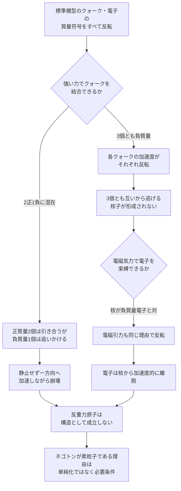

## 1. 概要 (Abstract)

ネゴトン（[g126](../../glossary/terms/g126.md)）は負の実質量を持つ架空の**素粒子**として定義されている。この定義のおかげで、既存の思考実験（[wiim_065](wiim_065.md)〜[wiim_067](wiim_067.md)、[wiim_080](wiim_080.md)）は「反重力天体同士は重力的に反発する」という帰結だけを扱えば済んでいた。

しかしもし、標準模型を構成するクォークや電子そのものの慣性質量が負だったら——つまり反重力を素粒子として天下り的に導入するのではなく、既存の物質の質量の符号だけを反転させて「反重力原子」を組み立てようとしたら、何が起きるだろうか。

> **前提:** 標準模型のクォーク・電子すべての慣性質量の符号を反転させると仮定する。電荷・色荷・結合定数は一切変更しない。
> **命題:** 「もし物質の最小単位まで負質量にしたら、それでも原子という構造は成立するか」

---

## 2. 実現不可能性の根拠 (Infeasibility Rationale)

### 物理的限界

重力が特殊なのは、力の式（$F \propto m_1 m_2$）にも加速度の式（$a = F/m$）にも質量が現れ、片方の質量が分子と分母の両方で打ち消し合うことだ。その結果、加速度は**相手側の質量の符号だけ**で決まる。

強い力・電磁気力は事情が異なる。力そのものは色荷・電荷で決まり、質量には依存しない。したがって打ち消し合いは起きず、加速度は**受け手自身の質量の符号**でそのまま決まる。通常なら引力として働く力が、負質量の受け手に対しては符号がそのまま反転した加速度を生む。

クォーク3個がすべて負質量の場合、グルーオン交換による通常の閉じ込め力は各クォークに「引き寄せる」向きの力を及ぼし続けるが、各クォークの加速度はそれぞれ自分の負質量で割られるため反転し、**3個とも互いから逃げる方向に加速する**。電子と原子核の間の電磁引力も同じ構造で反転し、電子は核に留まれない。

これは[wiim_066](wiim_066.md)で見たネゴトロン（正負電荷のネゴトン対）の電磁力反転と全く同じメカニズムであり、強い力・電磁気力のレベルでそのまま再現される。

### 技術的限界

この反転を回避する抜け道はないか——3個のクォークの質量符号を混在させたらどうか。たとえば2個を正質量、1個を負質量にすれば、正質量クォーク同士は通常通り引き合い、負質量クォークは正質量クォークを追いかける（[wiim_080](wiim_080.md)で見た「追う・逃げる」の暴走加速）。しかしこれは静止した束縛状態ではなく、無限に加速し続ける非対称な運動になる——「閉じ込め」ではなく「終わらない追いかけっこ」であり、どの符号の組み合わせを試しても、標準模型と同じ静止した安定核子には行き着かない。

結合定数側を調整して埋め合わせる道も塞がれている。[wiim_130_negoton_attraction_routes.md](../notes/wiim_130_negoton_attraction_routes.md)の経路4で整理した通り、力の結合定数そのものを局所的に変える操作（スカラー・テンソル理論の発想）は、それ自体が別の代償——今回で言えば「標準模型の強い力ではなくなる」という、前提の書き換えそのもの——を要求する。

### 論理的限界

強い力でクォークが閉じ込められず、電磁気力で電子が軌道を保てないなら、「反重力原子」という名前自体が矛盾を含んでいる。原子という言葉は「核子に閉じ込められたクォーク」と「軌道に留まる電子」という構造を前提とするが、負質量の標準模型粒子はその両方の前提を満たせない。

これは既存のネゴトンがなぜ**素粒子**として定義されているかの裏付けにもなる。ネゴトンをクォーク・電子の複合体として導出しようとした瞬間、強い力・電磁気力のレベルで構造が崩壊する——ネゴトンが素粒子であることは単純化のための設定ではなく、構造が成立するための必要条件だったと言える。

---

## 3. 実験の設定 (Setup)

1. **主体:** 標準模型のクォーク（アップ・ダウン）と電子。すべての慣性質量の符号を反転させる。電荷・色荷・スピン・結合定数は変更しない。
2. **操作A（核子形成の試行）:** 負質量のアップクォーク2個・ダウンクォーク1個を、通常の陽子と同じグルーオン交換で結合させようとする。
3. **操作B（原子形成の試行）:** 操作Aが仮に成功したとして、その周囲に負質量電子を通常の電磁引力で束縛させようとする。
4. **操作C（混在系の試行）:** 3個のクォークのうち1個だけ質量符号を反転させ、残り2個は正質量のままにする。
5. **観測目標:** 各操作で生じる相対加速度の向きと、束縛状態が形成されるかどうかを比較する。

---

## 4. 考察と予測 (Speculation)

### 予測1：核子は即座に解離する

強い相互作用の典型的な時間スケール（およそ10⁻²⁴秒程度）で、3個の負質量クォークは互いから逃げる方向に加速し始める。これは「弱い反発でゆっくり離れる」のではなく、閉じ込めエネルギー（1 GeV程度）に相当する反発として働くため、核子と呼べる構造は形成される間もなく崩壊すると考えられる。

### 予測2：電子は核に留まれない

操作Aが何らかの形で瞬間的に成立したとしても、電子は電磁気力の反転により核から加速度的に遠ざかる。軌道どころか、束縛状態と呼べる時間すら持たないと考えられる。

### 予測3：質量符号の混在は閉じ込めの代わりにならない

操作Cのように符号を混在させると、正質量クォーク2個は通常通り引き合う一方、負質量クォーク1個は正質量クォークを追いかける暴走加速に入る。3個が一体となって閉じ込められる代わりに、系全体が特定方向へ加速しながら崩壊していく非対称な描像になる。どの符号配分を試しても、静止した安定構造には到達しないと考えられる。

### 哲学的な問い

- ネゴトンが素粒子として定義されていることは、都合の良い単純化ではなく、構造が破綻しないための隠れた必要条件だったと言えるのではないか。
- 4つの力すべてが同じ「負の慣性質量による反転」で説明できるという事実は、CPT対称性をエネルギー・質量の符号まで拡張したパランティ粒子（[g161](../../glossary/terms/g161.md)）の発想と、標準模型の枠組みの間にまだ言語化されていない接点があることを示唆していないか。

---

## 5. 数式による表現 (Mathematical Notation)

強い力・電磁気力のように力自体が質量に依存しない相互作用では、加速度は単純にこう書ける：

$$\vec{a} = \frac{\vec{F}(q, \text{色荷})}{m}$$

$\vec{F}$ の向きは質量に依存せず不変のまま、$m$ の符号だけが反転すると、$\vec{a}$ の向きがそのまま反転する。

---

## 6. 図解 (Diagrams)

---

## 7. 関連記事 (Related)

- [g126](../../glossary/terms/g126.md) — ネゴトン（本記事が問い直す「なぜ素粒子として定義されているか」の当事者）
- [g161](../../glossary/terms/g161.md) — パランティ粒子（CPT対称性をエネルギー符号まで拡張する発想との接点）
- [wiim_066](wiim_066.md) — ネゴトン凝縮体の外部照射構築法（電磁力反転の原型となったネゴトロンの束縛問題）
- [wiim_080](wiim_080.md) — ネゴトンホワイトホールワープ（正負質量の「追う・逃げる」暴走加速の推進応用）
- [wiim_003](wiim_003.md) — 負の質量を持つ粒子による局所的時間加速（ネゴトンの初出記事）
