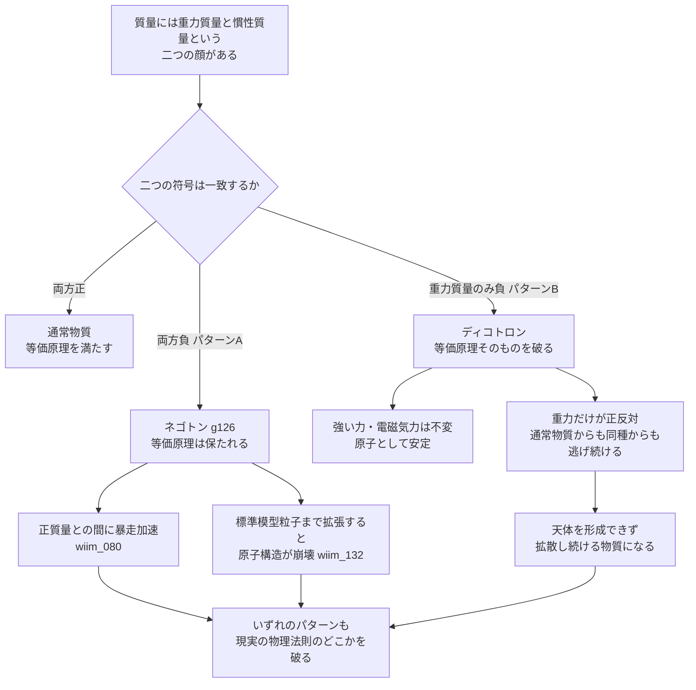

## 1. 概要 (Abstract)

ネゴトン（[g126](../../glossary/terms/g126.md)）は重力質量と慣性質量の両方を負にすることで等価原理を保ったまま負質量を実現していた。しかしその代償として、正質量物体との間に暴走加速（[wiim_080](wiim_080.md)）が生じ、標準模型のクォーク・電子にまで拡張すると強い力・電磁気力のレベルで原子構造そのものが崩壊する（[wiim_132](wiim_132.md)）。

ここで発想を逆転させたらどうなるか。慣性質量は正のまま保ち、**重力質量だけ**を負にする——等価原理を意図的に破る物質を考える。この物質を**ディコトロン**（ギリシャ語 δίχα「二つに裂けて」に由来）と呼ぶ。慣性質量が正である以上、強い力・電磁気力への応答は反転せず、原子は普通に安定する。だが重力に対する応答だけが正反対になる。

> **前提:** ある未知の物質の重力質量が負、慣性質量が正であると仮定する（等価原理を破る）。
> **命題:** 「もし重力質量と慣性質量が食い違う物質が存在したら、原子として安定していながら、現実の物理学が最も厳密に検証してきた一線をなぜ踏み越えることになるのか」

---

## 2. 実現不可能性の根拠 (Infeasibility Rationale)

### 物理的限界

等価原理（自由落下の普遍性）は、現実の物理学の中でも最も精密に検証された原理の一つだ。ねじれ天秤実験、月レーザー測距、そして2022年のMICROSCOPE衛星実験は、組成の異なる物質同士の落下加速度の差を10⁻¹⁵レベルで検出できないことを示している。2023年にはCERNのALPHA-g実験が反水素の自由落下を直接測定し、反物質ですら通常の重力方向に落下することを確認した。電荷を反転させても、スピンを反転させても、これまで検証されたあらゆる物質は同じ加速度で落下する。ディコトロンはこの、例外が一つも見つかっていないパターンを単独で破る物質ということになる。

一般相対性理論においてはこの限界はさらに根深い。アインシュタインの洞察は「重力とは時空の幾何学である」というものであり、幾何学である以上、その場所にどんな物質を置いても同じ測地線をたどるはずだ——組成によって異なる測地線をたどる物質があるなら、それはもはや単一の幾何学では記述できない。ネゴトンは重力質量と慣性質量の符号を一致させたまま負にしているため、一般相対論の枠内に「負の曲率源」として素直に収まる。ディコトロンはこの前提そのものを破るため、GRに単純な修正を加えるだけでは扱えず、幾何学とは別の、物質の種類によって働き方が変わる「第五の力」的な結合を新たに要求する。

### 技術的限界

この「第五の力」を仮定するには、慣性質量とは独立した「重力荷」という全く新しい物理量と、それに対応する未知の結合定数・媒介粒子を一から用意する必要がある。ネゴトンが「質量の符号を反転させる」という一点だけの追加仮定で済んだのに対し、ディコトロンは、通常の重力とは別チャンネルで働く新しい相互作用の全体像——保存則の有無、結合定数の大きさ、到達距離——をまるごと構築しなければならない。理論的コストはネゴトンよりも一段高い。

### 論理的限界

一般相対論の核心には「局所慣性系」という概念がある——十分小さな領域では、自由落下する観測者は重力と加速度を区別できない、という等価原理の言い換えだ。ディコトロンと通常物質が同じ場所に存在すると、この前提が崩れる。通常物質と共に自由落下する観測者から見ると、ディコトロンは2g相当の加速度で飛び去っていくように見える——両方の物質に同時に通用する単一の局所慣性系が存在しないことになる。これは単なる例外的なふるまいではなく、「時空の曲率は観測者や物質の種類によらず一意に定まる」という一般相対論の土台そのものと正面から矛盾する。

---

## 3. 実験の設定 (Setup)

1. **主体:** ディコトロン——重力質量が負・慣性質量が正の未知の物質。電荷・色荷は通常物質と同じであり、クォーク・電子としての内部構造は正常。
2. **環境:** 惑星表面付近。通常物質による一様な重力場（加速度g）を想定する。
3. **操作A:** ディコトロンの塊を惑星表面付近で静止状態から解放する。
4. **操作B:** 同じ場所・同じ瞬間に通常物質とディコトロンを同時に自由落下させ、軌跡を比較する。
5. **比較対照:** 等価原理を維持したネゴトン（[wiim_003](wiim_003.md)・[wiim_066](wiim_066.md)・[wiim_080](wiim_080.md)）との挙動の違いを整理する。

---

## 4. 考察と予測 (Speculation)

### 予測1：「浮く」のではなく「逆向きに落ちる」

一般的な反重力のイメージは「無重力のように静止する」ことだが、正確な描像は違う。重力質量の大きさが通常物質と等しく符号だけ逆なら、ディコトロンは惑星から**同じ加速度gで**遠ざかる方向へ加速する。静かに浮遊するのではなく、地面に対して普通の自由落下と同じ激しさで「逆向きに落下」する。

### 予測2：自分自身からも逃げる天体分離

ディコトロン同士の重力も、通常物質にとってのそれとは正反対に働く。物体1・2ともに重力質量が負・慣性質量が正の場合、力の向きは反発のままで、それを正の慣性質量で割っても向きは反転しない——結果、ディコトロン同士も互いに遠ざかる。通常物質のように自己重力で集まって天体を形成することがなく、ディコトロン自身の星や惑星は存在しえない。通常物質からもディコトロン同士からも永遠に逃げ続ける、拡散するだけの物質になる。

### 予測3：検出は「わずかな誤差」ではなく「劇的な逆転」として現れる

現実のねじれ天秤実験は、組成の異なる物質間の落下加速度差を探して10⁻¹⁵レベルの上限を置いている。もしディコトロンが存在するなら、その痕跡は微小な誤差としてではなく、符号が完全に反転した劇的な逆転として現れるはずだ。これは裏を返せば、もし太陽系内にわずかでも存在していたなら既に発見されていたはずだということでもある——ディコトロンが今も未発見だとすれば、通常物質と重力以外の経路で一切相互作用しない、極めて特殊な「暗い」物質でなければならない。

### 哲学的な問い

- 「重力は時空の幾何学である」というアインシュタインの洞察は、ディコトロンのような物質が存在しうる可能性を最初から排除する形で作られている。もし将来何らかの形でこの種の破れが示唆されたら、それは幾何学的重力理論そのものの放棄を意味するのだろうか。
- ディコトロンは自己重力で集まることも通常物質に集まることもない、恒久的に拡散し続ける物質だ。[wiim_130_negoton_duality.md](../notes/wiim_130_negoton_duality.md)で触れたFarnesの負質量ダークフラウィド仮説は等価原理を保ったネゴトン型の負質量を使って局所的な集積（ダークマター的）と大域的な反発（ダークエネルギー的）の両方を説明しようとしたが、ディコトロンは集積が原理的に起きないため、ダークエネルギー的な側面だけを純粋に担う物質になりうる。二つの負質量物質は、宇宙論において全く別の役割にしか使えないのではないか。

---

## 5. 数式による表現 (Mathematical Notation)

重力質量の大きさが通常物質と等しい場合、ディコトロンの加速度は通常物質が受ける局所重力加速度 $\vec{g}$ を使って単純に表せる：

$$\vec{a}_{\text{ディコトロン}} = -\vec{g}$$

同じ場所・同じ瞬間に自由落下させた通常物質とは、常に正反対の方向へ同じ大きさで加速する。

---

## 6. 図解 (Diagrams)

---

## 7. 関連記事 (Related)

- [g126](../../glossary/terms/g126.md) — ネゴトン（等価原理を保ったまま負質量を実現する対照的な設定）
- [wiim_003](wiim_003.md) — 負の質量を持つ粒子による局所的時間加速（ネゴトンの初出記事）
- [wiim_066](wiim_066.md) — ネゴトン凝縮体の外部照射構築法（パターンAが抱える束縛問題）
- [wiim_080](wiim_080.md) — ネゴトンホワイトホールワープ（パターンAに特有の暴走加速）
- [wiim_132](wiim_132.md) — 反重力原子は成立するか（パターンAを標準模型粒子まで拡張した場合の帰結）
- [wiim_130_negoton_duality.md](../notes/wiim_130_negoton_duality.md) — ネゴトンの二面性（負質量ダークフラウィド仮説との比較対象）
