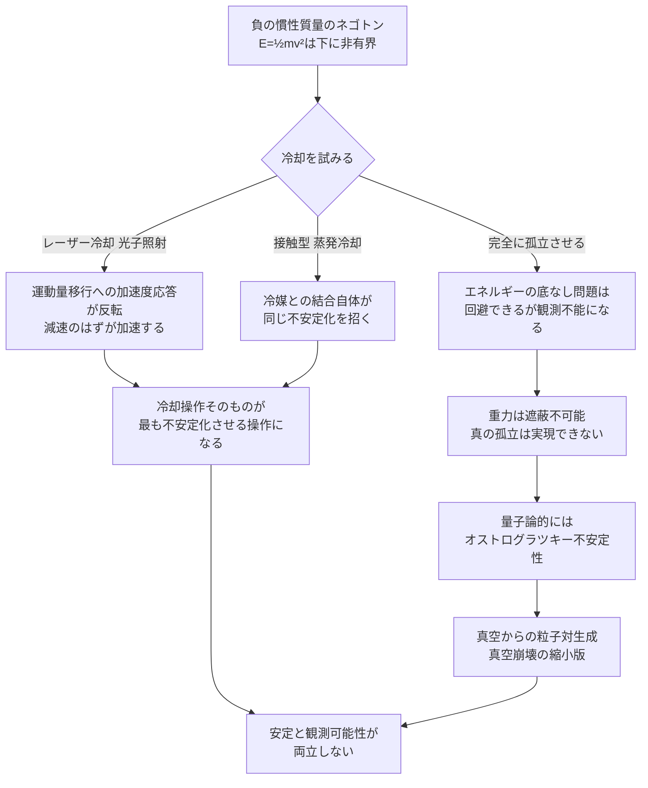

## 1. 概要 (Abstract)

これまで確立してきたネゴトン（[g126](../../glossary/terms/g126.md)）の暴走加速（[wiim_080](wiim_080.md)）は、正質量物体という「相手」がいて初めて発生する現象だった。では、相手のいない孤立したネゴトン1個を、通常の原子と同じように冷却しようとしたら何が起きるだろうか。

運動エネルギーは $E=\frac{1}{2}mv^2$ で表される。$m$ が正なら $E$ は $v=0$ で最小値ゼロを取り、冷却とは自然にこの最小値へ近づく過程だ。しかし $m$ が負なら、$v$ が大きくなるほど $E$ はどこまでもマイナスに深くなり、最小値そのものが存在しない。冷却が目指すべき「底」がないのだ。

> **前提:** 慣性質量が負の孤立したネゴトン1個を、正質量物体との相互作用を排除した上で、標準的な冷却技術（レーザー冷却・蒸発冷却）で絶対零度に近づけようとすると仮定する。
> **命題:** 「もし負の慣性質量を持つ物質を冷却しようとしたら、そもそも"冷える"とはどういう状態を指すのか」

---

## 2. 実現不可能性の根拠 (Infeasibility Rationale)

### 物理的限界

通常の冷却は、系からエネルギーを奪い、より低いエネルギー状態へ落ち着かせる過程だ。正質量の系ではこの行き先が $v=0$ という明確な底として存在する。ボース＝アインシュタイン凝縮は、まさに冷却によって粒子群がこの最低エネルギー状態（単一の量子基底状態）に集団で落ち込む現象として説明される。

負の慣性質量ではこの前提が崩れる。$E=\frac{1}{2}mv^2$ の $m$ が負である以上、$v$ を大きくするほど $E$ は際限なく低下する——エネルギーの最小値が存在しない。「エネルギーを奪って最低エネルギー状態に落ち着かせる」という冷却の定義そのものが、行き先を持たないまま宙に浮く。

### 技術的限界

冷却は必ず何らかの結合——冷媒との熱接触、あるいはレーザー冷却における光子の吸収・放出——を通じて行われる。ここで[wiim_132](wiim_132.md)で確立した原理が効いてくる。光子が原子に及ぼす力（運動量移行）は質量に依存せず、電荷・双極子結合だけで決まる。正質量原子なら、光子との相互作用が運動量を奪い減速する（レーザー冷却）。しかし負の慣性質量では、同じ運動量移行に対する加速度応答が反転するため、**減速させるはずの光子照射が、実際には加速として働く**。冷やそうとする操作そのものが、系を加速させる操作に反転してしまう。

### 論理的限界

エネルギーに下限がない系は、正のエネルギーを持つ他の系と何らかの形で結合した瞬間に不安定化する。これは孤立した状態でしか安定しないが、孤立した状態では観測も冷却も利用もできない——観測・冷却・封じ込めという行為そのものが結合を意味するからだ。「研究室で安全に扱う」という要求と「安定して存在する」という要求が両立しない。

これは理論物理学において全く新しい懸念ではない。運動項の符号が逆転した場（いわゆる「ゴースト場」）がハミルトニアンを下に非有界にすることは、高階微分理論や修正重力理論で繰り返し指摘されてきた問題であり、オストログラツキー不安定性として知られる。下に非有界な系が正のエネルギーを持つ通常の場と結合すると、エネルギー保存を破ることなく際限のない粒子対生成が起こりうる——真空そのものが崩壊する。孤立したネゴトンが抱える問題は、二体間の暴走加速よりも一段深い、この真空崩壊の縮小版だと考えられる。

---

## 3. 実験の設定 (Setup)

1. **主体:** 慣性質量が負の孤立したネゴトン1個。正質量物体との直接相互作用は意図的に排除する。
2. **環境:** 標準的な冷却装置——レーザー冷却トラップまたは蒸発冷却チャンバー。
3. **操作A:** 通常の原子と同じ手順（光子照射によるレーザー冷却）で冷却を試みる。
4. **操作B:** 冷却装置・観測装置を含め、いかなる系とも結合させない完全な孤立状態を想定する。
5. **比較対照:** [wiim_066](wiim_066.md)・[wiim_080](wiim_080.md)で確立した「正質量物体との暴走加速」との違いを整理する。

---

## 4. 考察と予測 (Speculation)

### 予測1：冷却しようとした瞬間に加熱する

レーザー冷却は光子の運動量移行で原子を減速させる技術だが、負の慣性質量ではこの移行に対する加速度応答が反転するため、照射のたびに速度が増していく。冷却を試みる操作そのものが系を最も不安定化させる操作になる——蒸発冷却のように接触型の冷媒を使っても、冷媒側へエネルギーが移動する過程自体が同じ結合を意味するため、事情は変わらないと考えられる。

### 予測2：安定できるのは観測不可能な孤立状態だけ

エネルギーの底なし問題を避けられるのは、いかなる系とも結合しない完全な孤立状態だけだ。しかしこの状態は定義上、観測も検出も利用もできない。「安定して存在する」ことと「研究室で扱える」ことが、負の慣性質量では両立しない要求になる。

### 予測3：量子論的には真空全体の問題になる

古典的な冷却装置がなくとも、量子場としてのネゴトンが通常の標準模型場とごくわずかでも結合していれば（重力を通じた結合は遮蔽できないため避けられない、[wiim_131](wiim_131.md)参照）、オストログラツキー不安定性により真空からの粒子対生成が原理的に進行しうる。進行速度は結合の弱さに応じて遅くなるだけで、完全には止まらない。冷却装置の話ではなく、ネゴトンが存在する宇宙そのものの安定性の話になる。

### 哲学的な問い

- 「絶対零度に近づく」という概念は、エネルギーが下に有界な物質だけに定義される概念であり、負の慣性質量に対しては「難しい」のではなく、そもそも「未定義」だと言うべきではないか。
- 重力は遮蔽不可能な普遍的結合である以上、どれほど巧妙に孤立させても真の孤立は実現できない。負の慣性質量が抱える不安定性は、工学的な課題ではなく、この宇宙に存在すること自体と両立しない性質なのかもしれない。

---

## 5. 数式による表現 (Mathematical Notation)

$$E = \frac{1}{2}mv^2$$

$m>0$ なら $E$ は $v=0$ で最小値ゼロを取るが、$m<0$ なら $v$ の増加とともに $E$ は下限なく減少し続ける。

---

## 6. 図解 (Diagrams)

---

## 7. 関連記事 (Related)

- [g126](../../glossary/terms/g126.md) — ネゴトン（負の実質量を持つ架空粒子、暴走加速の初出）
- [wiim_003](wiim_003.md) — 負の質量を持つ粒子による局所的時間加速（ネゴトンの初出記事）
- [wiim_066](wiim_066.md) — ネゴトン凝縮体の外部照射構築法（二体間の暴走加速）
- [wiim_080](wiim_080.md) — ネゴトンホワイトホールワープ（暴走加速の推進応用）
- [wiim_131](wiim_131.md) — グラビティ・パテと重力波コヒーレンス（重力の遮蔽不可能性）
- [wiim_132](wiim_132.md) — 反重力原子は成立するか（力は質量に依存しないという原理の初出）
- [wiim_133](wiim_133.md) — ディコトロン（対照的に正の慣性質量を持つため、この問題を回避できるパターン）
