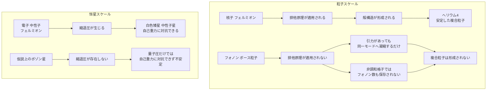

## 1. 概要 (Abstract)

結晶格子の中でフォノン（格子振動の量子）同士は無関係に振る舞うわけではない。非調和な格子では二つのフォノンが合体して一つになる「三フォノン過程」が絶えず起きている。この合体を積み重ねていけば、ヘリウム4の原子核のように「複数の量子が束縛されて一つの安定した複合粒子」を作れるだろうか。

> **前提:** 非調和性を持つ結晶格子中のフォノン集団に、仮に核力に類似した引力的相互作用が存在すると仮定する。
> **命題:** 「もしフォノン同士が引力で結びつくなら、ヘリウム4のように4個が束縛された安定な複合粒子を作れるか？」

答えは否だと考えられる。理由はフォノンの合体そのものが起きないからではなく、フォノンがボース粒子であり、パウリの排他原理に従わないという一点に集約される。

---

## 2. 実現不可能性の根拠 (Infeasibility Rationale)

### 物理的限界

フォノンは格子振動が量子化された準粒子で、スピンは整数でありボース＝アインシュタイン統計に従う。パウリの排他原理は半整数スピンのフェルミオンにのみ課される制約であり、ボース粒子であるフォノンには最初から「同一の量子状態を複数個が占めてはならない」という制限が存在しない。

ヘリウム4の原子核が特別に安定なのは、核力の引力だけによるものではないと考えられる。陽子2個・中性子2個はいずれもスピン1/2のフェルミオンであり、スピン上向き陽子・スピン下向き陽子・スピン上向き中性子・スピン下向き中性子という4つの異なる量子状態を排他原理に従って過不足なく埋めることで、殻が完全に閉じた特別な安定構造（いわゆる魔法数構造）を得ている。フォノンには「状態を分け合わなければならない」という力学的要請がそもそも存在しないため、核力に相当する引力を仮定しても、殻構造を持つ複合粒子という概念の土台が成立しない。

### 技術的限界

調和近似——格子ポテンシャルを完全な線形振動として扱う近似——ではフォノン同士は相互作用せず、複合化の議論はそもそも始まらない。しかし現実の結晶格子は非調和であり、格子ポテンシャルの三次・四次の項を介して「三フォノン過程」が常に進行している。これは二つのフォノンが合体して一つになる、あるいは一つが二つに分裂する過程で、エネルギーと結晶運動量（逆格子ベクトルを法として）を保存しながら進行する。絶縁体の熱伝導率が無限大にならず有限の値に落ち着く「ウムクラップ散乱」は、この過程が現実に起きていることの直接的な証拠である。

しかしこの過程はフォノンを合体させると同時に、フォノン数という量を保存しない。核子数（バリオン数）がほぼ厳密に保存され、ヘリウム4という構造を長期間維持できるのとは対照的に、フォノンには「4個を束ねたまま保持し続ける」ための保存則的な土台が存在しない。合体してできた一つの高エネルギーフォノンは、次の瞬間には別の過程で分裂・散乱しうる。

### 論理的限界

物理的限界と技術的限界を踏まえてもなお、「フォノン間に核力に類似した引力的相互作用が存在したら」という仮定を置いてみる。それでも排他原理がない以上、複数の量子が異なる量子状態を占有しなければならない力学的な理由は生じない。引力を持つボース粒子系がたどる自然な帰結は、殻構造の形成ではない。排他原理がなければ全ての量子が同一モードに集まろうとし、引力が弱ければ通常のボース＝アインシュタイン凝縮的な振る舞いに、引力が強ければ歯止めなく縮み続ける自己収縮（コラプス）に向かう——いずれの場合も、区別可能な構成要素を持つ安定した複合粒子ではない。

これは「4個が区別可能な状態で束縛された複合粒子」ではなく、単に「量子数の大きい一つのモード」に過ぎない。引力の有無に関わらず、フォノンがヘリウム4のような複合粒子になるという概念そのものが論理的に成立しないと考えられる。

---

## 3. 実験の設定 (Setup)

1. **主体:** 非調和性を持つ結晶格子中のフォノン集団。
2. **環境:** 極低温に保たれた理想化された結晶格子（1次元または3次元）。
3. **操作A:** 格子に強いコヒーレントな振動を励起し、多数のフォノンを特定の波数領域に集中させる。
4. **操作B:** 非調和相互作用（三フォノン過程・四フォノン過程）を人為的に強め、フォノン同士の結合を促進する。
5. **操作C:** 核力に類似した引力的相互作用を理論的に追加した場合の振る舞いを追跡する。
6. **観察対象:** 結果として現れる状態が「殻構造を持つ安定複合粒子」か「単一モードへの凝縮」かを判定する。

---

## 4. 考察と予測 (Speculation)

### 最も近い実在現象：ディスクリート・ブリーザー

非調和格子には、フォノンの複合化に最も近い実在の現象として「ディスクリート・ブリーザー（局在振動モード）」が知られている。非線形性によって多数の振動量子が格子の特定の位置に自己収束し、時間的にも空間的にも局在し続ける振動波束である。

エネルギー的には「多数のフォノン量子が一箇所にまとまっている」ように見えるが、その内実は区別可能な粒子が束縛されているのではなく、非線形波動方程式の解として一体化した連続的な波に過ぎない。ヘリウム4が「陽子2個・中性子2個」という数えられる内部構造を保つのとは対照的に、ディスクリート・ブリーザーは「何個のフォノンからできているか」という問いがあまり意味を持たない、量子数が連続的に変化しうる実体だと考えられる。

### スケールを超えて繰り返される同じ理由

排他原理の有無という一つの分岐点は、まったく異なるスケールの現象にも同じ形で現れる。白色矮星と中性子星がそれぞれ電子・中性子の縮退圧によって自己重力に対抗し、一定の大きさを保てるのは、これらがフェルミオンだからにほかならない。

もし仮に恒星が、スピン0の仮説的スカラー場のようなボース粒子だけで構成される「ボゾン星」であったなら、縮退圧という支えは存在せず、自己重力に対抗できるのはハイゼンベルクの不確定性原理に由来する弱い量子圧だけになる。理論的には、こうしたボゾン星は場に反発的な自己相互作用を追加しない限り安定な構造を保てず、崩壊に向かいやすいと考えられている。

フォノン4個がヘリウムになれない理由と、ボゾン星が中性子星のように安定できない理由は、スケールこそ原子核内部から恒星サイズまで大きく隔たっているが、「排他原理を持つ粒子かどうか」という同一の分岐点に行き着く。

---

## 5. 数式による表現 (Mathematical Notation)

三フォノン過程のエネルギー保存則：

$$\hbar\omega_3 = \hbar\omega_1 + \hbar\omega_2$$

二つのフォノンが合体して一つになる過程は、このエネルギー保存則（および結晶運動量の保存則）に従って進行する。ただし保存されるのはエネルギーと運動量であり、フォノンの個数ではない。

---

## 6. 図解 (Diagrams)

---

## 7. 関連記事 (Related)

- [wiim_102](../cosmology/wiim_102.md) — 音をブラックホールに折り畳み、ワームホールから取り出せるか（フォノンを情報の運搬体として扱う視点の関連記事）
- [g060](../../glossary/terms/g060.md) — パウリの排他原理（本記事の核となる原理）
- [g509](../../glossary/terms/g509.md) — 三フォノン過程（フォノン数が保存されない技術的根拠）
- [g510](../../glossary/terms/g510.md) — ディスクリート・ブリーザー（実在する最も近い現象）
- [g511](../../glossary/terms/g511.md) — ボゾン星（スケールを超えた対比）
