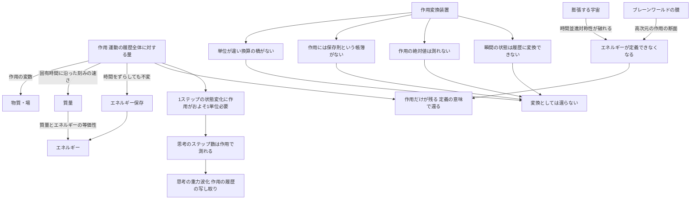

## 1. 概要 (Abstract)

20世紀の物理学は、物質がエネルギーに還ることを示した。質量とエネルギーの等価性によって、1グラムの物質は広島型原爆に匹敵するエネルギーと同じものだとわかり、原子核反応や対消滅はそれを実際に起こしている。

では、その次の段階はあるだろうか。物理学には、エネルギーよりさらに根本に置かれる量がある。**作用**（アクション）だ。作用は、物体や場がある時刻からある時刻までにたどった運動の履歴全体に対して一つの数を割り当てる量で、自然界はこの作用が極値をとる経路を選ぶ（**最小作用の原理**）。ニュートン力学も、電磁気学も、一般相対性理論も、標準模型も、すべて「一つの作用」の形で書ける。量子論では、作用の最小単位にあたるのがプランク定数（ℏ）だ。

物質がエネルギーに還ったように、エネルギーもまた作用に還るのだろうか。

> **前提:** 物質やエネルギーを投入すると、それを「作用そのもの」に変換して取り出す装置（以下、作用変換装置）が作れると仮定する。
> **命題:** 「物質やエネルギーは作用に還るか。還るとすれば、それは変換なのか、別の何かなのか？」

結論を先に述べると、**変換としては還らない**と考えられる。しかし、物質もエネルギーも**もともと作用から導かれる量**であり、その意味では最初から作用の一部だった。そして、エネルギーという概念そのものが成り立たなくなり、作用だけが残る場面が実際に存在する。本記事はこの区別を整理し、後に続く「思考を重力波に変換して膜の外へ出す」構想（[wiim_136](../cosmology/wiim_136.md)の延長）の理論的な土台を置く入口記事として位置づける。

---

## 2. 実現不可能性の根拠 (Infeasibility Rationale)

### 物理的限界

**単位が違い、換算の橋がない.** 作用の単位は「エネルギー×時間」（ジュール秒）で、プランク定数や角運動量と同じだ。質量とエネルギーが換算できるのは、光速という宇宙共通の定数が両者を結んでいるからだった。エネルギーと作用を結ぶには「時間」の定数が必要になる。候補としてプランク時間（約10⁻⁴³秒）を持ち出すことはできるが、それで換算した値がどんな物理過程で実現するのかを示す理論はない。

**受け皿となる保存則がない.** 質量がエネルギーに変わるという主張が意味を持つのは、エネルギー保存則があるからだ。質量が消えた分だけ別の形のエネルギーが現れ、帳簿の合計は変わらない。ところが作用には保存則がない。作用は時間とともに増え続けたり減ったりする量で、「消えた質量の分だけ作用が増えた」という帳簿をつける仕組みが物理の中に存在しない。変換には両側に同じ帳簿が要るが、作用の側には帳簿がないと考えられる。

### 技術的限界

**作用の絶対値は測れない.** 作用の値には、物理を一切変えずに足し引きできる部分がある。運動を記述する式に、始点と終点だけで決まる項を加えても、自然が選ぶ経路は変わらない。つまり「この運動の作用は何ジュール秒だ」という値そのものが、記述の選び方で変わってしまう。量子論でも、作用は波の位相として現れるが、全体に共通する位相のずれは観測できない。

測定できるのは、二つの経路の作用の**差**（干渉縞のずれ）だけだ。作用変換装置の出力口に計器をつないでも、そこに「どれだけの作用が出てきたか」を示す針は原理的に振れないと考えられる。

### 論理的限界

**瞬間の状態を履歴には変換できない.** 物質やエネルギーは「ある瞬間に、ここに、これだけある」と言える量だ。作用は違う。作用は始まりから終わりまでの**履歴全体**に対してはじめて定義される。瞬間の状態から履歴への変換は、位置を軌道に変換せよと言うのと同じく、種類の違うものどうしの取り違えにあたる。

さらに、作用変換装置そのものの動作も、宇宙全体の作用の中に書き込まれている。装置は作用を「取り出す」のではなく、自分自身が作用の一部として振る舞うしかない。取り出した作用を入れておく外側の容器が、論理的に用意できないと考えられる。

---

## 3. 実験の設定 (Setup)

1. **主体:** 作用変換装置と、そこに投入する1キログラムの物質。
2. **環境:** 平坦で静止した時空（操作A・B）、膨張する宇宙（操作C）、ブレーンワールドの膜の上（操作D）。
3. **操作A:** 静止した物質を投入し、質量を作用に変換しようとする。
4. **操作B:** 物質を対消滅させて光に変え、その光のエネルギーを作用に変換しようとする。
5. **操作C:** 膨張する宇宙で遠方から届く光を観測し、赤方偏移で失われたエネルギーの行き先を追う。
6. **操作D:** 膜の上で、エネルギーが余剰次元へ漏れ出す事象を観測する。
7. **観察対象:** 各操作で「作用に還った」と言える何かが起きるか、起きるならそれは変換か、定義の消失か。

---

## 4. 考察と予測 (Speculation)

### 質量は「作用が刻まれる速さ」である

操作Aで、装置は何も取り出せない。しかし、物質の中を覗き込むと、質量はすでに作用の言葉で書かれている。

静止した粒子が何もせずに存在しているとき、その作用は「質量×その粒子自身が経験する時間（固有時間）」に比例して積み上がっていく（数式は5節）。言い換えれば、**質量とは、存在しているだけで作用が刻まれていく速さ**だ。

量子論では、この刻みは粒子の波の位相の回転として現れる。電子は静止しているだけで、位相が毎秒およそ10²⁰回転の速さで回っている（コンプトン周波数）。ド・ブロイは、あらゆる物質粒子がこの「内部時計」を持つと考えた。重い粒子ほど時計は速く進む。

光には質量がない。光速で進む光にとって固有時間は進まず（[g174](../../glossary/terms/g174.md)）、この内部時計も刻まれない。質量を持つとは、自分の時計を持つことだと言える。

### エネルギーは作用の対称性の影である

操作Bでは、物質は光に変わり、エネルギーは保存される。ここまでは質量とエネルギーの等価性のとおりだ。

では、そもそもエネルギーはなぜ保存されるのか。ネーターの定理（[g089](../../glossary/terms/g089.md)）によれば、**作用が時間をずらしても変わらないこと**（時間並進対称性）から、エネルギーという保存量が導かれる。エネルギーは独立した実体ではなく、作用が持つ対称性から生まれる影のようなものだ。作用の値が時間とともにどれだけ変わるかという割合が、そのままエネルギーになる。

つまり、物質とエネルギーの関係は次のように整理できる。

| 量 | 作用から見た正体 |
|---|---|
| 物質・場 | 作用を書くための変数そのもの |
| 質量 | 固有時間に沿って作用が積み上がる速さ |
| エネルギー | 作用が時間とともに変わる割合。量子論では位相が回る速さ |
| エネルギー保存 | 作用が時間をずらしても変わらないことの帰結 |
| プランク定数 | 作用を「位相の角度」に読み替える単位 |

物質もエネルギーも、作用に**変換**されることはない。最初から作用の**性質の名前**だったからだ。

### 作用に還る場面1——膨張する宇宙

操作Cで、事態は変わる。

膨張する宇宙では、遠方の銀河を出た光が、長い旅の間に空間ごと引き伸ばされ、波長が伸びて届く（赤方偏移、[g001](../../glossary/terms/g001.md)）。波長が伸びた光はエネルギーが小さい。では、失われたエネルギーはどこへ行ったのか。

答えは「どこへも行っていない」ではなく、**その問いが立たない**だ。宇宙が膨張しているということは、時間をずらすと宇宙の状態が変わるということであり、時間並進対称性が成り立っていない。ネーターの定理の前提が崩れるので、宇宙全体のエネルギー保存はそもそも一般には定義できない。一般相対性理論では、重力場そのもののエネルギーを場所ごとに定めることも一般にはできないことが知られている。

それでも作用は健在だ。一般相対性理論の作用は膨張する宇宙でもきちんと定義され、光の振る舞いも宇宙の膨張も、すべてその作用から導かれる。対称性が壊れたとき、影であるエネルギーは輪郭を失い、光源である作用だけが残る。

**物質やエネルギーが作用に「還る」ことがあるとすれば、それは変換ではなく、エネルギーという概念を支えていた対称性が消え、作用だけが残るという形で起きる**と考えられる。宇宙膨張のエネルギーを回収する構想（[wiim_139](../cosmology/wiim_139.md)）が根本的に難しいのも、回収の対象となるエネルギーの帳簿が宇宙規模では成り立たないことに一因がある。

### 作用に還る場面2——膜の上のエネルギー保存

操作Dでは、ブレーンワールドの膜の上で、エネルギーが余剰次元へ漏れ出す。[wiim_138](../cosmology/wiim_138.md)で見たように、膜の上の住人にはエネルギー保存が破れて見える。

作用の立場から見ると、これは自然なことだ。本当の作用は高次元の時空全体に対して書かれており、膜の上のエネルギー保存は、その作用が持つ対称性のうち、膜に見える部分だけを切り出したものにすぎない。切り出し方が不完全なら、保存則もまた不完全に見える。高次元の作用に戻れば、帳尻は合っている。

ただし、帳尻が合うことは、代償が消えることを意味しない。膜から漏れたエネルギーは、バルク空間（[g524](../../glossary/terms/g524.md)）の重力場の乱れとして残るか、別の膜へ流れ込んで、そちらの住人にとっては「どこからともなく現れたエネルギー」になる。余剰次元は収支を消す場所ではなく、収支を記録する場所が膜の外に移るだけだと考えられる。

ここでも「還る」は変換ではない。膜の上の法則が、より大きな作用の断面だったことが明らかになるだけだ。

### 思考は作用で測れる

作用を中心に置くと、意外な量が測れるようになる。**計算、そして思考の量**だ。

量子力学には、ある状態がそれと完全に区別できる別の状態へ移るまでに、最低限必要な時間があるという定理がある（マーゴラス＝レヴィティンの定理）。その時間はエネルギーに反比例する。言い換えれば、1ステップの状態変化には、**エネルギー×時間、つまり作用がおよそプランク定数ほど必要**になる。

これは次のことを意味する。

- エネルギーが決めるのは、思考や計算の**速さ**
- 実際に何ステップの思考や計算が起きたかは、**積み上がった作用の総量**で上限が決まる

物理学者セス・ロイドは、この定理を使って1キログラムの物質で可能な計算速度の上限を毎秒およそ10⁵⁰回と見積もった。ヒトの脳（約1.4キログラム）が実際に行っている神経活動は毎秒10¹⁵回程度と見積もられるので、脳は物理的に許される上限の35桁ほど下で思考していることになる。思考は、自分の物質が持つ作用の刻みのほんの一部しか使っていないと考えられる。

エネルギーと情報を結ぶ原理としては、情報の消去に最低限の熱が必要だとするランダウアー原理（[g172](../../glossary/terms/g172.md)）がよく知られている。ランダウアー原理が「忘れる」ことのコストをエネルギーで測るのに対し、マーゴラス＝レヴィティンの定理は「考える」ことのコストを作用で測る、という対比ができる。

### 次の思考実験への橋——思考を運ぶとは何を運ぶことか

この整理は、[wiim_136](../cosmology/wiim_136.md)の方式①（閉じた弦への変換）を思考に適用する構想に、明確な言い直しを与える。

wiim_136では、物質を重力子の群れに変えて膜の外へ送り出すには、静止質量すべてのエネルギーが必要だとされた。しかし、送りたいものが物質ではなく思考なら、運ぶべきはエネルギーではない。思考の正体が「状態変化のステップの連なり」であり、そのステップ数が作用で測られるなら、**思考を重力波に変換することは、思考した作用の履歴を、重力場の作用の履歴に写し取ること**だと言い直せる。

エネルギーは運ぶための媒体にすぎず、運ばれる中身は作用の構造の側にある。そして重力波もまた、同じ定理に縛られている。ある重力波の束が運べる思考のステップ数は、その束のエネルギーと継続時間の積、つまり作用で上限が決まると考えられる。この構想は後続の記事で扱う。

### 哲学的な問い

質量が「存在しているだけで作用が刻まれる速さ」であるなら、物質として存在するとは、時計として刻み続けることなのかもしれない。

ファインマンの経路積分（量子論の一つの定式化）では、粒子はある点から別の点へ移るとき、可能なあらゆる経路を同時にたどり、それぞれの経路の作用が位相として重なり合って、実際に観測される結果を決める。この描像では、世界の基本単位は「もの」ではなく「履歴」だ。

私たちは物質を、ある瞬間に確かにそこにある実体だと感じている。しかし物理学の最も深い層で先に定義されているのが履歴の側だとしたら、物質とは、履歴が各瞬間に落とす断面の名前にすぎないのだろうか。そして、思考もまた履歴として測られるなら、思考する「私」は、瞬間の脳の状態ではなく、積み上がってきた作用の連なりのほうにいるのだろうか。

---

## 5. 数式による表現 (Mathematical Notation)

静止質量 m を持つ自由粒子の作用：

$$S = -mc^2 \int d\tau$$

τ は粒子自身が経験する時間（固有時間）、c は光速。粒子が存在して固有時間が進むたびに、作用は質量に比例した速さで積み上がっていく。質量とは「作用が刻まれる速さ」であることを、この一行が示している。光のように質量がゼロの粒子では、固有時間も進まず、この形の作用は刻まれない。

---

## 6. 図解 (Diagrams)

---

## 7. 関連記事 (Related)

- [wiim_136](../cosmology/wiim_136.md) — ブレーン宇宙の移動（方式①「閉じた弦への変換」を思考に適用する構想の出発点）
- [wiim_138](../cosmology/wiim_138.md) — 膜の裏側の物理（膜の上で破れて見える保存則と高次元の作用）
- [wiim_139](../cosmology/wiim_139.md) — ダークエネルギーを弱らせる技術（宇宙規模でエネルギーの帳簿が成り立たない問題）
- [wiim_020](wiim_020.md) — アカシックレコードが重力場による自己強化型情報網だったら（観測や思考の痕跡を重力場に残すという先行する発想）
- [wiim_013](wiim_013.md) — 空間を超越する粒子——コーラ粒子の仮説（固有時間を持たない光の性質の関連）
- [g527](../../glossary/terms/g527.md) — 作用（本記事の中心概念）
- [g528](../../glossary/terms/g528.md) — プランク定数（作用の単位）
- [g529](../../glossary/terms/g529.md) — 経路積分（履歴を基本単位とする量子論の定式化）
- [g530](../../glossary/terms/g530.md) — マーゴラス＝レヴィティンの定理（状態変化のステップ数を作用で測る）
- [g089](../../glossary/terms/g089.md) — ネーターの定理（エネルギー保存を作用の対称性から導く）
- [g174](../../glossary/terms/g174.md) — 固有時間（質量が作用を刻む時間）
- [g202](../../glossary/terms/g202.md) — ド・ブロイ波（物質の内部時計）
- [g001](../../glossary/terms/g001.md) — 赤方偏移（膨張宇宙で失われて見えるエネルギー）
- [g172](../../glossary/terms/g172.md) — ランダウアー原理（情報とエネルギーの対比）
- 今後の記事：思考の重力波化——思考した作用の履歴を膜の外へ写し出す（予定）
