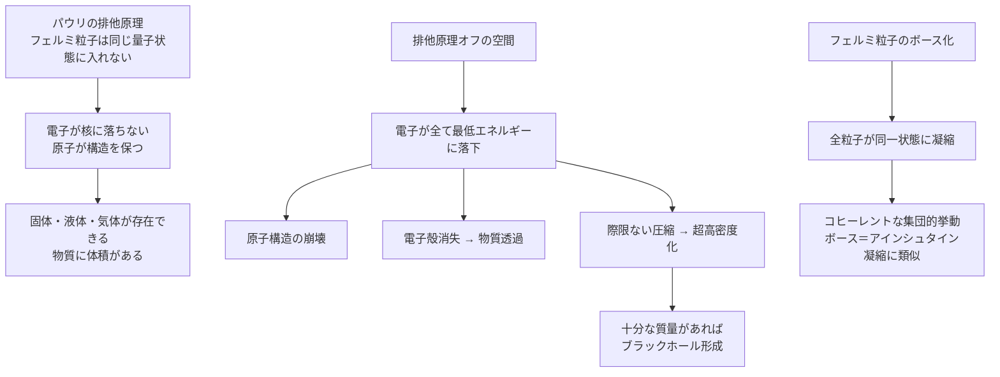

## 概要 (Abstract)

固体が固体である理由を問われたとき、多くの人は「原子同士が反発するから」と答える。しかしその反発の正体は、電磁気力だけではない。むしろより根本的な原因は**パウリの排他原理**にある——同じ量子状態に2つ以上のフェルミ粒子（電子・陽子・中性子など）は存在できないという、量子力学の根本的な制約だ。

この原理があるから電子は原子核に落ち込まず、原子は構造を保ち、物質は体積を持つ。裏を返せば、もしこの原理を局所的にオフにできたら何が起きるか——固体は透過できるようになり、物質は想像を絶する密度に圧縮され、原子そのものが崩壊する。

この思考実験ではさらに、フェルミ粒子が一時的にボース粒子（光子のように「重なり合える」粒子）化するメカニズムを組み合わせ、その帰結を探る。

---

## 実現不可能性の根拠 (Infeasibility Rationale)

### 物理的限界

パウリの排他原理は単なる「ルール」ではなく、**スピン統計定理**という量子場理論の根幹から導かれる。スピンが半整数（1/2, 3/2…）の粒子はフェルミ統計に従い、整数スピン（0, 1, 2…）の粒子はボース統計に従う。この対応は特殊相対性理論と量子力学を同時に満たすために必然的に導かれるものであり、どちらか一方でも成立するなら排他原理は破れない。

排他原理を無効化するには、スピン統計定理そのものを壊す必要がある。これは特殊相対性理論か量子力学を局所的に無効化することと同義であり、現在知られている物理法則の枠内では不可能とされている。

### 技術的限界

フェルミ粒子をボース粒子化するアイデアは、理論的には「スピンを操作して整数値にする」ことを意味する。電子（スピン1/2）のスピンを1にするには、角運動量を1/2だけ外部から与える必要があるが、その状態は安定して存在できない。超伝導体で起きるクーパー対（電子2個が対を組み、合計スピンが整数になる現象）は「実質的なボース化」の自然な例だが、これは対全体が一つの準粒子として振る舞うものであり、個々の電子の統計性を変えているわけではない。

### 論理的限界

排他原理を局所的にオフにする「境界面」では深刻な矛盾が生じる。その内側では電子は全て同一の最低エネルギー状態に落ち込み、外側では通常の電子配置を保つ。この境界を電子が通過する瞬間、量子状態が不連続に変化することになり、量子力学の連続性・ユニタリ性と矛盾する。

---

## 実験の設定 (Setup)

- **対象空間**: 半径1メートルの球形領域。内部ではスピン統計定理が無効化されている
- **導入物質**: 鉄の塊（通常の固体）
- **観察**: 対象空間内に持ち込んだとき、何が起きるかを段階的に追う

| フェーズ | 現象 | 原因 |
|---------|------|------|
| 導入直後 | 原子構造が不安定化し始める | 電子が最低エネルギー準位に集中 |
| 数ミリ秒後 | 固体の剛性が失われ液状化 | 電子殻の意味が消え原子間の反発消失 |
| 数秒後 | 物質が極端に圧縮・高密度化 | 電子が核に落下、中性子化が進む |
| 最終状態 | 中性子星密度の超圧縮物質 | ほぼ全ての体積が消失 |

また、フェルミ粒子がボース粒子化した状態では：

- **物質透過**: 電子殻が消えるため、原子同士が「すり抜ける」
- **ボース＝アインシュタイン凝縮的挙動**: 全粒子が同一状態に落ち込み、コヒーレントな振る舞いを示す可能性

---

## 考察と予測 (Speculation)

### 固体が固体である本当の理由

私たちが机を叩いて「硬い」と感じるとき、その感触の大部分はパウリの排他原理が生み出す**縮退圧**によるものだ。電磁力だけなら、理論上もっと物質を圧縮できるはずだが、電子が「これ以上同じ場所には入れない」と拒絶するため物質は体積を持つ。

排他原理がオフになった空間では、机も床も空気も、その「硬さ」の根拠を失う。物質の体積の大部分は「空虚」であることは有名な事実だが、排他原理がなければその空虚に向かって物質が自発的に崩壊していく。

### ブラックホール製造装置として

排他原理が消えた空間に十分な質量を持ち込めば、縮退圧による反発なしに際限なく圧縮が進み、最終的にシュワルツシルト半径以下に収まった時点でブラックホールが形成されると考えられる。これは爆発的な核融合反応や超新星爆発を経ずに、「静かに」ブラックホールを生成できることを意味する。

### 高次元への逃避という解釈

SFとして面白い別解釈がある。排他原理を「破る」のではなく、**追加の次元へ量子状態を逃がす**という発想だ。電子Aが状態1に入り、電子Bも状態1に入りたい場合、Bが「状態1＋微小な追加次元α」という別状態に退避すれば、3次元から見ると同じ場所に2つの電子が「重なって」存在できる。これは余剰次元の理論（カルツァ＝クライン理論、弦理論）と自然につながる発想だ。

---

## 図解 (Diagrams)

---

## 関連記事 (Related)

- [wiim_003](../physics/wiim_003.md) — 負の質量を持つ粒子による局所的時間加速（エキゾチック物質の共通テーマ）
- [wiim_007](wiim_007.md) — 排他原理が10%だけ弱い宇宙（本記事の「部分的無効化」バージョン）
- （未作成）中性子星の内部では何が起きているか
- （未作成）超伝導体のクーパー対——フェルミ粒子の「擬似ボース化」
- （未作成）余剰次元が存在するなら物質はどう変わるか
- [wiim_011](../physics/wiim_011.md) — コスモシェル——真空中に閉鎖膜を作る
- [wiim_013](../physics/wiim_013.md) — 空間を超越する粒子——コーラ粒子の仮説
- [wiim_053](wiim_053.md) — 粒子に個性を持たせることができるか——量子的同一性とトポロジカル粒子の標識問題
- [wiim_024](../biology/wiim_024.md) — マイコプラズマギカ——最小生命体による生物的核変換が可能な世界

