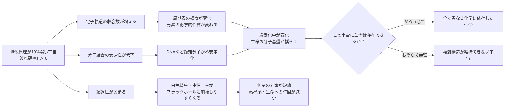

## 概要 (Abstract)

wiim_006では、パウリの排他原理が完全にオフになる世界を考えた。しかし「完全に消える」よりも、ある意味でより不気味な問いがある——**もし排他原理がほんの少しだけ弱かったら**、宇宙はどうなっていたか。

「10%弱い」というのは比喩的な表現だが（排他原理は力ではないため厳密に強弱を定義できない）、ここでは「フェルミ粒子が確率的に、ごくわずかな頻度で同一量子状態への重複占有を許す」という設定として考える。確率にして0.001%でも十分だ。

この宇宙では、周期表の構造が変わり、星の寿命が変わり、そして生命が存在できるかどうかという問いにまで影響が及ぶと考えられる。

---

## 実現不可能性の根拠 (Infeasibility Rationale)

### 物理的限界

排他原理はスピン統計定理から導かれる。この定理は「0か1か」——フェルミ粒子は同一状態に0個か1個だけという厳格な制約であり、「0.9個まで」という中間状態は量子力学の数学的枠組みの中で定義できない。本記事の「10%弱い」という設定は、より正確には**「スピン統計定理の有効強度を低下させた宇宙」という仮想的再定義**として読むべきだ——現行の数学的枠組みの「弱化版」を想定する思考実験であり、実際の物理量の弱化を主張するものではない。

現実に「排他原理の破れ」を探す実験（Ramberg-Snow実験など）では、電子が禁じられた状態に遷移する確率の上限を測定している。現時点では、そのような破れは**10の−26乗以下**という極めて厳しい上限が設けられており、「10%弱い」どころか1兆分の1兆分の1のスケールでも検出されていない。

### 技術的限界

「わずかに弱い排他原理」を人工的に再現する方法は知られていない。これは宇宙の基本定数を局所的に書き換えることに等しく、現時点では完全に理論外の操作だ。

### 論理的限界

排他原理が確率的に破れる世界では、その「破れる確率」自体が物理定数として扱われる。すると、この定数が時空によって変動する可能性も生じ、場所によって物理法則が異なる世界が示唆される。これは観測から得られている宇宙の等方性・均質性という基本前提と衝突する。

---

## 実験の設定 (Setup)

この宇宙では次のパラメータを設定する：

- **破れ確率ε**: フェルミ粒子が同一量子状態に入り込む確率 = 0.01%（通常の宇宙では限りなくゼロ）
- **スケール**: 宇宙全体で均一にこの緩みが存在する
- **その他の定数**: 光速・プランク定数・電荷など一切変更しない

観察対象：

| 対象 | 変化の予測 |
|------|-----------|
| 水素原子 | 電子が1s軌道に2個以上入る確率がわずかに生じる |
| 周期表 | 各軌道の最大収容数が微妙にずれ、元素の化学的性質が変化 |
| 恒星 | 縮退圧（白色矮星・中性子星を支える力）が弱まり、より小さな質量で重力崩壊が起きる |
| DNA・分子構造 | 共有結合の電子配置が確率的にずれ、分子の安定性が低下 |

---

## 考察と予測 (Speculation)

### 周期表が別の顔を持つ

現在の周期表は「各軌道に入れる電子の数」によって決まっている。s軌道に2個、p軌道に6個……という上限は排他原理の直接的な帰結だ。これが「10%弱い」宇宙では、各軌道の収容数がわずかに増える。元素の化学的性質は電子配置で決まるため、全元素の化学的振る舞いが現在とは微妙に異なることになる。

炭素が4つの手を持つのも排他原理と密接に関係している。炭素の特殊な結合能力は生命の化学的基盤だ。排他原理が揺らぐ宇宙では、炭素化学が今とは異なる形になり、生命が存在するとしても全く別の分子機構に依存する可能性がある。

### 星が早く死ぬ

白色矮星と中性子星は、縮退圧——排他原理が生み出す「これ以上は詰められない」という圧力——によって重力崩壊を免れている。排他原理が弱いと縮退圧も弱くなり、本来なら白色矮星で安定するはずの天体がブラックホールへと崩壊する。

つまりこの宇宙では、**星の「死に際」がより劇的で早い**。恒星の寿命が短くなれば、惑星系が形成され生命が誕生するのに十分な時間が確保できない可能性がある。

### 「ほんの少し違う宇宙」という問い

物理学には「微調整問題」という未解決問題がある。宇宙の基本定数（重力定数・電磁気力の強さ・陽子と電子の質量比など）が現在の値からわずかに変わるだけで、星・原子・生命が存在できない宇宙になってしまうという観察だ。

排他原理の「強さ」（正確には排他原理が成立するか否か）も、この微調整の一部と考えられる。0か1かの二値で成立しているこの原理が「0.9」になった途端に宇宙の構造が崩れ始めるなら、現在の宇宙は「排他原理が完全に成立している」という極めて特殊な設定の上に立っていることになる。なぜこの宇宙では完全に成立しているのか——この問いは、宇宙がなぜこの形をしているのかという問いと地続きだ。

---

## 図解 (Diagrams)

---

## 関連記事 (Related)

- [wiim_006](wiim_006.md) — パウリの排他原理が局所的にオフになる空間（完全無効化バージョン）
- （未作成）物理定数が宇宙場所によって異なる世界
- （未作成）微調整問題——宇宙の定数はなぜこの値なのか
- （未作成）炭素が存在しなければ生命はどんな形をとるか
- （未作成）中性子星の内部では何が起きているか
- [wiim_015](../physics/wiim_015.md) — エントロピーが減少する宇宙——時間の矢が逆を向いた世界の物理と知性
- [wiim_008](../biology/wiim_008.md) — コズミックマイス——菌糸ネットワークが宇宙空間で分散知性に進化したら

