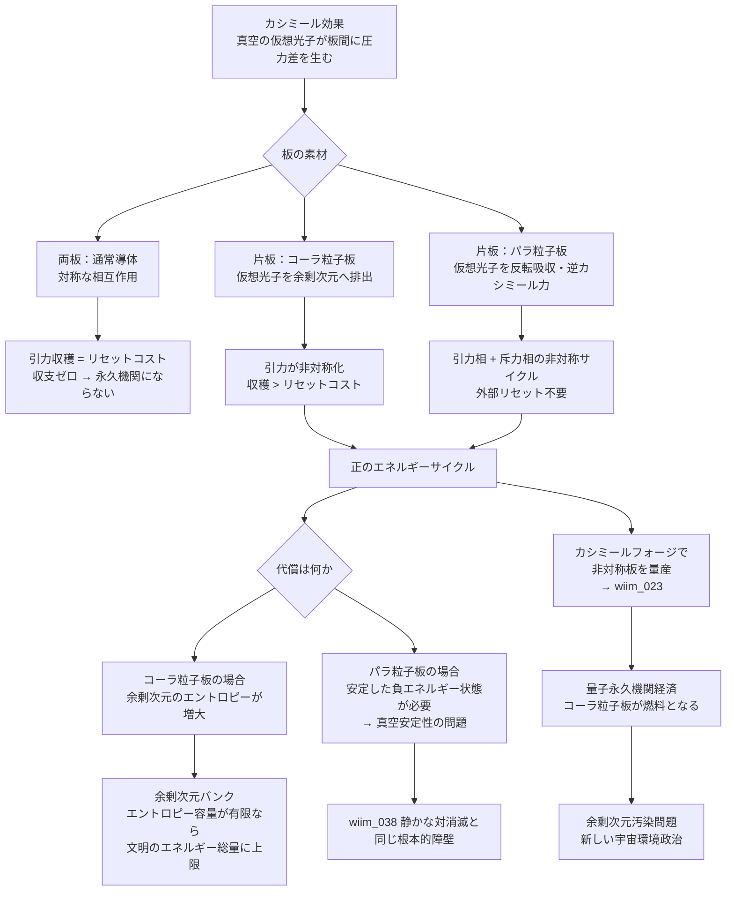

## 1. 概要 (Abstract)

永久機関はなぜ動かないのか。

古典的な答えは「エネルギーが保存されるから」だ。しかし量子力学は奇妙な抜け穴を示唆している——真空は空ではない。何もない空間にも仮想光子が絶え間なく湧き出ては消え、ゼロ点エネルギーが宿っている。カシミール効果はその証拠だ。2枚の金属板を数ナノメートルまで近づけると、測定可能な引力が生じる。真空のエネルギーが物理的な力として現れる、唯一の実験室スケールの現象だ。

ならば、この力でエンジンが動かせないか。

問題は**対称性**にある。板が引き合う過程でエネルギーを収穫できても、板を元の位置に戻す（リセット）には同量のエネルギーが必要だ。引力と同じだけの力に抗って板を離さなければならない。収支はゼロ——対称なカシミール板では永久機関にならない。

では、片方の板を**非対称な素材**に置き換えたら？

> **命題：** 「カシミール板の一方をコーラ粒子素材に変えれば、真空との相互作用が非対称化し、エネルギー収支が崩れる——ただしそれは真空からエネルギーを奪うのではなく、余剰次元にエントロピーを押し付けながらエネルギーを取り出す機構だ。」

---

## 2. 実現不可能性の根拠 (Infeasibility Rationale)

### 物理的限界

通常のカシミール効果は、両板が仮想光子を反射するという**対称な前提**の上に成り立っている。片方の板がコーラ粒子（wiim_013）で作られているなら、その板は仮想光子を反射するのではなく余剰次元へ排出する。これにより板の間の真空モード制限が非対称になり、エネルギー収支が崩れる可能性がある——しかし問題はコーラ粒子板の存在そのものだ。

コーラ粒子板が仮想光子を余剰次元に排出し続けるためには、その余剰次元のエントロピーが増大し続けなければならない。局所的にエネルギーを取り出せても、宇宙全体の帳簿は必ず赤字になる。パラ粒子（g161）板を使う場合は、さらに根本的な障壁がある——安定した負エネルギー状態は現行の量子場理論に存在せず、パラ粒子板を生成する時点で真空の安定性を脅かす（wiim_038と同じ問題が再現される）。

### 技術的限界

仮にコーラ粒子板が生成できたとしても、**デコヒーレンス**が立ちはだかる。

非対称カシミール効果を維持するためには、板の量子状態——具体的にはコーラ粒子が余剰次元との接続を保った状態——を保ち続けなければならない。しかし周囲の熱雑音や電磁場との相互作用はこの量子状態を壊し、コーラ粒子板を通常の導体として振る舞わせる。量子コヒーレンスを巨視的スケールで維持する技術は、超伝導においてさえ極低温という極端な条件が必要だ。

さらにコーラ粒子板の「排出効率」が経時劣化する可能性がある。仮想光子を余剰次元に排出し続けるうちに、板の内部構造が変質し、通常の導体に近づいていく——消耗品としてのコーラ粒子板を定期交換するコストが、収穫エネルギーを上回るかもしれない。

### 論理的限界

最も根本的な問いは「エネルギーはどこから来るのか」だ。

非対称カシミール板が本当に正のエネルギーサイクルを生み出すとしても、それは真空エネルギーを「創出」しているのではない。余剰次元をエントロピーの捨て場として使い、そのコストを他所に転嫁しているに過ぎない。エネルギー保存則は破れていない——余剰次元という「帳簿外の領域」に負債が積み上がっているだけだ。

余剰次元の容量が有限であれば、文明が取り出せるエネルギーの総量に上限が生まれる。無限に動く「永久機関」ではなく、余剰次元という巨大なバッテリーを放電し続ける機構——真の永久機関とは本質的に異なる。

---

## 3. 実験の設定 (Setup)

### 通常カシミールサイクルとの比較

```
【通常の対称カシミールサイクル】

  ①板を近づける  →  ②引力でエネルギー収穫  →  ③板を離す（リセット）
                                                    ↑
                               ③で②と同量のエネルギーが必要
                               → 収支ゼロ、永久機関にならない
```

```
【非対称カシミールサイクル（コーラ粒子板）】

  通常板 ←── 仮想光子の圧力差 ──→ コーラ粒子板
             ↑                      ↑
          反射して戻る           余剰次元へ排出される

  →  通常板側だけ真空モードが制限される
  →  引力が非対称化：収穫エネルギー > リセットコスト
  →  差分エネルギーを外部に取り出せる
```

### パラ粒子板による引力・斥力非対称サイクル

パラ粒子（g161）板を使うと、さらに能動的なサイクルが構成できる可能性がある。

| フェーズ | 通常板 | パラ粒子板 | 力の方向 |
|---------|--------|-----------|---------|
| 接近相 | 仮想光子を反射 | 仮想光子を反転吸収（負エネルギー） | 引力（通常カシミール） |
| 離隔相 | 仮想光子を反射 | 反転放出で逆カシミール力 | 斥力（自然に押し離される） |

接近時にエネルギーを収穫し、離隔時にパラ粒子板が自然に板を押し返す——外部からリセットエネルギーを投入しなくても板が自動で元の位置に戻るサイクルだ。ただしこれはパラ粒子の安定生成という、現行物理では不可能な前提を要する。

### カシミールフォージとの接続

カシミールフォージ（wiim_023）はカシミール効果を利用してエキゾチック物質を生成する設備として設計されている。非対称カシミール板の製造にも応用できると考えられる——フォージの出力物として「コーラ粒子含浸板」や「パラ粒子コーティング板」を生産し、エンジンの消耗部品として供給するサプライチェーンが成立しうる。

---

## 4. 考察と予測 (Speculation)

### 余剰次元バンク——文明のエネルギー総量に上限が生まれる

非対称カシミールエンジンが動作するなら、その「燃料」は余剰次元のエントロピー容量だ。

余剰次元が無限の容量を持つなら、エンジンは事実上永続できる。しかし弦理論が示唆するコンパクト化された余剰次元は有限の容量を持つ可能性が高い。その場合、文明が使えるエネルギーの総量は「余剰次元のエントロピー受容量」によって上限が決まる——採掘量に限界のある資源と同じ構造だ。

これを**余剰次元バンク**と呼ぶことができる。文明が高度化するほどバンクの残量が減り、いつか余剰次元が「満杯」になったとき、エンジンは止まる。宇宙規模のエネルギー危機は、燃料の枯渇ではなくエントロピーの行き場の喪失として訪れるかもしれない。

### レトロンとの比較——二種類の「コスト回避」

透明な観察者を目指す手段として、レトロン（wiim_037）と非対称カシミールエンジンは対照的なアプローチを取る。

| 手法 | コスト回避の方法 | 代償 |
|------|--------------|------|
| レトロン | 負エントロピーでコストを吸収・打ち消す | 存在できない（自己否定的） |
| 非対称カシミール板 | コストを余剰次元に転嫁する | 余剰次元のエントロピーが増大し続ける |

レトロンはコストそのものをなくそうとして失敗し、非対称カシミール板はコストを「見えない場所」に移すことで成功する。どちらも熱力学第二法則を破ってはいない——ただし後者は「破っているように見える」状態を局所的に作り出せる。

### 量子永久機関経済と余剰次元の枯渇問題

非対称カシミールエンジンが普及した文明では、エネルギー経済の構造が根本から変わる。

通常の燃料（石油・核燃料など）に代わり、コーラ粒子板の製造・交換・廃棄サイクルがエネルギー産業の中心になる。カシミールフォージを保有する勢力がエネルギー供給を支配し、余剰次元の「残量」を監視する機関が宇宙規模の環境問題として浮上する——「余剰次元汚染」が新しい政治問題になる可能性がある。

---

## 5. 図解 (Diagrams)



---

## 6. 関連記事 (Related)

- [wiim_013](../cosmology/wiim_013.md) — コーラ粒子（板素材・余剰次元排出機構の提供）
- [wiim_023](../physics/wiim_023.md) — カシミールフォージ（非対称板の製造設備）
- [wiim_037](../physics/wiim_037.md) — レトロン（熱力学コスト回避の比較対象）
- [wiim_038](../physics/wiim_038.md) — 静かな対消滅（パラ粒子板が直面する同一の障壁）
- wiim_??? — 余剰次元汚染（非対称カシミールエンジン普及後の環境問題）
- wiim_??? — 第一種永久機関とエネルギー保存則（量子版との比較）
