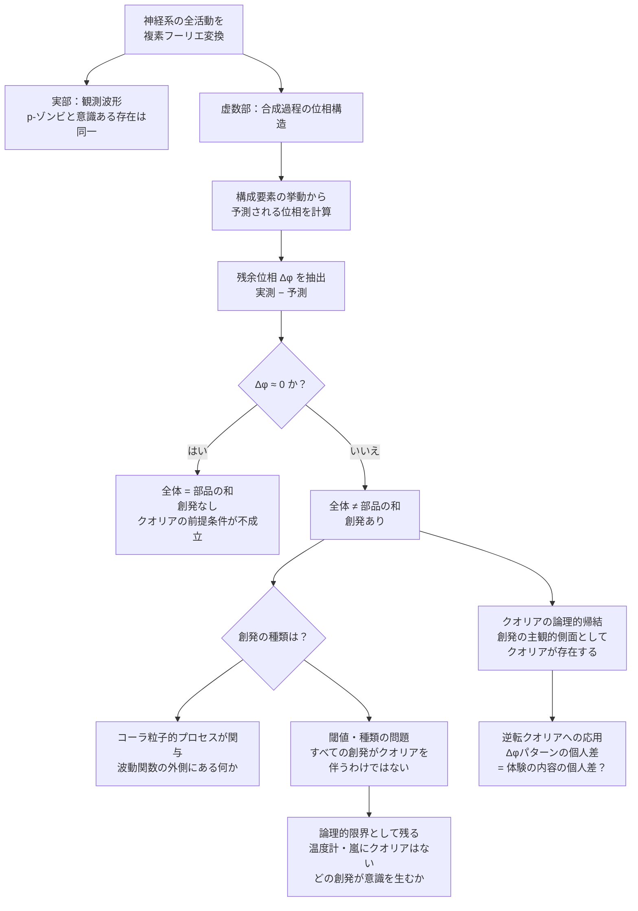

## 1. 概要 (Abstract)

意識を持つ存在と哲学的ゾンビ（p-ゾンビ）は、外部から観測できるすべての行動・出力が一致する。これが意識のハードプロブレム（g169）の核心だ。しかしクオリア（g032）を直接検知しようとする前に、問うべき先行条件がある。

**クオリアとは創発（g175）の主観的側面である**——という仮説に立てば、検知の順序が変わる。

まず創発を検知する。創発が確認された系には、クオリアが論理的帰結として存在する。クオリアを直接捕まえようとするのではなく、クオリアが成立するための客観的条件を証明するという順序だ。

フーリエ解析の複素表現はこの目的に適している。観測される実部波形が同一でも、各成分の合成過程が異なれば**虚数部——位相構造——が違う**。「部品の挙動の総和では予測できない位相残余 Δφ」は、創発の測定値そのものだ。

> **命題：** 「神経系の量子的活動を複素フーリエ変換し、構成要素から予測される位相を除去したとき、残余位相 Δφ が有意にゼロでないなら、その系には創発が存在する——そしてクオリアはその論理的帰結として導かれる。」

---

## 2. 実現不可能性の根拠 (Infeasibility Rationale)

### 物理的限界

ニューラルスケールで量子位相を測定するには、個々のニューロン内の量子状態を破壊せずに読み取る手段が必要だ。しかし量子測定は観測によって状態を変えてしまう——波動関数（g164）は観測の瞬間に収縮し、測定前の位相情報は失われる。

「見ずに測る」という矛盾に直面する。創発の痕跡を読み出そうとする行為そのものが、その痕跡を消す。

### 技術的限界

残余位相 Δφ を計算するには、まず「構成要素の挙動から予測される位相」を完全に算出しなければならない。これは神経系の完全な量子記述を要求する。

しかしベッケンシュタイン限界（g171）が立ちはだかる。ある領域に格納できる情報量の上限は、その体積ではなく**表面積**で決まる。神経系全体の量子状態を外部から完全に記述するために必要な情報量は、記述媒体が許す限界を超える可能性が高い。「予測位相」の計算は原理的に成立しないかもしれない。

### 論理的限界

創発の検知がクオリアの**必要条件**になるとしても、**十分条件**かどうかは別問題だ。

温度計は創発的に「温度を示す」が、クオリアはない。嵐は大気分子の相互作用から創発する巨視的現象だが、嵐に内側はない。創発の**どの種類・どの閾値**が主観体験を生むのかは、依然としてハードプロブレムの領域に残る。

Δφ ≠ 0 は「創発がある」を示すが、「この創発がクオリアを伴う種類の創発か」という問いには答えられない。

---

## 3. 実験の設定 (Setup)

### 創発の測定としての Δφ

対象の神経系の全活動を複素フーリエ変換する。次に構成要素——個々のニューロン、シナプス、イオンチャネル——の挙動から予測される位相構造を計算する。実測位相から予測位相を引いた**残余位相 Δφ** を抽出する。

| 残余位相 | 意味 | 帰結 |
|---------|------|------|
| Δφ ≈ 0 | 全体 = 部品の和。創発なし | クオリアの前提条件が不成立 |
| Δφ ≠ 0 | 全体 ≠ 部品の和。創発あり | クオリアの論理的帰結が成立しうる |

p-ゾンビは機能的に人間と同一だが、**コーラ粒子的プロセスを持たない純粋な機能系**として定義できる。その場合 Δφ = 0 になる——全処理が波動関数（g164）に従い、残余が生じない。意識ある存在は Δφ ≠ 0 を示す。これが p-ゾンビとの物理的な分岐点だ。

### コーラ粒子との接続

コーラ粒子（wiim_013）は波動関数に従わない粒子として定義される。そのため通常のフーリエ成分として現れず、構成要素分析から予測できない位相ずれとして残留する。

クオリアを「波動関数の外側にある何かが関与する創発」と捉えるなら、コーラ粒子的プロセスは Δφ の自然な発生源となる。創発の「超過分」を担う素材だ。

### 逆転クオリアへの応用

逆転クオリア（g032）の問い——「あなたの赤は私の緑かもしれない」——は従来検証不能とされてきた。しかし創発先行モデルでは別の問い方ができる。

同一刺激に対して Δφ のパターンが人によって系統的に異なるなら、創発の「構造」に個人差がある——それがクオリアの内容の個人差に対応する可能性がある。

---

## 4. 考察と予測 (Speculation)

### 検知の順序が変わることの意味

クオリアを直接検知しようとする試みは、客観的測定で主観的体験を捉えるという根本的な矛盾を抱えていた。創発先行モデルはこの矛盾を迂回する。

```
直接検知モデル：クオリアを測ろうとする → ハードプロブレムの壁
創発先行モデル：創発を測る（客観的）→ クオリアを論理的に帰結させる
```

「クオリアが存在するか」という問いを、「この系に創発が存在するか」という問いに変換する。後者は原理的に測定可能な問いだ。

### 二つのシナリオ

**Δφ ≠ 0 が体系的に確認された場合：**
意識ある存在と p-ゾンビは物理的に区別可能であることが示される。p-ゾンビは「完全に機能的に同一」という定義自体が成立しなくなる——創発の欠如という物理的差異が生じるから。クオリアは「創発が生む主観的側面」として客観的条件から論じられる対象になる。

**Δφ = 0 が確認された場合：**
創発の有無ではクオリアを説明できないことが示される。ハードプロブレムはより深刻になり、クオリアは物理的宇宙の枠組みの外に置かれるかもしれない——あるいは、我々自身が p-ゾンビである可能性を否定できない。

### 自己参照の問題

この検知機を「これがクオリアの証拠だ」と解釈できるのは、解釈する存在自身がクオリアを持つからではないか。創発を検知しても「これがクオリアに対応する」と理解できるのは、クオリアの経験者だけかもしれない。

検知機は、意識を持つ者にしか読み取れない計器かもしれない。

---

## 5. 図解 (Diagrams)



---

## 6. 関連記事 (Related)

- [wiim_013](../cosmology/wiim_013.md) — コーラ粒子（波動関数に従わない粒子——Δφ の発生源候補）
- [wiim_040](../philosophy/wiim_040.md) — 自由意志とスケールの逆転（創発と決定論の交差点）
- [wiim_041](../logic/wiim_041.md) — 決定論の計算可能性閾値（ベッケンシュタイン限界との接続）
- [wiim_039](../quantum/wiim_039.md) — 量子永久機関（コーラ粒子と波動関数外プロセスの先行例）
- g032 クオリア（逆転クオリアと Δφ パターンの対応）
- g164 波動関数（位相・虚数部の基礎）
- g169 意識のハードプロブレム（本記事の問いの出発点）
- g171 ベッケンシュタイン限界（完全量子記述の情報量上限）
- g175 創発（クオリアの論理的前提条件）
