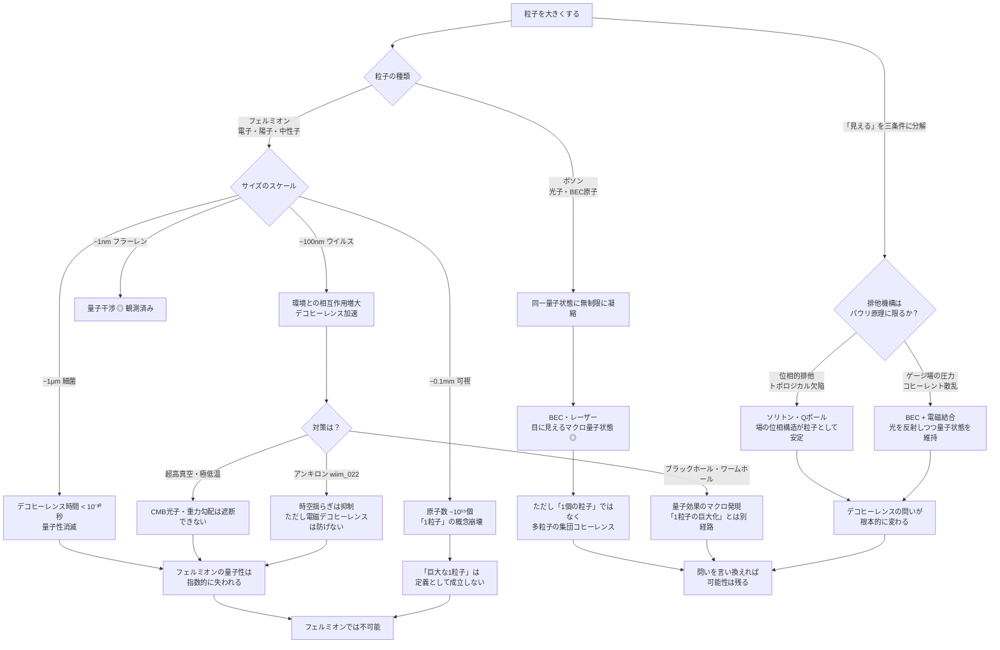
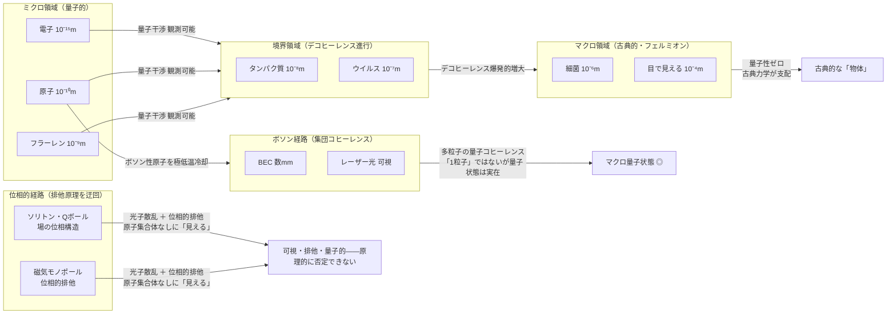

## 概要

電子は波のように振る舞い、二重スリットを同時にくぐる。原子も、分子も、フラーレン（炭素60個の球体分子）でさえ量子干渉縞を作る。では——もし「粒子」をどんどん大きくしていったら、どこかで目に見えるサイズになるだろうか。

問いに答える前に「見える」とは何かを分解する必要がある。私たちが物を見るのは①光子を反射・散乱する電磁相互作用があり、②他の物質を押し退ける排他機構があり、③目が解像できる空間的広がりを持つからだ。通常の固体はこれをパウリの排他原理（電子間の量子統計）と電磁相互作用の組み合わせで実現しているが、この三条件は必ずしも原子の集合体を必要としない。

従来の問い——「原子集合体を量子化できるか」——は、**量子デコヒーレンス**という物理機構によって指数関数的に困難になる。しかし「粒子的に振る舞うマクロな場の構造を生成できるか」と言い換えると、別の経路が見えてくる。

---

## 実現不可能性の根拠

### 物理的限界——デコヒーレンスはスケールとともに加速する

量子重ね合わせ状態が壊れる速さ（デコヒーレンス時間）は、系が環境とどれだけ相互作用するかで決まる。系が大きいほど、表面積が大きく、より多くの環境粒子（光子・空気分子・熱輻射）と絶えず衝突する。

フラーレン（直径約1ナノメートル）では量子干渉が実際に観測されている。しかし同じ実験を細菌サイズ（約1マイクロメートル）に拡張しようとすると、デコヒーレンス時間は常温・常圧では理論上10⁻³⁰秒以下になると見積もられる。これは原子核の内部で起きる反応よりはるかに速い。可視サイズ（0.1ミリ）になれば、デコヒーレンス時間は宇宙で起きた全事象を足し合わせても追いつかないほど短くなる。

量子性は「ゆっくり失われる」のではなく、サイズの増大に対してほぼ絶壁のように失われる。

### 技術的限界——環境からの完全遮断は不可能

デコヒーレンスを防ぐには、系を環境から完全に切り離す必要がある。超高真空・絶対零度近傍の実験環境がその近似だが、限界がある。

宇宙空間でさえ、宇宙マイクロ波背景放射（CMB）の光子が絶えず飛び交っている。1センチ角の物体は毎秒数百万個のCMB光子と衝突する。光子1個との相互作用は、量子干渉を破壊するのに十分だ。また重力場の勾配も量子状態を乱す——地球近傍では重力の勾配自体がデコヒーレンスの原因になりうる。

現在の技術で量子状態を保てるのはマイクロメートル以下のスケールに限られており、可視サイズまでの12桁の差を埋める見通しはない。

### 論理的限界——「1個の粒子」とは何か

素粒子（電子・クォーク）は内部構造を持たない点粒子だ。しかし「目に見えるサイズの粒子」は必然的に原子の集合体になる。0.1ミリの物体には原子がおよそ10¹⁵個含まれる。

これを「1個の粒子」と呼ぶことに意味はあるか。量子力学では「1個の粒子」とは1個の波動関数で記述される系を指す。10¹⁵個の原子全体を単一の波動関数で扱うためには、すべての原子間の相互作用がエンタングルメントを保ったまま維持される必要がある——これはデコヒーレンス問題と根本的に同じ障壁だ。「粒子」という概念そのものが、マクロスケールでは自己崩壊する。

---

## 実験の設定

量子干渉実験を段階的にスケールアップし、どこで量子性が失われるかを追う。

| 対象 | サイズ | 量子干渉 | 現状 |
|------|--------|---------|------|
| 電子 | ~10⁻¹⁵ m | ◎ 観測済み | 教科書的事実 |
| フラーレン C₆₀ | ~1 nm | ◎ 観測済み | 2019年までに実証 |
| タンパク質（小型） | ~10 nm | △ 実験進行中 | デコヒーレンス制御が鍵 |
| ウイルスサイズ | ~100 nm | ✗ 理論的に困難 | 環境遮断の壁 |
| 細菌サイズ | ~1 μm | ✗ 不可能 | デコヒーレンス時間 < 10⁻³⁰秒 |
| 可視サイズ | ~0.1 mm | ✗ 原理的に不可能 | 概念自体が崩壊 |

---

## 考察と予測

### 量子と古典の境界は崖ではなく霧だ

「量子的」と「古典的」の間に明確な境界線はない。デコヒーレンスは系のサイズ・質量・環境との結合強度によって連続的に進行する。境界は「どこかに引かれた線」ではなく、スケールの増大とともに量子効果が指数関数的に消えていく勾配だ。

シュレーディンガーの猫が「生きているか死んでいるかわからない重ね合わせ状態」を保てない理由は、猫が10²⁷個の粒子から成り、そのすべてが空気・光・熱と絶えず相互作用しているからだ。量子重ね合わせが成立するはずの時間は、宇宙の年齢より遙かに短い。

### アンキロンとデコヒーレンスの競合

アンキロン（wiim_022）は時空の計量変化に対する粘性的抵抗として機能し、プランクスケールの時空の泡を安定化させる。時空の量子揺らぎはデコヒーレンスの一因——微小な重力場の揺らぎが量子状態を乱す——とされており、アンキロンが密集した領域ではこの経路のデコヒーレンスが抑制される可能性がある。

しかし、デコヒーレンスの支配的な原因は熱輻射・光子・空気分子との電磁的相互作用だ。アンキロンは時空の計量に作用するが、電磁場には直接介入しない。したがって「アンキロンに守られたマクロ量子状態」も、光子1個が触れた瞬間に崩壊する——時空が安定していても、量子性は守れない。

### コーラ粒子との対比——空間を飛ぶが量子性は持てない

コーラ粒子（g127）は空間を経由せずに別の点に出現する思考実験上の粒子だ。「空間的位置が確定しない」という点では量子的な重ね合わせと似て見えるが、根本的に異なる。量子重ね合わせは確率的な複数の状態が同時に成立することであり、コーラ粒子の瞬間移動は「別の場所への決定論的な再出現」だ。コーラ粒子がマクロサイズに成長した場合も、デコヒーレンスの壁は同様に立ちはだかる——移動の機構は量子性を保証しない。

### ボソンという抜け道——可能性は残っている

ここまでの議論は暗黙にフェルミオン（電子・陽子・中性子）を念頭に置いていた。フェルミオンはパウリの排他原理に従い、同一量子状態に1個しか入れない。しかしボソン（光子・ヒッグス粒子・ヘリウム-4原子など）はこの制約を受けない——無限に多くの個体が同一の量子状態に凝縮できる。

**ボーズ・アインシュタイン凝縮（BEC）**はその直接的帰結だ。絶対零度近傍でルビジウムやナトリウムのボソン性原子を冷却すると、原子雲全体が単一の波動関数で記述されるマクロ量子状態が実現する。現在の実験では数ミリメートルに達するBECが生成されており、これは目で見えるサイズのマクロ量子状態だ。

さらに根本的な例が**レーザー光**だ。レーザーは光子（ボソン）が同一の量子状態に揃ったコヒーレント状態であり、部屋を横切る可視光線として明らかに目に見える。「巨大な量子状態」は、ボソンによって既に実現されている。

ただし「1個のボソン粒子がマクロサイズを持つ」のとは異なる。BECもレーザーも、多数の粒子が量子コヒーレンスを共有した集合体だ。問いを「1個の粒子を巨大化する」から「マクロな量子状態を生成する」に言い換えれば、ボソンが答えを持っている——可能性は残っているのだ。

### ブラックホール・ワームホールという特殊条件

重力が極限まで強まる天体はデコヒーレンスの議論に変化をもたらすか。

**ブラックホール**の事象の地平面付近では、ホーキング輻射という量子効果がマクロスケールで現れる。ブラックホール全体を量子力学的に記述しなければ「情報パラドックス」（蒸発後に情報が消えるか否か）が解けないことも知られており、質量が太陽の何倍もある天体に量子力学が適用されると考えられている。しかしこれは「目で見える1個の量子粒子」ではなく、マクロな天体の量子的性質の問題だ。事象の地平面の内側——特異点付近——は量子重力が支配する領域であり、現在の理論では語れない未開地だ。

**ワームホール**については、ER=EPR仮説が興味深い示唆を与える。エンタングルした2粒子の間には微視的なワームホール（アインシュタイン＝ローゼン橋）が存在するという考えだ。もしこれが正しければ、量子エンタングルメント自体が時空のトポロジーに書き込まれていることになる。逆に言えば、マクロなワームホールが形成されれば、その入口と出口は量子的に結びついた「マクロな量子構造」として振る舞う可能性がある。ただしワームホールはエキゾチック物質を要し、「1個の粒子」とは概念が異なる。ホワイトホールも理論的には同様の枠組みに収まり、電磁デコヒーレンスへの耐性を与える機構は持たない。

結局、ブラックホール・ワームホールはデコヒーレンスの壁を突破するのではなく、「量子性がマクロに宿りうる別の形態」を示している——粒子の巨大化とは別の経路だ。

### 「見える」の三条件——排他原理を迂回する可能性

ここで問いを根本から立て直す。「見える」の三条件のうち②の排他機構は、パウリの排他原理に限らない。場の理論にはそれ以外の排他機構が存在する。

**位相的排他**：トポロジカル欠陥（ソリトン・Qボール・磁気モノポール）は場の位相が空間に巻き付いた構造として安定する。この位相の巻き付きは他の場が侵入できない「位相的な壁」を形成し、パウリ排他原理とは独立した排他機構として機能しうる。

**Qボール**は理論上もっとも具体的な候補だ。バリオン数や電荷が保存された場の凝縮体で、パウリ排他原理ではなく場のエネルギー最小化によって安定を保つ。理論上はマクロサイズに成長でき、電荷を持てば電磁相互作用で光子を散乱する——つまり「見える」可能性がある。

**ソリトン**も同様だ。非線形波動方程式の安定した局在解で、光ファイバー中の光学ソリトンは既に実用化されたマクロサイズの「粒子的な波」だ。電磁場のソリトンが適切な相互作用を持てば、光を散乱しつつ空間を占有する構造を形成できる。

これらの機構では「原子集合体の量子化」という問いは最初から問われない——量子場の位相的構造そのものが「粒子」であり、デコヒーレンスの意味が根本的に変わる。パウリ排他原理が別の系で働くか、あるいはそれ以外の何かが物質を押し退け光を反射するなら、それは目に見えるほど大きな粒子と言えるのではないか——この問いに対する答えは「原理的には否定できない」だ。

---

## 図解

---

## 関連記事

- [wiim_022](wiim_022.md) — アンキロン：時空の計量に錨を打つ粒子
- [wiim_039](wiim_039.md) — 量子永久機関：非対称カシミール板と真空エネルギーの搾取（デコヒーレンスとの関連）
- [wiim_042](wiim_042.md) — クオリア検知機：Δφによる操作的定義と検証不可能性
- wiim_??? — シュレーディンガーの猫は本当に重ね合わせ状態にあるか
- [wiim_051](wiim_051.md) — パラポジ粒子との衝突：量子数の幽霊状態は何をもたらすか（トポロジカル欠陥との接点）
- wiim_??? — ブラックホール情報パラドックス：蒸発後に量子情報は保存されるか
- wiim_??? — Qボールとソリトン：場の位相構造が「粒子」になるとき
- 用語: 量子デコヒーレンス / 波動関数 g164 / アンキロン g128 / コーラ粒子 g127 / ボーズ・アインシュタイン凝縮
