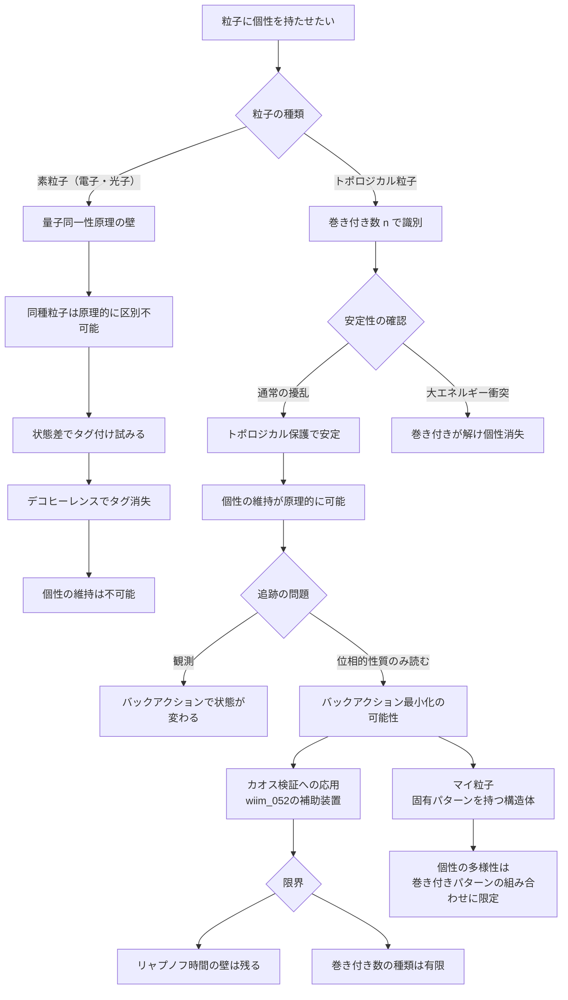
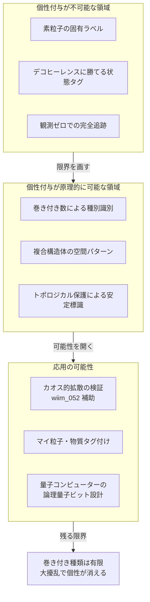

## 概要

量子力学の根底には「同種粒子は完全に区別できない」という原理がある。2つの電子はどちらがどちらかを問うこと自体が無意味であり、波動関数は粒子の交換に対して完全に対称または反対称でなければならない。電子に名前を書き込もうとしても、その「名前」を担う物理的状態はデコヒーレンスによってたちまち環境に溶け込んでしまう。

しかし近年、トポロジカル粒子と呼ばれる構造体——ソリトン（g211）、Qボール（g212）、磁気モノポール（g213）——には「位相的な個性」が宿りうることが示唆されている。これらの構造は巻き付き数（ワインディングナンバー）と呼ばれるトポロジカル量子数によって特徴づけられ、連続的な変形では変化しない。

もし粒子に消えない「個性」を持たせられるなら、カオス的拡散の検証（wiim_052）は劇的に変わる。観測なしに追跡できる粒子が存在するとき、カオスの悪魔方程式はどれほど強力になるか——そしてその可能性はどこで壁に突き当たるか。

---

## 実現不可能性の根拠

### 物理的限界——量子同一性原理の壁

量子力学では、同種の素粒子は原理的に区別できない。2つの電子が存在するとき、「1番目の電子が位置Aに、2番目が位置Bにいる」という記述と「逆の電子が逆の位置にいる」という記述は、物理的に完全に同等だ。波動関数はこれを自動的に対称化（ボソン）または反対称化（フェルミオン）することで表現する——個別の経路履歴は波動関数の中に存在しない。

これは近似的な困難ではなく、自然の根本的な構造だ。電子をどれだけ精密に操作しても、「この電子」という固有の同一性を保証する物理量は存在しない。同一性は粒子の内在的な性質ではなく、古典的な物体観が粒子に投影した概念だ。

### 技術的限界——デコヒーレンスがタグを消す

スピン状態や位相差など、何らかの状態差によって粒子を標識しようとしても、環境との相互作用によってデコヒーレンスが起きる。気体分子1個でさえ、室温では10⁻¹³秒以下のデコヒーレンス時間しか持たない。精密な真空環境を整えても、追跡のために行う観測そのものがバックアクションを生じさせ、標識に使った状態を変えてしまう。

さらに根本的な問題がある——粒子の「現在位置を知る」という観測行為は必ず系に干渉する。追跡しようとすればするほど、追跡対象の状態が乱される。量子ゼノン効果（頻繁な観測が系の進化を凍結する現象）を利用すれば追跡精度は上がるが、それは粒子を「観測で縛りつける」ことであり、自由な拡散を見守ることとは矛盾する。

### 論理的限界——「個性」という概念の古典性

粒子に名前をつけるという行為は、古典的な物体論に根ざしている。石ころや車なら「このA車」と「あのB車」を区別できるのは、連続した時空の軌跡が存在するからだ。しかし量子力学の経路積分では、粒子は「ある点から別の点へ」の全ての可能な経路を同時に辿る。どの経路を通ったかという概念が確定しない以上、「粒子Aがここを通った」という個体の物語は存在しない。

「個性ある粒子」を定義しようとすれば、量子力学の形式主義そのものを修正する必要が生じる——これは量子力学の予測精度を損なう方向にしか働かない。

---

## 実験の設定

量子的同一性の壁を迂回できるかを、トポロジカル粒子を使って検討する。

**標識の候補**: 巻き付き数が異なる2種のトポロジカルソリトン

| 性質 | 通常粒子（電子など） | トポロジカルソリトン |
|------|---------------------|---------------------|
| 個体識別 | 原理的に不可能 | 巻き付き数 n で識別可能 |
| 状態の安定性 | デコヒーレンスで崩壊 | トポロジカル保護で安定 |
| 観測バックアクション | 状態を乱す | 位相的性質は保存される可能性 |
| サイズ | 点粒子的 | マクロスケールに成長可能（wiim_050） |

巻き付き数 n=1（一重に巻き付いた場の配位）と n=2（二重）のソリトンは、連続的な変形によって互いに移行できない——これが「個性」の物理的根拠となる。

**追跡の手順（思考実験）**:

1. n=1 のソリトンを10個、n=2 のソリトンを10個生成する
2. カオス的な場の揺らぎが支配する環境に放出する
3. 時間 t 後に位置分布を測定し、巻き付き数で種別を識別する
4. n=1 と n=2 の拡散パターンが異なるかを比較する

**限界の確認**:

- ソリトン同士の衝突で巻き付き数が変化（n=1 + n=1 → n=2）する反応が起きると標識が失われる
- 大きなエネルギー擾乱があれば位相的安定性は破れる（巻き付きが解ける）
- 追跡のためには何らかの観測が必要であり、完全なバックアクションゼロは達成できない

---

## 考察と予測

### カオスの悪魔方程式の補助装置として

カオスの悪魔方程式（wiim_052）は確率的な粒子誘導を目指すが、その最大の弱点は「標的粒子の現在位置を知るための観測バックアクション」だ。もしトポロジカルソリトンのように観測によらず位相的性質だけで識別できる粒子が使えるなら、バックアクションを最小化しながら追跡できる可能性がある。

ただしこれはカオスの悪魔方程式を「強化」するものではなく、「弱点のひとつを緩和する補助装置」に過ぎない。リャプノフ時間の壁（予測有効期間）とランダウアー原理（計算コスト）は依然として突破できない。

### 「個性の最小単位」としてのトポロジカル量子数

巻き付き数は整数値しか取れない離散量だ。これは「個性」を持てる種類が有限個しか存在しないことを意味する。n=1, 2, 3, ... と巻き付きを増やすほど構造のエネルギーが上がり、不安定になる。現実的に安定な「個性の種類」は数種類に限られると考えられる。

これは生命のDNA塩基配列との対比として興味深い。塩基4種の組み合わせが無限の「個性」を生み出すように、限られたトポロジカル量子数の組み合わせパターンが「個性の多様性」を生み出す余地はある。複数のトポロジカル欠陥を空間的に配置した複合構造体が「指紋」として機能しうるかは、未解決の問いだ。

### マイ粒子の可能性と物理学への示唆

将来、トポロジカル粒子を任意のサイズで生成・安定化する技術が生まれるとすれば、固有の巻き付き数パターンを持つ「個人専用構造体」が設計できるかもしれない——「マイ粒子」だ。これは個人認証や物質タグ付け（特定のソリトンが特定の空間領域に結びつく）への応用が考えられる。

より根本的な示唆は、「個性とは何か」という問いに対する量子論的回答だ。古典的な物体の個性は「連続した軌跡」に宿るが、量子的な個性があるとすれば「変形で消えない位相的構造」に宿る。量子力学は「個性」を禁じているのではなく、個性の根拠を連続性からトポロジーへと移し替えているのかもしれない。

---

## 図解

---

## 関連記事

- [wiim_050](../quantum/wiim_050.md) — 目に見えるほど大きな粒子を生成できるか：マクロなトポロジカル構造の可能性
- [wiim_051](../physics/wiim_051.md) — パラポジ粒子との衝突：量子数の幽霊状態は何をもたらすか
- [wiim_052](../physics/wiim_052.md) — カオスを制御するカオスの悪魔の方程式：確率的粒子誘導の限界
- [wiim_006](../quantum/wiim_006.md) — パウリの排他原理が局所的にオフになる空間
- wiim_??? — 情報の物理的担体：量子タグの最小単位はトポロジカル欠陥か
- 用語: ソリトン g211 / Qボール g212 / 磁気モノポール g213 / カオスの悪魔 g210 / バタフライ効果 g178
- [wiim_091](../physics/wiim_091.md) — 大気境界衛星——安定軌道の三方式と使い捨て群探査への問いの転換

