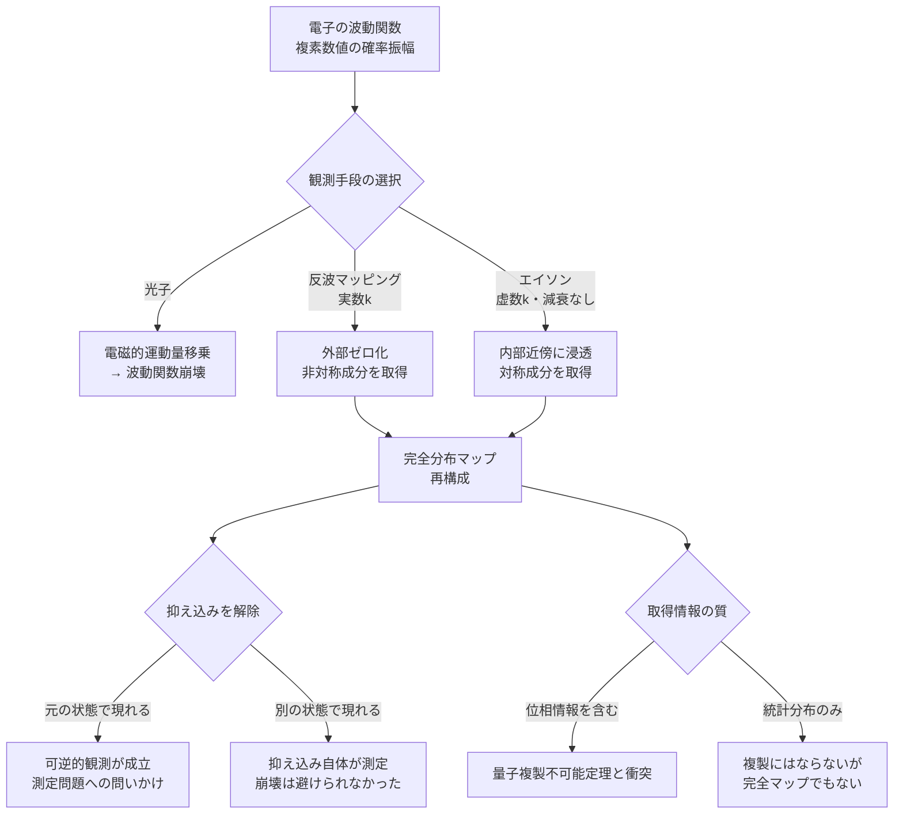

## 概要

電子がどこにいるかを測ろうとすると、電子は「どこかに落ち着く」。光子をぶつければ電子は蹴られ、波動関数は崩壊する。これは技術的な限界ではなく、量子力学の根幹にある原理的な問題だ。

> **前提:** エイソン（g277）という架空粒子が存在する。エバネッセント波（g278）の虚数波数kモードで伝播し、通常の指数関数的減衰を持たない。  
> **命題:** 「エイソンを観測媒体として用いることで、電子の波動関数を崩壊させずに完全な分布マップを得られるか？」

鍵となるのは「観測」の再定義だ。電子の外部への電磁的影響を反波でゼロに打ち消す「外部ゼロ化」と、エイソンが内部構造に浸透する「近傍計測」を組み合わせることで、崩壊を回避した完全なマッピングが原理上可能かどうかを問う。

---

## 実現不可能性の根拠

### 物理的限界 — ハイゼンベルクの不確定性原理

電子の位置を精密に測るほど、運動量は激しく乱れる。これは測定精度の問題ではなく、「測定という行為そのものが電子の状態を変える」という量子力学の構造的特性だ。光子が電子に当たる瞬間、波動関数は確率的な固有状態へと収縮し、観測前の分布情報は失われる。

### 技術的限界 — エバネッセント波の減衰

内部対称構造（例：球対称な分布の内側）は、外部からの伝播波には原理上届かない。エバネッセント波は境界近傍にしか存在できず、距離とともに指数関数的に消えていく。現実の近接場顕微鏡（NSOM）は回折限界を突破するが、そこには指数関数的減衰という制約が常に伴う。

### 論理的限界 — 量子複製不可能定理

未知の量子状態をコピーすることは不可能だと証明されている（量子複製不可能定理）。電子の波動関数を「完全にマップする」ことは、その状態を完全に記述する情報を取り出すことと等価に見える。これは「読み取り」か「複製」か——両者の差はどこにあるのか。

---

## 実験の設定

**対象:** 電子（複素数値の確率振幅として空間に分布する波動関数）

**操作1 — 反波による外部ゼロ化（非対称成分の取得）**  
伝播波（実数k）のプローブを多方向から照射し、電子の外部への電磁的影響が合成上ゼロになるよう反波を調整する。位相・振幅・角度を変えながら「何が打ち消せたか」を記録していくことで、非対称な成分の分布が得られる。この過程で電子は「抑え込まれた状態」にあり、消滅してはいない。ノイズキャンセリングが音を消すのではなく「耳への影響をゼロにする」のと同じ構造だ。

**操作2 — エイソンによる内部浸透（対称成分の取得）**  
エイソン（g277）は虚数波数kのエバネッセント的モードで、指数関数的減衰なしに内部近傍まで届く。通常の伝播波では到達できない球対称な内部構造の情報を取り出す。エイソンが電磁的な運動量移乗を行わない場合、内部への浸透は崩壊を起こさない可能性がある。

**操作3 — 合成と解除**  
操作1と操作2で得た情報を合成し、波動関数の完全な分布マップを再構成する。その後、反波抑え込みを解除し、電子がどの状態で「現れる」かを確認する。

---

## 考察と予測

### 抑え込み後、電子はどこにいるか

抑え込みを解除したとき、電子が元の分布のまま再現されるなら、**可逆的な観測**が成立したことになる。量子力学の測定問題——観測が崩壊を引き起こすとはどういうことか——に対する根本的な問いかけだ。

逆に、別の状態で現れるなら「反波による抑え込みプロセス自体が一種の測定だった」ことになる。完全マップが得られたとしても、そのプロセスで崩壊は既に起きていたことになる。

### 「読み取り」と「複製」の境界

量子複製不可能定理は、未知の量子状態を**別の媒体にコピーする**ことを禁じる。しかし「情報を古典的に記録する」ことと「量子状態を複製する」ことは同じことだろうか。

もしエイソンによるマッピングが位相情報まで取り出せるとすれば、それは定理と真正面から衝突する。得られた情報が位相なしの統計分布に留まるなら複製にはならないが、同時に「完全な」マップとも言えない。情報の質によって、思考実験の結論が180度変わる。

### 対称構造の一意性問題

操作1の外部ゼロ化だけでは、外部電場が同一に見える異なる内部分布を区別できない（球殻と中心点電荷の問題）。エイソンの内部浸透がこの縮退を破るかどうかが、完全マッピングの可否を決定する鍵だ。エイソンが電子の内部に届くことを所与とすれば、理論上は縮退は解消されると考えられる。

### 重力波との比較 — 現実に存在する部分的な近似

実在する波として、重力波はエイソンに近い性質を部分的に持つ。電磁的に不透明な物体も通過し、電子への力学的擾乱は光子に比べて天文学的に小さい——「ほぼ非破壊的な観測媒体」という点でエイソンと重なる。

しかし重力波は実数波数kの伝播波であり、球対称な質量分布は四重極モーメントがゼロになるため重力波を放射しない。散乱パターンでも、球殻と中心点質量は外部から区別できない。エイソンが必要とされる「内部対称成分への到達」は、重力波では原理上実現しない。

重力波を「非対称成分の低擾乱計測」に用い、エイソンで「対称成分の内部浸透」を補う——という二段構えが、現実の物理とエイソンの役割分担を最も明確に示している。

---

## 関連記事

- [wiim_042](wiim_042.md) — クオリア検知機：波動関数の虚数項に意識の痕跡を探す
- [wiim_050](wiim_050.md) — 目に見えるほど大きな粒子を生成できるか（量子デコヒーレンスとマクロ量子状態）
- [wiim_013](../physics/wiim_013.md) — コーラ粒子：空間を超越する粒子の仮説
- [wiim_009](../cosmology/wiim_009.md) — 重力波をキャンセルする：時空のノイズキャンセリング（重力波の伝播特性）
- 用語: エイソン g277 / エバネッセント波 g278 / コーラ粒子 g127 / 重力波 g004 / 波動関数崩壊 / 量子複製不可能定理
