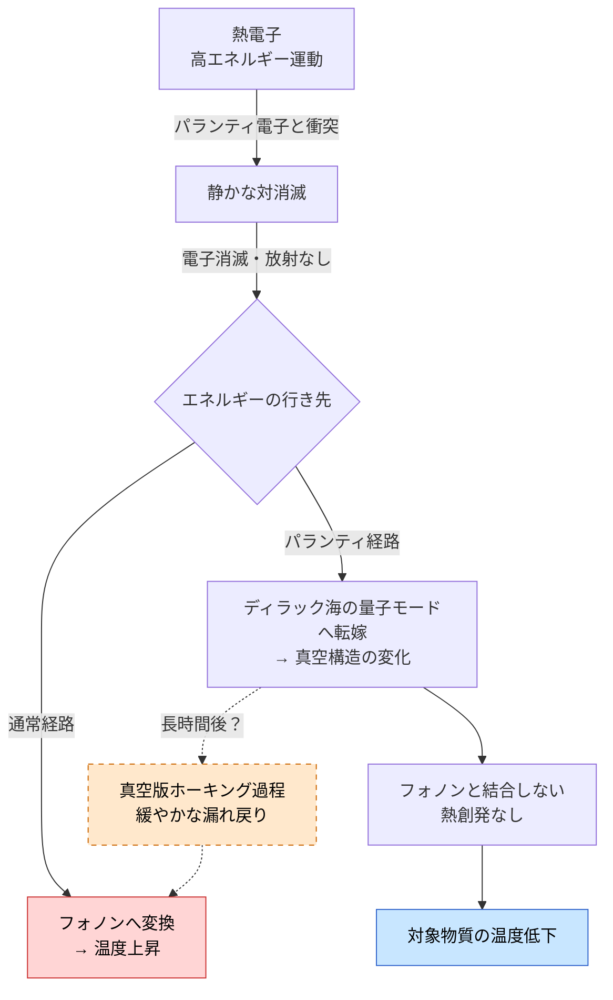

## 1. 概要 (Abstract)

熱とは何か。温度計が示す値は、系を構成する無数の粒子が持つエネルギーが「無秩序に等分配された状態」として現れる創発現象だ。重要なのは、エネルギーが存在することと、熱として現れることは別問題だということである。ニュートリノは莫大なエネルギーを運ぶが、ほとんど相互作用しないため熱を生まない。コヒーレントな音波は熱雑音と同じ機械的振動だが、秩序ある構造を保つ限り「熱」ではない。エネルギーが非熱的なモードに格納される限り、温度は上がらない。

この思考実験が問うのは、**「パランティ電子（負エネルギーの電子）を照射することで、通常電子の熱運動エネルギーをディラック海の量子モードへ転嫁し、熱として創発させずに除去できるか」** だ。エネルギーは消えない。ただし格納先が変わる——物質の格子振動（フォノン）ではなく、真空構造そのものの変化として。

---

## 2. 実現不可能性の根拠 (Infeasibility Rationale)

### 物理的限界

パランティ電子はパランティ粒子（g161）の電子版——「負のエネルギーを持つ電子」だ。ディラック方程式は負エネルギー解を持ち、ディラックはこれが「負エネルギー状態を満たした電子の海（g145）」として充填されていると解釈した。しかし現代の量子場理論（QFT）では、この充填は真空の定義として繰り込まれており、個別に取り出せる対象として扱われない。

より根本的に言うと、**安定した負エネルギー状態は標準的なQFTに存在しない**。負エネルギー状態があれば系はそこへ向かって無限に崩壊し続けるためだ。パランティ電子の前提——安定した負エネルギーの電子——はこの意味で標準理論の外側にある。静かな対消滅（[wiim_038](../physics/wiim_038.md)）が直面する障壁と同一だ。

### 技術的限界

仮にパランティ電子が存在しうるとしても、その生成経路は未確立だ。最も自然な候補は「ディラック海の充填電子を選択的に抽出する逆カシミール装置」だ。通常のカシミールフォージ（g133）は真空モードを抑制して負のエネルギー密度を生成するが、その逆——真空モードを特定の焦点に集束させてパランティ電子を取り出す——が工学的に実現可能かどうかは理論的にも見通しが立っていない。

### 論理的限界

最も難解な問いは「ディラック海に転嫁されたエネルギーは永遠に熱化しないか」だ。

ホーキング放射は、真空モードが事象の地平線付近で「漏れ出す」現象だ。それと類比的に、ディラック海に格納されたエネルギーも、長時間スケールでは量子揺らぎ（g061）を介して通常の熱モードに再結合する可能性が排除できない——「真空版ホーキング過程」とでも呼ぶべき緩やかな漏れだ。熱化を回避するのは「永遠」ではなく「長い緩和時間を持つ」にすぎない可能性がある。

---

## 3. 実験の設定 (Setup)

### 条件

- **対象物質**：高温の金属（伝導電子が多く、電子系の熱容量が大きい）
- **照射源**：逆カシミール装置から生成されたパランティ電子のビーム
- **環境**：真空中（意図しない通常物質との対消滅を防ぐため）
- **観測量**：①対象物質の温度変化、②ガンマ線・光子の有無（静かな対消滅なら放射なし）、③電子密度変化（電子消失の確認）

### 予想されるプロセス

1. パランティ電子が金属内の熱運動する伝導電子と衝突
2. 静かな対消滅が成立：電子とパランティ電子が消滅し、放射が出ない
3. 電子が持っていた運動エネルギーがディラック海の量子モードに転嫁
4. ディラック海モードは金属のフォノンと結合しない → 金属の温度が下がる
5. 電子密度が減少するため電気抵抗がわずかに変化する

### 制御上の課題

パランティ電子を照射し続けると対象物質の電子が失われ、最終的に電子のない格子だけになる。「冷却」と「物質破壊」の間のどこで止めるかが制御の核心となる。

---

## 4. 考察と予測 (Speculation)

### 熱は創発であり、エネルギーとは別物だ

「温度が上がる」とは単にエネルギーが増えることではない。エネルギーが多数の自由度にランダムに分配——等分配——されたとき初めて「熱」として現れる。これを創発という。

逆を言えば、エネルギーが非ランダムなモードに格納されている限り、それは熱ではない。量子もつれに格納されたエネルギーは局所的には取り出せない。ゼロ点エネルギーは存在するが利用できない最低状態だ。ディラック海の量子モードも同じカテゴリに属すると考えられる——真空の集団励起として格納されたエネルギーは、通常物質のフォノンや光子と相互作用しないため、熱として「現れる経路」がない。

### レトロンが抱えていた問いへの応答

レトロン（g163）は負のエントロピーを持つ粒子であり、系のエントロピーを局所的に下げる能力を持つとされる。しかし「吸収されたエントロピーはどこへ行くのか」という問いが未解決のままだった。

パランティ電子によるディラック海転嫁はその一つの回答になりうる。エントロピーの担い手である熱電子が静かな対消滅によって消滅し、その状態変化がディラック海の量子モードに格納されるなら、「エントロピーが真空構造に溶け込んでいく」という描像が成立する。第二法則は「破れていない」——エントロピーは消えたのではなく、通常物質系からアクセスできない真空構造へと転嫁されている。

### 真空の緩和時間——永遠の非熱化か、長い緩和か

最大の未解決問題は「転嫁されたエネルギーが長期間後に戻ってくるか」だ。

ホーキング放射の物理的本質は「真空モードが境界条件の変化によってリアル粒子として漏れ出す」ことだ。ディラック海に格納されたエネルギーに対しても、類似の漏れが真空ゆらぎを介して長時間スケールで生じうる。これはパランティ電子冷却が「完全な非熱化」ではなく「きわめて長い熱緩和時間を持つ冷却」である可能性を示す。宇宙の年齢より長い緩和時間であれば実用上は同等だが、理論的な完全性は損なわれる。

また、パラドックス粒子（[wiim_030](../physics/wiim_030.md)）の「理論B：因果真空ゆらぎ」が示すように、真空モードの集積は時空の泡構造と相互作用する可能性がある。多量のエネルギーをディラック海に転嫁し続けた場合、その蓄積が時空構造に何らかの影響を与えるかどうかも未解決だ。

---

## 5. 図解 (Diagrams)

---

## 6. 関連記事 (Related)

- [wiim_038](../physics/wiim_038.md) — 静かな対消滅——パランティ粒子による完全無効化（本記事の基盤）
- [wiim_030](../physics/wiim_030.md) — パラドックス粒子——時間的ディラックの海という先行概念
- [wiim_039](wiim_039.md) — 量子永久機関——真空エネルギー搾取と同じ根本障壁を共有
- wiim_086 — パランティ電子冷却の宇宙船応用（応用編、別途執筆予定）
