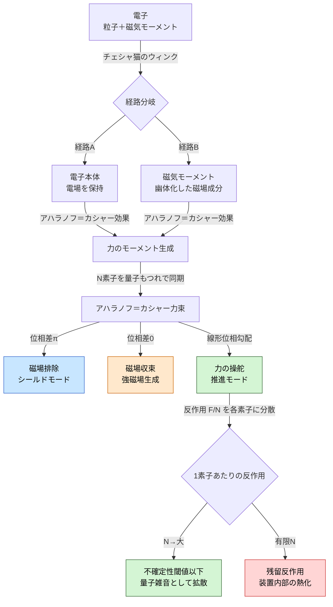

## 1. 概要 (Abstract)

2013年に実験室で実証された**量子チェシャ猫効果**（g144）は、粒子とその物理的性質を空間的に分離できることを示した。干渉計の中を通る中性子は一方の経路を進み、その磁気モーメントは別の経路を通る——不思議の国のアリスのチェシャ猫が姿を消しても笑みだけを残すように。

この思考実験が問うのは、**「チェシャ猫効果を電子のアレイに適用し、磁気モーメントを選択的に分離・制御することで、電磁場操作と反作用分散型推進力を実現できるか」** だ。

電子に量子チェシャ猫効果を適用すると、粒子本体（電荷・電場をともなう電子）が一方の経路を通り、磁気モーメントだけが別経路へ幽体化する。この基本操作を**チェシャ猫のウィンク**と呼ぶ——片目だけ閉じるように、片側の性質だけを取り出す操作だ。このウィンクを格子状にアレイ化し、量子もつれと位相制御で同期させた装置を**チェシャ磁場格子**と呼ぶ。

チェシャ磁場格子は単なる磁場操作にとどまらない。アレイが出力するアハラノフ＝カシャー効果による結合力場——**アハラノフ＝カシャー力束**——は、N個の量子ペアに反作用を分散させることで、装置自体をほぼ静止させたまま外部に力を働かせる可能性を持つ。

---

## 2. 実現不可能性の根拠 (Infeasibility Rationale)

### 物理的限界

量子チェシャ猫効果は現在のところ、超低温・高度に制御された環境下における単一粒子（中性子）で実証されている。マクロなアレイへの拡張において最大の障壁となるのが**量子デコヒーレンス**だ。室温では格子振動（フォノン）・電磁ノイズ・周辺粒子との衝突が絶え間なく発生し、量子コヒーレンスは10⁻¹³秒程度で崩壊すると見積もられる。アレイ全体のコヒーレンスを維持するには、この時間スケールを何十桁も延長しなければならない。

電場と磁場はマクスウェル方程式において本質的に結合している。磁気モーメントを分離する操作は電場成分の動的変化を誘起し、ファラデー則による誘導電場が生じる。「純粋に電場だけ、あるいは磁場だけが存在する領域」はこの結合を破ることを意味し、通常の電磁気学の制約の外にある。

### 技術的限界

N個の量子もつれペアの位相を同時に制御するには、各ペアを個別にアドレス指定できる読み書き機構が必要だ。現在の量子コンピュータでさえ、エラー訂正込みで数百から数千量子ビットの制御が精一杯であり、推進力として意味のある力を生むために必要な粒子数（ざっと10²³個のオーダー）との隔たりは桁外れに大きい。

アハラノフ＝カシャー効果はトポロジカルな幾何学的位相現象であり、経路の形状・速度・電場強度に敏感だ。アレイ全体で位相を揃えるためには、各素子の配置精度が量子的な波長スケール（ナノメートル以下）で揃っている必要がある。

### 論理的限界

反作用分散の核心は「N個のペアに反作用を分配することで、1ペアあたりの反作用がハイゼンベルクの不確定性の閾値を下回る」という論理だ。しかし運動量保存則はアレイ全体に厳密に成立する。反作用が「取り出せない形に分散する」ためには理論上 N→∞ が必要であり、有限の系では必ず残留反作用が存在する。反作用が消えるのではなく、量子雑音として拡散して「計測不能になる」に過ぎない。

---

## 3. 実験の設定 (Setup)

### 装置の構成

チェシャ磁場格子は三層構造で考える。

**素子層**：電子一個ずつを干渉計に通し、チェシャ猫のウィンクを実行する。電子本体（電場）は経路Aへ、磁気モーメントは経路Bへ分岐する。

**もつれ制御層**：各素子の磁気モーメントを量子もつれ状態に接続する。もつれた磁気モーメントは一体として振る舞い、位相を外部から制御できる。

**位相制御層**：アレイ全体の位相パターンを指定することで、出力される力の方向・強度・焦点を調整する。

### 動作モード

| モード | 位相設定 | 効果 |
|--------|---------|------|
| シールドモード | 位相差π | 磁場を対象領域から排除（能動型マイスナー効果） |
| 収束モード | 位相差0 | 磁気モーメントを一点に集積・強磁場を生成 |
| 推進モード | 線形位相勾配 | アハラノフ＝カシャー力束を特定方向に操舵 |
| センシングモード | 微小位相揺らぎ検出 | 周囲のEM場変化を超高感度で感知 |

### 反作用分散のしくみ

N個の素子が協調して力 F を出力する場合、各素子が受け持つ反作用は F/N となる。N が十分大きければ、1素子あたりの反作用がハイゼンベルクの不確定性関係 Δp・Δx ≥ ℏ/2 において「確定した力として局在できない」水準に到達する。このとき反作用は量子真空の揺らぎ・熱雑音として拡散し、装置自体に巨視的な加速をもたらさない。

これはメスバウアー効果と同じ原理だ。ガンマ線放出時の反動を結晶全体のN個の原子核が分担することで、原子1個あたりの反動が事実上ゼロになり「反動なしの核遷移」が実現する。チェシャ磁場格子はその電磁力版だ。

---

## 4. 考察と予測 (Speculation)

### 電磁場の成分分離が開く可能性

チェシャ磁場格子が持つ最も根本的な能力は、通常の電磁気学では不可能な**EとBの空間的独立制御**だ。電子本体（電場）を経路Aに誘導し、磁気モーメント（磁場）を経路Bへ分岐させることで、「電場はあるが磁場への結合がない領域」と「磁場効果だけが存在する領域」を同時に生み出せる。

これは超伝導体のマイスナー効果とは根本的に異なる。マイスナー効果は受動的な磁場排除だが、チェシャ磁場格子は能動的・形状可変・常温動作を目指した制御だ。

### アハラノフ＝カシャー効果がフィードバックを与える

分離された磁気モーメントが電子本体の電場の中を移動するとき、**アハラノフ＝カシャー効果**により幾何学的位相が蓄積される。この位相は干渉パターンを通じて力のモーメント（トルク）として現れる。

重要なのは、このトルクが「再結合への引き戻し力」として機能する点だ。分離距離が大きくなるほどトルクが増大し、アレイの位相制御に対するフィードバック信号として利用できる。つまり装置は自己感知型の構造を持ち、出力力の大きさを内部状態から推定できる。

### 推進力としての応用と熱力学的代償

反作用が量子雑音として拡散するとき、それはエネルギーが何もないところへ消えることを意味しない。運動量保存則は破れない。アレイ全体の運動量収支は厳密に成立しており、拡散した反作用は最終的に装置を構成する量子系全体に等分配される形で熱化する——つまり**装置は内部から静かに加熱される**。

この熱化のレートが出力力の規模に対して無視できる水準であれば、実用的な推進機として機能する。しかし長時間動作させると内部エネルギーが蓄積し、コヒーレンス維持がさらに難しくなるという自己破壊的なフィードバックが生じる可能性がある。

### 電場を「連れてくる」か「切り離す」か

電子に適用されたウィンクでは、電場は必然的に粒子側に付いてくる。これを逆用すると「磁気的に透明な電子ビーム」——電荷は持つが周囲の磁場と相互作用しない粒子流——が得られる。荷電粒子ビームの制御に磁場偏向が使えない環境（すでにチェシャ磁場格子が磁場を操作している内部空間など）では、この分離が本質的な意味を持つ。

---

## 5. 図解 (Diagrams)

---

## 6. 関連記事 (Related)

- [wiim_039](wiim_039.md) — 量子永久機関——非対称カシミール板と真空エネルギーの搾取（真空エネルギーの制御という同系統の問い）
- [wiim_050](wiim_050.md) — 目に見えるほど大きな粒子を生成できるか——量子デコヒーレンスの根本障壁を共有
- [wiim_053](wiim_053.md) — 粒子に個性を持たせることができるか——量子的同一性とトポロジカル操作の問い
- [wiim_072](wiim_072.md) — エイソンによる非崩壊量子マッピング——量子系を壊さずに読む技術の同系統
- [wiim_085](wiim_085.md) — パランティ電子と非熱的エネルギー存在様式——反作用エネルギーの「熱化回避」という関連する問い
