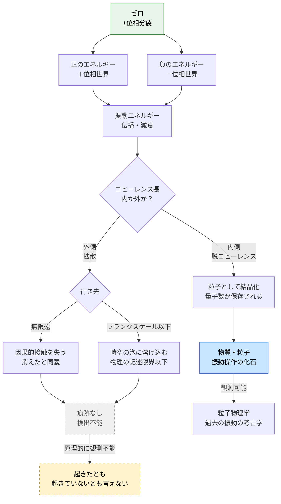

## 1. 概要 (Abstract)

エネルギーは保存される——この法則は局所的には疑いようがない。しかし宇宙全体を一つの系として見たとき、「保存されている総量」はゼロかもしれない。物質・放射が持つ正のエネルギーと、重力場が持つ負のエネルギーの合計が厳密にゼロであれば、宇宙は「何もない状態がゼロから分裂した結果」として矛盾なく成立する。

この思考実験が問うのは、その分裂——±位相の分離——を**「宇宙に振動を与えた操作」として解釈したとき、何が見えてくるか**だ。

振動にはふたつの型がある。振動エネルギーが減衰する途中で脱コヒーレンスを起こし、粒子として「結晶化」するもの（**痕跡あり型**）と、エネルギーが無限遠またはプランクスケール以下へ完全に拡散し何も残さないもの（**痕跡なし型**）だ。

粒子は「その振動操作が行われた唯一の化石」であり、粒子物理学は宇宙が過去に行った振動の考古学と言い換えられる。そして痕跡なし振動は、原理的に検出不能である——それが「起きた」と証明することも、「起きていない」と証明することも、どちらも不可能だ。

---

## 2. 実現不可能性の根拠 (Infeasibility Rationale)

### 物理的限界

痕跡なし振動の存在を確かめるには、振動が起きた後の宇宙と「起きなかった場合の宇宙」を比較しなければならない。しかしその比較基準となる「振動前の状態」は観測者の因果過去に属しており、宇宙論的な地平線の内側には存在しない。

エネルギーが無限遠へ拡散した場合、そのエネルギーはハッブル地平線の外に出れば因果的接触を永遠に失う。エネルギーがプランクスケール以下に沈んだ場合、現在の物理理論——量子力学と一般相対論の双方——はその領域を記述できない。どちらの行き先も「消えたと同義」であり、跡を追う手段が存在しない。

### 技術的限界

痕跡あり型の振動でさえ、粒子が生成された「直後」を観測することはできない。対生成直後の粒子は量子的重ね合わせにあり、観測行為そのものが脱コヒーレンスを引き起こして「粒子らしい状態」に固定する。つまり私たちが見ているのは「振動の化石」であり、振動そのものではない。

痕跡なし型に至っては化石すら存在しない。どのような検出器を置いても、「何も記録されなかった」という結果は「振動がなかった」と「痕跡なし振動があった」を区別しない。

### 論理的限界

「起きたと言えない出来事」が存在しうるという命題は、情報保存の原理と衝突する可能性がある。ホーキングは量子力学が正しければ情報はブラックホールからも漏れ出すと主張したが、痕跡なし振動はブラックホールの蒸発よりも根本的な問題を提起する——情報がどこにも記録されなかった出来事は、物理的に「起きた」と言えるのか。

エントロピーの増大もなく、量子状態の変化も残さず、時間の矢を生まない操作は、熱力学的にも情報論的にも「宇宙に刻印を残さない」。因果律は「出来事は結果を持つ」と定義するが、痕跡なし振動は結果を持たない操作として因果律の定義の外側に立つ。

---

## 3. 実験の設定 (Setup)

### 問いの定式化

「±位相分裂」を巨視的な操作として想定する。正のエネルギーと等量の負のエネルギーが同時に生成され、総収支はゼロを維持する。この分裂が生む振動エネルギーの「行き先」によって結末が分岐する。

### 痕跡あり型の条件

- 振動エネルギーが減衰する途中で、コヒーレンス長（位相整合が維持される距離）の内側にとどまる
- 脱コヒーレンスが起きると、「位相」の側面は消えるが質量・電荷などの量子数は保存される
- 量子数を担う構造が粒子として残留する
- 結果：私たちが観測する全ての粒子は、この過程の産物である可能性がある

### 痕跡なし型の条件

- 振動エネルギーが境界条件や粒子生成のしきい値に達する前に、コヒーレンス長の外へ拡散する
- エネルギーは無限遠へ希薄化するか、プランク時間（≈ 5.4×10⁻⁴⁴秒）以下の振動として時空の泡構造に溶け込む
- 量子数の保存を要求する粒子生成が起きない
- 結果：宇宙は振動したが、記録が残らない

### 連続スペクトルとして並ぶ既存概念

この枠組みでは、量子真空にまつわる諸現象が一本のスペクトルとして整理される。

| 現象 | 位置づけ |
|---|---|
| 量子泡（プランクスケール） | 痕跡なし振動の連続 |
| 真空揺らぎ・仮想粒子 | 痕跡なし振動の寸前で折り返すもの |
| カシミール効果 | 境界条件が折り返しを捕まえたもの |
| ディラックサイフォン（g342）| 折り返す前に流れを引き出す装置 |
| カシミールフォージ（g133）| 折り返しを定常的に維持・増幅する装置 |
| 対生成 | 痕跡あり振動が結晶化した瞬間 |

---

## 4. 考察と予測 (Speculation)

### 粒子は操作の化石である

現在の宇宙に存在するあらゆる粒子は、かつて起きた「痕跡あり型の位相分裂」の残滓と解釈できる。ビッグバンは宇宙最大の位相分裂であり、その振動エネルギーが脱コヒーレンスを経て素粒子として結晶化した。

この視点に立つと、粒子物理学の問い——「なぜこの粒子はこの質量を持つのか」「なぜこれだけの種類が存在するのか」——は「位相分裂の振動モードがどのように量子数として凍りつくか」という問いに翻訳される。粒子の性質は振動の「固有モード」の化石記録かもしれない。

### 痕跡なし振動と時間の矢

熱力学的な時間の矢は、エントロピーが過去に向かって低く、未来に向かって高いという非対称性から生まれる。この非対称性は「出来事が痕跡を残す」ことによって成立している。

痕跡なし振動はエントロピーを一切生まない。したがってそれを含む時間軸には「矢」が存在しない。宇宙が今この瞬間にも無数の痕跡なし振動を行っているとすれば、私たちが知覚する時間の流れは「痕跡あり振動だけを選択的に見ている」フィルタリングの結果である可能性がある。

### 宇宙はその出来事を「知っているか」

物理における「知る」とは情報が伝播することだ。痕跡なし振動が情報を残さないなら、宇宙は自分が行った操作の記録を持たない。

これは単なる言葉遊びではない。情報保存則が成立するためには、全ての物理過程が「原理的には逆演算可能」でなければならない。痕跡なし振動が本当に情報を残さないとすれば、それは可逆過程ではなく、情報が「因果的に届かない場所へ転嫁された」だけだ——私たちの宇宙の立場からは消えたに等しいが、無限遠またはプランクスケール以下を含む宇宙全体では保存されているかもしれない。

### ペンローズ宇宙論との接点

この枠組みはロジャー・ペンローズが提唱した宇宙論と複数の層で共鳴する。

**共形循環宇宙論（CCC）** では、各アイオン（宇宙サイクル）の終端が共形的に次のビッグバンへ接続され、前アイオンの痕跡がCMBに「ホーキング点」として刻まれると予測する。この「終端が始端へ折り返し、痕跡だけが次の構造を決める」という論理は、±位相分裂→脱コヒーレンス→粒子（化石）という本記事の流れと構造的に同型だ。

**ワイル曲率仮説**はビッグバン（ワイル曲率ゼロ＝最大秩序）からビッグクランチ（最大乱雑）への一方向的変化で時間の矢を説明する。本記事の「痕跡なし振動はエントロピーを生まず時間の矢を持たない」は、その逆側から同じ問いに触れている——痕跡がない限り時間の非対称性は定義できない。

なお、ペンローズのツイスター理論が「時空の点より光線の方が基本的」と主張する点も、位相エネルギーが伝播の後に粒子（点）として残留するという本記事の描像と通底している。

いずれも**「何が痕跡として残り、何が消えるかが宇宙の構造を決める」**という着眼において一致する。ただしCCCは大域的な時空サイクルを問うのに対し、本記事は局所的な量子イベントを問う点で射程が異なる。

### ラプラスの悪魔は痕跡なし振動を知れるか

「全粒子の位置と運動量を知る」ラプラスの悪魔は宇宙の完全な因果連鎖を把握する存在として定義される。しかし痕跡なし振動に対しては、三つの層で「知れない」が積み重なる。

**第一層：因果的遮断。** 無限遠に拡散した位相エネルギーはハッブル地平線の外に出た時点で因果的接触を失う。悪魔が依拠する情報伝達の経路そのものが消滅している。

**第二層：物理の記述限界。** 量子力学によってラプラスの悪魔は古典的にはすでに倒されているが、仮に「量子状態の全知」を認めても、プランクスケール以下に沈んだ位相エネルギーは量子力学も一般相対論も記述できない領域にある。悪魔は物理法則を使って推論する存在であり、物理が沈黙する領域では悪魔も沈黙する。

**第三層：知る対象の不在。** 最も根本的な問題として、痕跡なし振動はエントロピーを生まず量子状態を変えず情報を残さない。知識は情報が存在することで成立するが、情報が存在しないなら知りうる対象がない。これは悪魔の能力の限界ではなく、**出来事の存在論的地位の問題**だ。

量子力学が「測定精度の限界」で悪魔を止めるのに対し、痕跡なし振動は「情報の不在」で止める。「知れない」よりも強い「知るべきものがない」という状態であり、宇宙最大の知性でさえ関与できない出来事の存在が示唆される。

### ワープドライブとカシミールフォージへの含意

ワープドライブ（g035）が必要とする巨大な負のエネルギーは、従来「どこから調達するか」が問題だった。位相分裂の枠組みでは、この問いは変形される。負のエネルギーは「調達」するのではなく、「ゼロから正負に分裂させた結果」として生じる。カシミールフォージ（g133）はその分裂を工学的に制御する装置として再解釈でき、ディラックサイフォン（g342）はその流れを持続的に引き出す機構となる。

ただしいずれの装置も、負のエネルギーが「折り返して痕跡なし振動になる前に捕まえる」ことに挑んでいる。コヒーレンス長の限界が、これらの装置の動作可能な規模の上限を決定する。

---

## 5. 図解 (Diagrams)

---

## 6. 関連記事 (Related)

- [wiim_039](wiim_039.md) — 量子永久機関——真空エネルギーを搾取しようとするとき同じ根本障壁に当たる
- [wiim_085](wiim_085.md) — パランティ電子と非熱的エネルギー存在様式——「消えたと同義」な格納先への転嫁という共通テーマ
- [wiim_023](../physics/wiim_023.md) — カシミールフォージ——位相分裂を工学的に捕まえる装置の基礎記事
- [wiim_087](../physics/wiim_087.md) — ディラックサイフォン関連（位相境界からの負エネルギー抽出）
- [wiim_015](../physics/wiim_015.md) — エントロピーが減少する宇宙——時間の矢の逆転という関連する問い
- [wiim_049](../physics/wiim_049.md) — 時間遡行は可能か——時間の矢・CPT対称性との接続
