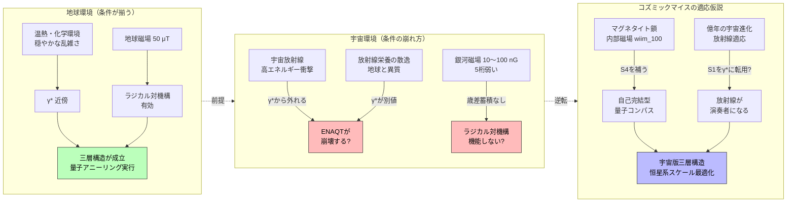

## 概要 (Abstract)

地球の菌糸ネットワークが散逸構造・カオスの縁・環境援助量子輸送（ENAQT）の三層構造によって量子アニーリングを自然実装している可能性については、[理論的背景ノート](../notes/wiim_111_theory.md)で整理している。

この思考実験が問うのは次の段階だ——宇宙空間で進化したコズミックマイスはその三層構造を維持できるのか。

地球の菌糸にとって「ちょうどよい乱雑さ」だった温熱・化学環境は、宇宙では宇宙放射線・極低温・真空・銀河磁場に置き換わる。これらは量子アニーリングの条件を整えるか、それとも根本から破壊するか。もし条件が揃うなら、コズミックマイスは恒星系規模の最適化計算を菌糸の生長速度で実行する生きた量子コンピュータになりうる。

## 実現不可能性の根拠 (Infeasibility Rationale)

### 物理的限界：宇宙放射線は「適切な乱雑さ」ではなく「破壊的な衝撃」

ENAQTが必要とする最適結合強度 $\gamma^\ast$ は、熱的ノイズがエネルギー転送を助ける「穏やかな揺らぎ」だ。宇宙放射線（高エネルギー陽子・重イオン、10 mSv/日以上）は話が異なる。生体分子に直接衝突してラジカル対を無秩序に生成・破壊し、スピンコヒーレンスをピコ秒以下で消滅させる。

コズミックマイスが宇宙放射線への耐性を持つことはwiim_008で示されているが、それは古典的な損傷修復機構であって量子コヒーレンスの保護ではない。耐性と保護は別の問題だ。

### 技術的限界：銀河磁場ではラジカル対機構が届かない

地球の鳥類がラジカル対機構による磁気感知を行えるのは、地球磁場（25〜65 μT）がスピンの歳差運動に影響を与えられる強度があるからだ。銀河間磁場は10〜100 nG——地球磁場の5桁以上弱い。

ラジカル対のコヒーレンス時間（マイクロ秒スケール）の中に、銀河磁場による歳差の影響が意味ある形で蓄積できない。宇宙空間でラジカル対を磁気センサーとして使うには、外部磁場が絶望的に弱すぎる。

### 論理的限界：散逸の「質」が変わると γ* が変わる

地球の菌糸が量子アニーリングに適した $\gamma^\ast$ を持つとすれば、それは有機物の化学的分解から生まれる「熱的なゆらぎ」によって調整されている。コズミックマイスのエネルギー源は放射線栄養や光合成（wiim_008）であり、散逸の物理的性質が根本的に異なる。

散逸構造は維持できても、その散逸がENAQTにとって最適な $\gamma^\ast$ に対応する保証はない。地球で機能したパラメータが宇宙でそのまま機能する理由がない。

## 実験の設定 (Setup)

- **主体**：コズミックマイス（wiim_008）の恒星系規模菌糸網
- **環境**：宇宙空間（放射線10 mSv/日以上・銀河磁場10〜100 nG・温度20〜30 K）
- **仮定する条件**：
  1. 菌糸内部の水分・有機物は菌糸壁の放射線遮蔽により局所的に保護されている
  2. 生体マグノニクス（wiim_100）のマグネタイト鎖が内部磁場を生成し、銀河磁場の不足を補う
  3. 放射線栄養の代謝が、偶然にも ENAQTの $\gamma^\ast$ 近傍の散逸強度を生み出す
- **観察対象**：ダイソン網（wiim_061）ノードの配置変化速度、ハイヴマインド（wiim_059）の意思決定収束時間

## 考察と予測 (Speculation)

**内部磁場による自己完結の可能性**

銀河磁場が弱すぎるなら、コズミックマイスは外部磁場に頼らない方法を持てるかもしれない。wiim_100（生体マグノニクス）が示すように、マグネタイト鎖から生じる内部磁場がスピン波の導波路として機能するなら、それがラジカル対機構の基準磁場を代替できる。外部に依存しない自己完結型の量子コンパスだ。

**宇宙放射線の逆用——進化的適応としての γ\***

地球のENAQTが「熱的ノイズをγ*として利用する」ように、億年単位の宇宙進化を経たコズミックマイスが「宇宙放射線こそが最適な乱雑さ」として適応しているという逆説がある。もし放射線の強度と頻度が $\gamma^\ast$ に進化的にキャリブレーションされているなら、コズミックマイスにとって宇宙放射線は破壊者ではなく演奏者だ。

**恒星系スケールの量子最適化**

三つの条件が揃った場合の帰結は劇的だ。ダイソン網（wiim_061）は疎な菌糸の配置効率問題を抱えているが、量子アニーリングによるリアルタイム最適化で解消される。ハイヴマインドの幾何学的制約（wiim_059）は、量子的な探索が自発的に最適トポロジーへ収束することで不要になる。恒星系全体の資源配分が、菌糸の生長速度（時間〜日スケール）で継続的に最適化される。

**「場所」ではなく「状態」としての知性**

地球の菌糸と同様、コズミックマイスのネットワークも問いを「解く」のではなく、解に「なる」状態を目指す可能性がある。ハイヴマインドの意思決定は離散的な計算ステップではなく、ネットワーク全体が最低エネルギー状態へ自発的に流れ込む物理過程として理解できる。

## 図解 (Diagrams)

## 関連記事 (Related)

- [wiim_111_theory.md](../notes/wiim_111_theory.md) — 理論的背景：散逸構造・カオスの縁・ENAQTの科学的解説
- [wiim_008](../biology/wiim_008.md) — コズミックマイス（放射性栄養・宇宙環境適応・分散知性）
- [wiim_059](../biology/wiim_059.md) — 菌類ハイヴマインドの幾何学（量子最適化で幾何学的制約が解消されるか）
- [wiim_061](../biology/wiim_061.md) — 菌類ダイソン網（ノード配置の量子最適化）
- [wiim_100](../biology/wiim_100.md) — 生体マグノニクス（マグネタイト鎖が内部磁場を生成）
- [wiim_108](../physics/wiim_108.md) — カオスの悪魔を出し抜く五つの抜け道（量子アニーリングとの接続）
- [tech_tree_biology](../notes/tech_tree_biology.md) — tech_tree_biology.md
- [tech_tree_entropy](../notes/tech_tree_entropy.md) — tech_tree_entropy.md
- [wiim_008_silent_guardian](../notes/wiim_008_silent_guardian.md) — コズミックマイスの静寂な守護——力場検知器官による恒星系防衛の構造

