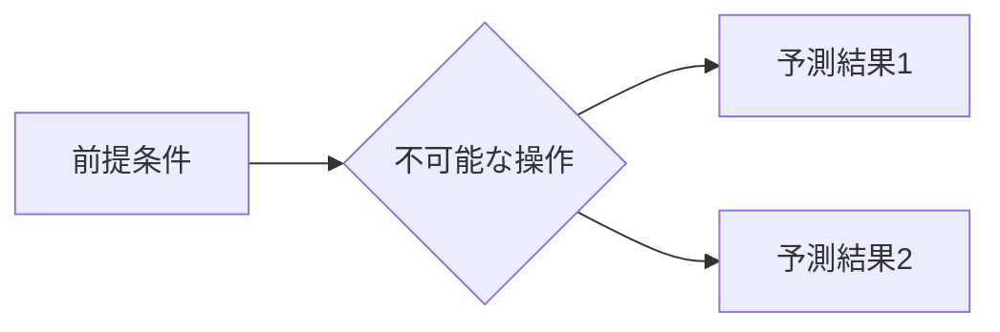

## 1. 概要 (Abstract)

現代科学では**実現不可能な**この思考実験の核心を簡潔に述べる。

> **前提:** 現代の物理法則の○○を無視する。
> **命題:** 「もし○○が実現したら、何が起こるか？」

---

## 2. 実現不可能性の根拠 (Infeasibility Rationale)

- **物理的限界:** 例）光速超え通信、無限エネルギー
- **技術的限界:** 例）量子状態の完全観測
- **論理的限界:** 例）自己言及のパラドックス

---

## 3. 実験の設定 (Setup)

1. **要素A（主体）:** 例）シュレーディンガーの猫
2. **要素B（環境）:** 例）完全に孤立した系
3. **操作:** 例）箱を開ける

---

## 4. 考察と予測 (Speculation)

### 予測される結果

- 予測1:
- 予測2:

### 哲学的な問い

- 問い1:
- 問い2:

---

## 5. 図解 (Diagrams)

---

## 6. 関連記事 (Related)

- 関連記事1
- 関連記事2
