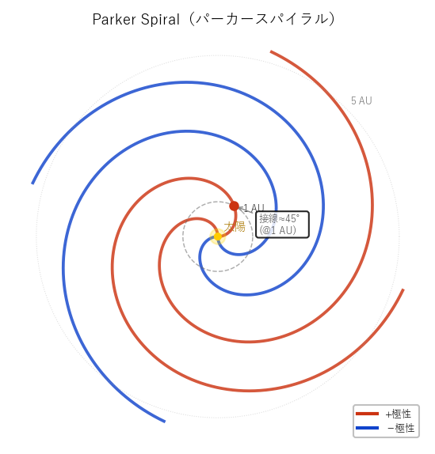

# パーカースパイラル（Parker Spiral）

**Parker Spiral**  天文学・宇宙論 / 太陽物理学・惑星間空間物理学 / g379
読み: ぱーかーすぱいらる　関連: [wiim_092](../../docs/biology/wiim_092.md), [wiim_093](../../docs/biology/wiim_093.md)

**別名**: 惑星間磁場 / IMF / Interplanetary Magnetic Field

[太陽](g084.md)が自転しながら太陽風を放出するため、[惑星](g123.md)間磁場（IMF: Interplanetary Magnetic Field）が太陽系内で描くアルキメデス螺旋状の構造。1958年にユージン・パーカーが理論的に予言し、後の観測で確認された。太陽からの距離が増すほど螺旋の巻き角は大きくなり、地球軌道（1 [AU](g095.md)）では太陽半径方向から約45°の傾きを持つ。

磁場の向きが切り替わる「ヘリオスフェリック電流シート」によって扇状の極性セクターに区切られており、太陽風を利用した磁気航行においては天然の「航路レール」として機能しうる。磁気帆を持つ生命体がパーカースパイラルの極性境界を渡ることで、外惑星帯への放流と内惑星帯への遡上を制御できる可能性がある。

