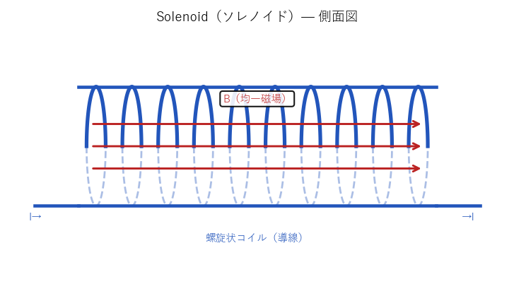

# ソレノイド（Solenoid）

**Solenoid**  物理学 / 電磁気学・電気工学 / g382
読み: それのいど　関連: —

導線を螺旋状に巻いたコイル構造体。電流を流すと内部に一様で強い磁場を生成し、外部磁場は理想的にはゼロになる。棒磁石と同等の磁気双極子として機能し、巻き数・電流・断面積を変えることで磁場強度を制御できる。MRI装置・[粒子加速器](g074.md)・電磁弁・スピーカーなど広く用いられる。

生物学的な文脈では、[菌糸体](g112.md)やコロニーを構成する磁性細胞が螺旋幾何に配列することで「生物的ソレノイド」を形成しうるという思考実験がある。[マグネトソーム](g380.md)を持つ磁性細菌が菌糸ネットワーク内で協調配列すれば、外部電源なしに自律的な磁場バブルを生成するメカニズムが[原理](g306.md)的に成立し、宇宙生命体の磁気シールドや推進への応用が考えられる。

