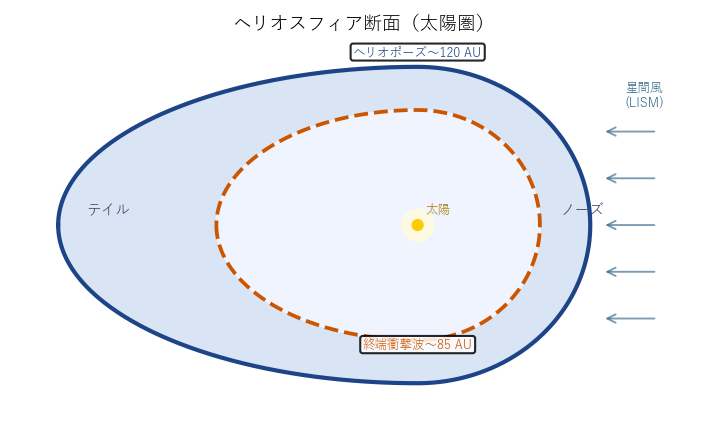

# ヘリオスフィア（Heliosphere）

**Heliosphere**  天文学・宇宙論 / 太陽物理学・惑星間空間物理学 / g383
読み: へりおすふぃあ　関連: [wiim_092](../../docs/biology/wiim_092.md), [wiim_093](../../docs/biology/wiim_093.md)

**別名**: 太陽圏

[太陽](g084.md)風と太陽磁場が支配する空間領域の総称。太陽から吹き出す太陽風が星間空間のガスと釣り合う境界（ヘリオポーズ）までを指し、その距離は約120 [AU](g095.md)に達する。ヘリオポーズの手前では太陽風が星間ガスに衝突して減速するターミネーションショック（約85 AU）が形成される。[ボイジャー](g076.md)1号が2012年にヘリオポーズを越えたことで、人類が初めて太陽圏を離脱した記録を残した。

内部は[パーカースパイラル](g379.md)が描く[惑星](g123.md)間磁場によって扇状の極性セクターに区切られており、太陽活動の11年周期に応じて全体の形状や境界位置が変動する。磁気帆を持つ生命体にとっては太陽風が届く「ホーム海域」に相当し、太陽活動周期に同期した回遊生活圏の外縁を画する。

